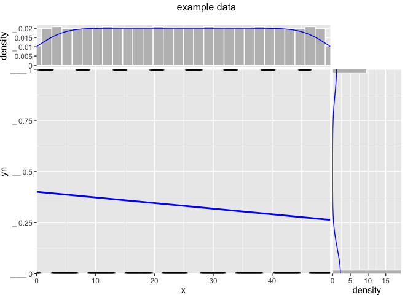
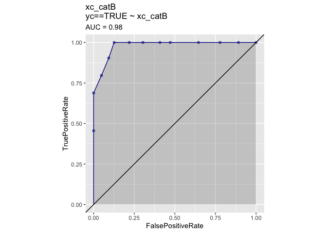
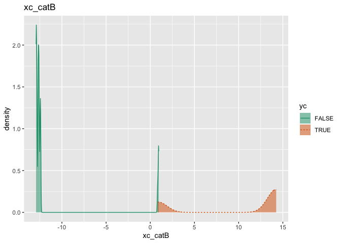
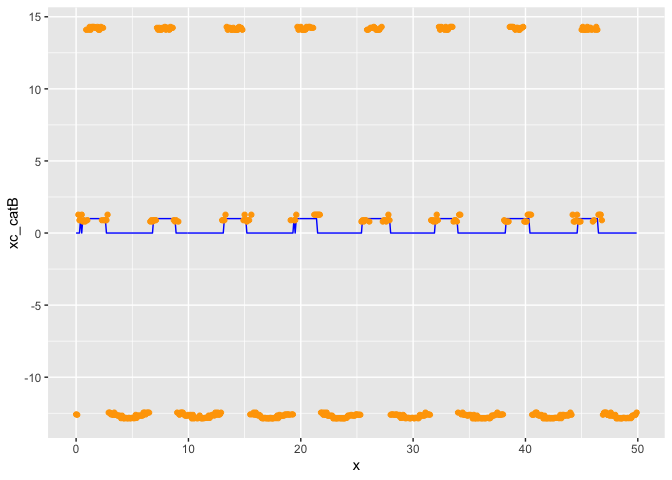

Classification
================

Attache packages.

``` r
library(ggplot2)
library(WVPlots)
library(xgboost)
library(vtreat)
library(wrapr)
```

Generate example data.

``` r
d <- data.frame(x = 0.1*(0:499))
d$y <- sin(d$x) + 0.1*rnorm(n = nrow(d))
d$xc <- paste0('level_', 5*round(d$y/5, digits = 1))
d$yc <- d$y>0.5
d$yn <- as.numeric(d$yc)
head(d)
```

    ##     x           y        xc    yc yn
    ## 1 0.0  0.18844778   level_0 FALSE  0
    ## 2 0.1 -0.04353528   level_0 FALSE  0
    ## 3 0.2  0.14609018   level_0 FALSE  0
    ## 4 0.3  0.26005405 level_0.5 FALSE  0
    ## 5 0.4  0.42255290 level_0.5 FALSE  0
    ## 6 0.5  0.50048762 level_0.5  TRUE  1

``` r
mean(d$yc)
```

    ## [1] 0.334

``` r
WVPlots::ScatterHist(d, xvar = "x", yvar = "yn", title = "example data")
```

<!-- -->

Build a classification
model.

``` r
cfe <- mkCrossFrameCExperiment(d, varlist = c('x', 'xc'), outcomename = 'yc', outcometarget = TRUE)
```

    ## [1] "vtreat 1.4.5 start initial treatment design Wed Jul 31 11:23:27 2019"
    ## [1] " start cross frame work Wed Jul 31 11:23:28 2019"
    ## [1] " vtreat::mkCrossFrameCExperiment done Wed Jul 31 11:23:28 2019"

``` r
d_prepared = cfe$crossFrame
d_prepared$yn = d$yn
head(d_prepared)
```

    ##     x   xc_catP     xc_catB xc_lev_x_level_minus_0_5
    ## 1 0.0 0.1561562 -12.4684393                        0
    ## 2 0.1 0.1766467 -12.6037014                        0
    ## 3 0.2 0.1471471 -12.4090160                        0
    ## 4 0.3 0.1801802   0.9614098                        0
    ## 5 0.4 0.1831832   0.9236696                        0
    ## 6 0.5 0.2005988   0.8337094                        0
    ##   xc_lev_x_level_minus_1 xc_lev_x_level_0 xc_lev_x_level_0_5
    ## 1                      0                1                  0
    ## 2                      0                1                  0
    ## 3                      0                1                  0
    ## 4                      0                0                  1
    ## 5                      0                0                  1
    ## 6                      0                0                  1
    ##   xc_lev_x_level_1    yc yn
    ## 1                0 FALSE  0
    ## 2                0 FALSE  0
    ## 3                0 FALSE  0
    ## 4                0 FALSE  0
    ## 5                0 FALSE  0
    ## 6                0  TRUE  1

``` r
cfe$treatments$scoreFrame
```

    ##                    varName varMoves         rsq           sig needsSplit
    ## 1                        x     TRUE 0.003701741  1.246485e-01      FALSE
    ## 2                  xc_catP     TRUE 0.077665352  2.013353e-12       TRUE
    ## 3                  xc_catB     TRUE 0.796991586 2.043992e-112       TRUE
    ## 4 xc_lev_x_level_minus_0_5     TRUE 0.134884278  1.875587e-20      FALSE
    ## 5   xc_lev_x_level_minus_1     TRUE 0.178120268  1.712533e-26      FALSE
    ## 6         xc_lev_x_level_0     TRUE 0.113766305  1.699068e-17      FALSE
    ## 7       xc_lev_x_level_0_5     TRUE 0.037331446  1.080433e-06      FALSE
    ## 8         xc_lev_x_level_1     TRUE 0.521417645  3.302506e-74      FALSE
    ##   extraModelDegrees origName  code
    ## 1                 0        x clean
    ## 2                 4       xc  catP
    ## 3                 4       xc  catB
    ## 4                 0       xc   lev
    ## 5                 0       xc   lev
    ## 6                 0       xc   lev
    ## 7                 0       xc   lev
    ## 8                 0       xc   lev

Loot at
`xc_catB`.

``` r
ROCPlot(d_prepared, xvar = 'xc_catB', truthVar = 'yc', truthTarget = TRUE, title = "xc_catB")
```

<!-- -->

``` r
DoubleDensityPlot(d_prepared, xvar = 'xc_catB', truthVar = 'yc', title = "xc_catB")
```

<!-- -->

``` r
ggplot(d_prepared, aes(x=x)) +
  geom_line(aes(y=yn), color='blue') +
  geom_point(aes(y=xc_catB), color='orange') + 
  ylab('xc_catB')
```

<!-- -->

Lot at
`xc_catP`.

``` r
ROCPlot(d_prepared, xvar = 'xc_catP', truthVar = 'yc', truthTarget = TRUE, title = "xc_catP")
```

<!-- -->

``` r
DoubleDensityPlot(d_prepared, xvar = 'xc_catP', truthVar = 'yc', title = "xc_catP")
```

<!-- -->

``` r
ggplot(d_prepared, aes(x=x)) +
  geom_line(aes(y=yn), color='blue') +
  geom_point(aes(y=xc_catP), color='orange') + 
  ylab('xc_catP')
```

<!-- -->
