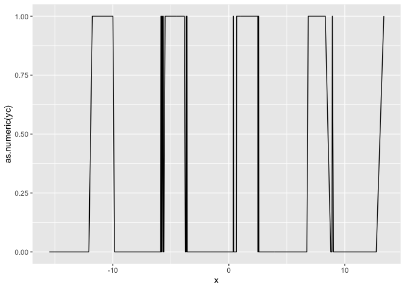
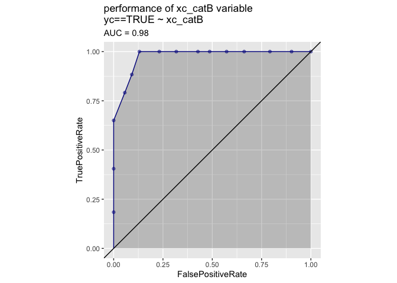
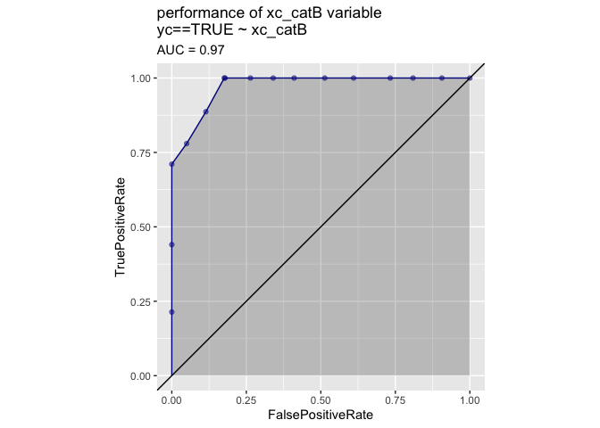
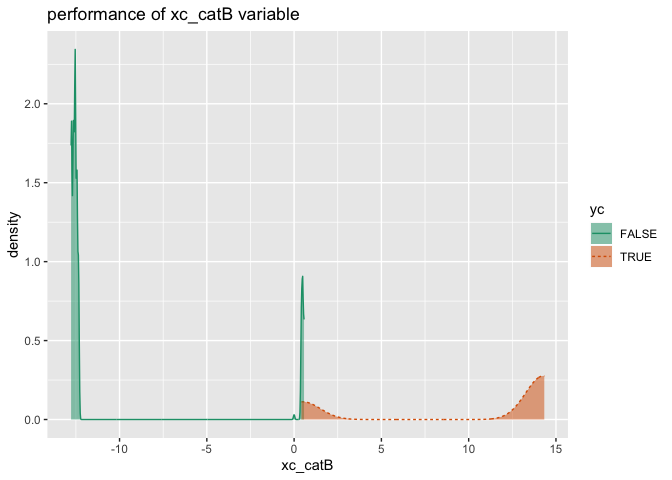
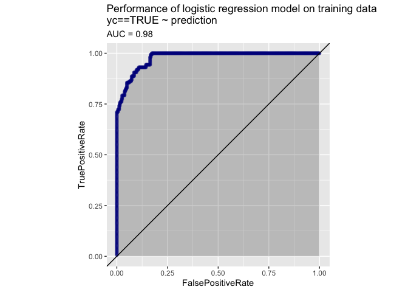

Classification Fit Transform Notation
================

# Using [vtreat](https://github.com/WinVector/vtreat) with Classification Problems

Nina Zumel and John Mount December 2019

Note this the “fit\_transform” variation (a notation closer to that used
in [`pyvtreat`](https://github.com/WinVector/pyvtreat)) of the
description of the [`R` version of
`vtreat`](https://github.com/WinVector/vtreat). The original `vtreat`
notation version can be found
[here](https://github.com/WinVector/vtreat/blob/master/Examples/Classification/Classification.md).
The same example for the [`Python` version of
`vtreat`](https://github.com/WinVector/pyvtreat) can be found
[here](https://github.com/WinVector/pyvtreat/blob/master/Examples/Classification/Classification.md).

## Preliminaries

Load modules/packages.

``` r
library(rqdatatable)
```

    ## Loading required package: rquery

``` r
library(vtreat)
suppressPackageStartupMessages(library(ggplot2))
library(WVPlots)
```

Generate example data.

  - `y` is a noisy sinusoidal function of the variable `x`
  - `yc` is the output to be predicted: whether `y` is \> 0.5.
  - Input `xc` is a categorical variable that represents a
    discretization of `y`, along some `NA`s
  - Input `x2` is a pure noise variable with no relationship to the
    output

<!-- end list -->

``` r
make_data <- function(nrows) {
    d <- data.frame(x = 5*rnorm(nrows))
    d['y'] = sin(d['x']) + 0.1*rnorm(n = nrows)
    d[4:10, 'x'] = NA                  # introduce NAs
    d['xc'] = paste0('level_', 5*round(d$y/5, 1))
    d['x2'] = rnorm(n = nrows)
    d[d['xc']=='level_-1', 'xc'] = NA  # introduce a NA level
    d['yc'] = d[['y']]>0.5
    return(d)
}

d = make_data(500)

d %.>%
  head(.) %.>%
  knitr::kable(.)
```

|          x |           y | xc          |          x2 | yc    |
| ---------: | ----------: | :---------- | ----------: | :---- |
|   6.302692 | \-0.1295796 | level\_0    |   0.4567776 | FALSE |
| \-1.492638 | \-1.0181135 | NA          |   0.6904050 | FALSE |
|   9.011422 |   0.2406594 | level\_0    |   2.1542995 | FALSE |
|         NA | \-0.5377555 | level\_-0.5 | \-0.1497430 | FALSE |
|         NA |   0.9582693 | level\_1    | \-0.9892123 | TRUE  |
|         NA | \-1.0622297 | NA          |   0.0241504 | FALSE |

### Some quick data exploration

Check how many levels `xc` has, and their distribution (including `NA`)

``` r
unique(d['xc'])
```

    ##           xc
    ## 1    level_0
    ## 2       <NA>
    ## 4 level_-0.5
    ## 5    level_1
    ## 8  level_0.5

``` r
table(d$xc, useNA = 'always')
```

    ## 
    ## level_-0.5    level_0  level_0.5    level_1       <NA> 
    ##         95         71        114        114        106

Find the mean value of `yc`

``` r
mean(d[['yc']])
```

    ## [1] 0.352

Plot of `yc` versus `x`.

``` r
ggplot(d, aes(x=x, y=as.numeric(yc))) + 
  geom_line()
```

    ## Warning: Removed 7 rows containing missing values (geom_path).

<!-- -->

## Build a transform appropriate for classification problems.

Now that we have the data, we want to treat it prior to modeling: we
want training data where all the input variables are numeric and have no
missing values or `NA`s.

First create the data treatment transform design object, in this case a
treatment for a binomial classification problem.

We use the training data `d` to fit the transform and the return a
treated training set: completely numeric, with no missing values.

``` r
transform_design = vtreat::BinomialOutcomeTreatment(
    var_list = setdiff(colnames(d), c('y', 'yc')),  # columns to transform
    outcome_name = 'yc',                            # outcome variable
    outcome_target = TRUE                           # outcome of interest
)

# learn transform from data
d_prepared <-  transform_design$fit_transform(d)

# get statistics on the variables
score_frame <- transform_design$score_frame()
score_frame$recommended <- score_frame$varMoves & (score_frame$sig < 1/nrow(score_frame))
```

Note that for the training data `d`: `transform_design$fit_transform(d)`
is **not** the same as `transform_design$fit(d)$transform(d)`; the
second call can lead to nested model bias in some situations, and is
**not** recommended. For other, later data, not seen during transform
design `transform_design$transform(o)` is an appropriate step.

Now examine the score frame, which gives information about each new
variable, including its type, which original variable it is derived
from, its (cross-validated) correlation with the outcome, and its
(cross-validated) significance as a one-variable linear model for the
outcome.

``` r
knitr::kable(score_frame)
```

| varName                        | varMoves |       rsq |       sig | needsSplit | extraModelDegrees | origName | code  | recommended |
| :----------------------------- | :------- | --------: | --------: | :--------- | ----------------: | :------- | :---- | :---------- |
| x                              | TRUE     | 0.0013210 | 0.3546032 | FALSE      |                 0 | x        | clean | FALSE       |
| x\_isBAD                       | TRUE     | 0.0002178 | 0.7070100 | FALSE      |                 0 | x        | isBAD | FALSE       |
| xc\_catP                       | TRUE     | 0.3915048 | 0.0000000 | TRUE       |                 4 | xc       | catP  | TRUE        |
| xc\_catB                       | TRUE     | 0.7542349 | 0.0000000 | TRUE       |                 4 | xc       | catB  | TRUE        |
| x2                             | TRUE     | 0.0000596 | 0.8440993 | FALSE      |                 0 | x2       | clean | FALSE       |
| xc\_lev\_NA                    | TRUE     | 0.1648922 | 0.0000000 | FALSE      |                 0 | xc       | lev   | TRUE        |
| xc\_lev\_x\_level\_minus\_0\_5 | TRUE     | 0.1451918 | 0.0000000 | FALSE      |                 0 | xc       | lev   | TRUE        |
| xc\_lev\_x\_level\_0           | TRUE     | 0.1045998 | 0.0000000 | FALSE      |                 0 | xc       | lev   | TRUE        |
| xc\_lev\_x\_level\_0\_5        | TRUE     | 0.0354874 | 0.0000016 | FALSE      |                 0 | xc       | lev   | TRUE        |
| xc\_lev\_x\_level\_1           | TRUE     | 0.4755162 | 0.0000000 | FALSE      |                 0 | xc       | lev   | TRUE        |

Note that the variable `xc` has been converted to multiple variables:

  - an indicator variable for each possible level (`xc_lev_*`)
  - the value of a (cross-validated) one-variable model for `yc` as a
    function of `xc` (`xc_catB`)
  - a variable that returns how prevalent this particular value of `xc`
    is in the training data (`xc_catP`)
  - a variable indicating when `xc` was `NA` in the original data
    (`xc_lev_NA` for categorical variables, `x_isBAD` for continuous
    variables).

Any or all of these new variables are available for downstream modeling.

The `recommended` column indicates which variables are non constant
(`varMoves` == TRUE) and have a significance value smaller than
`1/nrow(score_frame)`. See the section *Deriving the Default Thresholds*
below for the reasoning behind such a default threshold. Recommended
columns are intended as advice about which variables appear to be most
likely to be useful in a downstream model. This advice attempts to be
conservative, to reduce the possibility of mistakenly eliminating
variables that may in fact be useful (although, obviously, it can still
mistakenly eliminate variables that have a real but non-linear
relationship to the output, as is the case with `x`, in our example).

Let’s look at the variables that are and are not recommended:

``` r
# recommended variables
score_frame[score_frame[['recommended']], 'varName', drop = FALSE]  %.>%
  knitr::kable(.)
```

|    | varName                        |
| -- | :----------------------------- |
| 3  | xc\_catP                       |
| 4  | xc\_catB                       |
| 6  | xc\_lev\_NA                    |
| 7  | xc\_lev\_x\_level\_minus\_0\_5 |
| 8  | xc\_lev\_x\_level\_0           |
| 9  | xc\_lev\_x\_level\_0\_5        |
| 10 | xc\_lev\_x\_level\_1           |

``` r
# not recommended variables
score_frame[!score_frame[['recommended']], 'varName', drop = FALSE] %.>%
  knitr::kable(.)
```

|   | varName  |
| - | :------- |
| 1 | x        |
| 2 | x\_isBAD |
| 5 | x2       |

Notice that `d_prepared` only includes derived variables and the outcome
`y`:

``` r
d_prepared %.>%
  head(.) %.>%
  knitr::kable(.)
```

|           x | x\_isBAD |  xc\_catP |   xc\_catB |          x2 | xc\_lev\_NA | xc\_lev\_x\_level\_minus\_0\_5 | xc\_lev\_x\_level\_0 | xc\_lev\_x\_level\_0\_5 | xc\_lev\_x\_level\_1 | yc    |
| ----------: | -------: | --------: | ---------: | ----------: | ----------: | -----------------------------: | -------------------: | ----------------------: | -------------------: | :---- |
|   6.3026920 |        0 | 0.1381381 | \-12.42588 |   0.4567776 |           0 |                              0 |                    1 |                       0 |                    0 | FALSE |
| \-1.4926379 |        0 | 0.2102102 | \-12.84573 |   0.6904050 |           1 |                              0 |                    0 |                       0 |                    0 | FALSE |
|   9.0114217 |        0 | 0.1381381 | \-12.42588 |   2.1542995 |           0 |                              0 |                    1 |                       0 |                    0 | FALSE |
| \-0.1894789 |        1 | 0.1976048 | \-12.79540 | \-0.1497430 |           0 |                              1 |                    0 |                       0 |                    0 | FALSE |
|   0.3048341 |        1 | 0.2282282 |   14.15418 | \-0.9892123 |           0 |                              0 |                    0 |                       0 |                    1 | TRUE  |
|   0.3048341 |        1 | 0.2102102 | \-12.84573 |   0.0241504 |           1 |                              0 |                    0 |                       0 |                    0 | FALSE |

## A Closer Look at `catB` variables

Variables of type `catB` are the outputs of a one-variable regularized
logistic regression of a categorical variable (in our example, `xc`)
against the centered output on the (cross-validated) treated training
data.

Let’s see whether `xc_catB` makes a good one-variable model for `yc`. It
has a large AUC:

``` r
WVPlots::ROCPlot(
  frame = d_prepared,
  xvar = 'xc_catB',
  truthVar = 'yc',
  truthTarget = TRUE,
  title = 'performance of xc_catB variable')
```

<!-- -->

This indicates that `xc_catB` is strongly predictive of the outcome.
Negative values of `xc_catB` correspond strongly to negative outcomes,
and positive values correspond strongly to positive outcomes.

``` r
WVPlots::DoubleDensityPlot(
  frame = d_prepared,
  xvar = 'xc_catB',
  truthVar = 'yc',
  title = 'performance of xc_catB variable')
```

<!-- -->

The values of `xc_catB` are in “link space”.

Variables of type `catB` are useful when dealing with categorical
variables with a very large number of possible levels. For example, a
categorical variable with 10,000 possible values potentially converts to
10,000 indicator variables, which may be unwieldy for some modeling
methods. Using a single numerical variable of type `catB` may be a
preferable alternative.

## Using the Prepared Data in a Model

Of course, what we really want to do with the prepared training data is
to fit a model jointly with all the (recommended) variables. Let’s try
fitting a logistic regression model to `d_prepared`.

``` r
model_vars <- score_frame$varName[score_frame$recommended]
f <- wrapr::mk_formula('yc', model_vars, outcome_target = TRUE)

model = glm(f, data = d_prepared)

# now predict
d_prepared['prediction'] = predict(
  model,
  newdata = d_prepared, 
  type = 'response')
```

    ## Warning in predict.lm(object, newdata, se.fit, scale = 1, type = if (type == :
    ## prediction from a rank-deficient fit may be misleading

``` r
# look at the ROC curve (on the training data)
WVPlots::ROCPlot(
  frame = d_prepared,
  xvar = 'prediction',
  truthVar = 'yc',
  truthTarget = TRUE,
  title = 'Performance of logistic regression model on training data')
```

<!-- -->

Now apply the model to new data.

``` r
# create the new data
dtest <- make_data(450)

# prepare the new data with vtreat
dtest_prepared = transform_design$transform(dtest)

# apply the model to the prepared data
dtest_prepared['prediction'] = predict(
  model,
  newdata = dtest_prepared,
  type = 'response')
```

    ## Warning in predict.lm(object, newdata, se.fit, scale = 1, type = if (type == :
    ## prediction from a rank-deficient fit may be misleading

``` r
WVPlots::ROCPlot(
  frame = dtest_prepared,
  xvar = 'prediction',
  truthVar = 'yc',
  truthTarget = TRUE,
  title = 'Performance of logistic regression model on test data')
```

<!-- -->

## Parameters for `BinomialOutcomeTreatment`

We’ve tried to set the defaults for all parameters so that `vtreat` is
usable out of the box for most applications.

``` r
classification_parameters()
```

    ## $minFraction
    ## [1] 0.02
    ## 
    ## $smFactor
    ## [1] 0
    ## 
    ## $rareCount
    ## [1] 0
    ## 
    ## $rareSig
    ## NULL
    ## 
    ## $collarProb
    ## [1] 0
    ## 
    ## $codeRestriction
    ## NULL
    ## 
    ## $customCoders
    ## NULL
    ## 
    ## $splitFunction
    ## NULL
    ## 
    ## $ncross
    ## [1] 3
    ## 
    ## $forceSplit
    ## [1] FALSE
    ## 
    ## $catScaling
    ## [1] TRUE
    ## 
    ## $verbose
    ## [1] FALSE
    ## 
    ## $use_parallel
    ## [1] TRUE
    ## 
    ## $missingness_imputation
    ## NULL
    ## 
    ## $pruneSig
    ## NULL
    ## 
    ## $scale
    ## [1] FALSE
    ## 
    ## $doCollar
    ## [1] FALSE
    ## 
    ## $varRestriction
    ## NULL
    ## 
    ## $trackedValues
    ## NULL
    ## 
    ## attr(,"class")
    ## [1] "classification_parameters"

Some parameters of note include:

**codeRestriction**: The types of synthetic variables that `vtreat` will
(potentially) produce. See *Types of prepared variables* below.

**minFraction**: For categorical variables, indicator variables (type
`indicator_code`) are only produced for levels that are present at least
`minFraction` of the time. A consequence of this is that 1/`minFraction`
is the maximum number of indicators that will be produced for a given
categorical variable. To make sure that *all* possible indicator
variables are produced, set `minFraction = 0`

**splitFunction**: The cross validation method used by `vtreat`. Most
people won’t have to change this.

**ncross**: The number of folds to use for cross-validation

**customCoders**: For passing in user-defined transforms for custom data
preparation. Won’t be needed in most situations, but see
[here](http://www.win-vector.com/blog/2017/09/custom-level-coding-in-vtreat/)
for an example of applying a GAM transform to input variables.

## Types of prepared variables

**clean**: Produced from numerical variables: a clean numerical variable
with no `NAs` or missing values

**lev**: Produced from categorical variables, one for each (common)
level: for each level of the variable, indicates if that level was “on”

**catP**: Produced from categorical variables: indicates how often each
level of the variable was “on”

**catB**: Produced from categorical variables: score from a
one-dimensional model of the centered output as a function of the
variable

**is\_BAD**: Produced for both numerical and categorical variables: an
indicator variable that marks when the original variable was missing or
`NaN`.

More on the coding types can be found
[here](https://winvector.github.io/vtreat/articles/vtreatVariableTypes.html).

## Deriving the Default Thresholds

While machine learning algorithms are generally tolerant to a reasonable
number of irrelevant or noise variables, too many irrelevant variables
can lead to serious overfit; see [this
article](http://www.win-vector.com/blog/2014/02/bad-bayes-an-example-of-why-you-need-hold-out-testing/)
for an extreme example, one we call “Bad Bayes”. The default threshold
is an attempt to eliminate obviously irrelevant variables early.

Imagine that you have a pure noise dataset, where none of the *n* inputs
are related to the output. If you treat each variable as a one-variable
model for the output, and look at the significances of each model, these
significance-values will be uniformly distributed in the range \[0:1\].
You want to pick a weakest possible significance threshold that
eliminates as many noise variables as possible. A moment’s thought
should convince you that a threshold of *1/n* allows only one variable
through, in expectation. This leads to the general-case heuristic that a
significance threshold of *1/n* on your variables should allow only one
irrelevant variable through, in expectation (along with all the relevant
variables). Hence, *1/n* used to be our recommended threshold, when we
developed the R version of `vtreat`.

As noted above, because `vtreat` estimates variable significances using
linear methods by default, some variables with a non-linear relationship
to the output may fail to pass the threshold. So it may make sense for
the data scientist to filter (or not) as they will.

The variables can be appraised in a non-linear fashion as follows:

``` r
d %.>%
  value_variables_C(dframe = .,
                  varlist = setdiff(colnames(.), c('y', 'yc')), 
                  outcomename = 'yc',
                  outcometarget = TRUE) %.>%
  knitr::kable(.)
```

|         rsq | count |       sig | var |
| ----------: | ----: | --------: | :-- |
| 0.001321023 |     2 | 0.7092064 | x   |
| 0.001335232 |     3 | 1.0000000 | x2  |
| 0.755567579 |     2 | 0.0000000 | xc  |

More on non-linear variable scoring can be found
[here](https://cran.r-project.org/web/packages/vtreat/vignettes/VariableImportance.html).

## Conclusion

In all cases (classification, regression, unsupervised, and multinomial
classification) the intent is that `vtreat` transforms are essentially
one liners.

The preparation commands are organized as follows:

  - **Regression**: [`R` regression
    example](https://github.com/WinVector/vtreat/blob/master/Examples/Regression/Regression.md),
    [`Python` regression
    example](https://github.com/WinVector/pyvtreat/blob/master/Examples/Regression/Regression.md).
  - **Classification**: [`R` classification
    example](https://github.com/WinVector/vtreat/blob/master/Examples/Classification/Classification.md),
    [`Python` classification
    example](https://github.com/WinVector/pyvtreat/blob/master/Examples/Classification/Classification.md).
  - **Unsupervised tasks**: [`R` unsupervised
    example](https://github.com/WinVector/vtreat/blob/master/Examples/Unsupervised/Unsupervised.md),
    [`Python` unsupervised
    example](https://github.com/WinVector/pyvtreat/blob/master/Examples/Unsupervised/Unsupervised.md).
  - **Multinomial classification**: [`R` multinomial classification
    example](https://github.com/WinVector/vtreat/blob/master/Examples/Multinomial/MultinomialExample.md),
    [`Python` multinomial classification
    example](https://github.com/WinVector/pyvtreat/blob/master/Examples/Multinomial/MultinomialExample.md).

These current revisions of the examples are designed to be small, yet
complete. So as a set they have some overlap, but the user can rely
mostly on a single example for a single task type.
