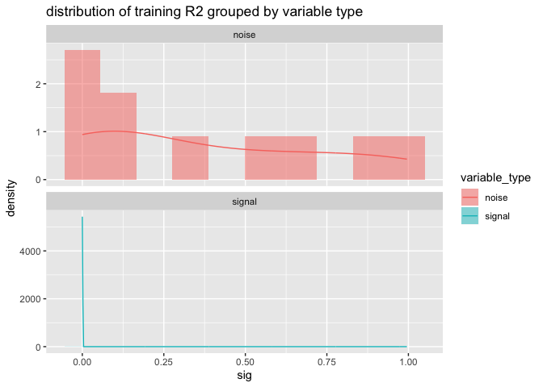
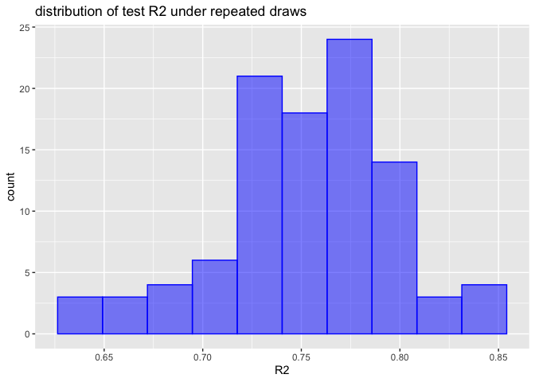

CrossFrameExample
================

The `vtreat` step from [“Cross-Methods are a Leak/Variance
Trade-Off”](https://github.com/WinVector/pyvtreat/blob/master/Examples/CrossVal/LeakTradeOff/CrossFrameExample.ipynb)
re-worked in `R`.

For the purpose of each of these steps, please refer to the [original
article](https://github.com/WinVector/pyvtreat/blob/master/Examples/CrossVal/LeakTradeOff/CrossFrameExample.ipynb),
the purpose of this note is to show the related `vtreat` steps in `R`
(and how similar they are to the `Python` steps).

``` r
# https://CRAN.R-project.org/package=wrapr
library(wrapr)

# https://CRAN.R-project.org/package=vtreat
library(vtreat)

# https://github.com/WinVector/vtreat/blob/master/Examples/CrossVal/LeakTradeOff/break_cross_val.R
source("break_cross_val.R")

# https://CRAN.R-project.org/package=ggplot2
library(ggplot2)
```

``` r
set.seed(2020)
```

``` r
unpack[
  d_example_s = d, 
  y_example_s = y
  ] <- mk_data(
    nrow = 100,
    n_noise_var = 10,
    n_noise_level = 50,
    n_signal_var = 5)

d_example_s$y <- y_example_s
```

``` r
d_example_s %.>%
  head(.) %.>%
  knitr::kable(.)
```

| const\_col | noise\_1 | noise\_2 | noise\_3 | noise\_4 | noise\_5 | noise\_6 | noise\_7 | noise\_8 | noise\_9 | noise\_10 | signal\_1 | signal\_2 | signal\_3 | signal\_4 | signal\_5 |           y |
| :--------- | :------- | :------- | :------- | :------- | :------- | :------- | :------- | :------- | :------- | :-------- | :-------- | :-------- | :-------- | :-------- | :-------- | ----------: |
| a          | nl\_41   | nl\_9    | nl\_19   | nl\_4    | nl\_21   | nl\_26   | nl\_12   | nl\_20   | nl\_19   | nl\_49    | a         | b         | a         | b         | a         |   1.3769721 |
| a          | nl\_37   | nl\_28   | nl\_21   | nl\_16   | nl\_48   | nl\_31   | nl\_24   | nl\_12   | nl\_13   | nl\_10    | a         | b         | b         | b         | a         | \-0.6984516 |
| a          | nl\_3    | nl\_48   | nl\_22   | nl\_9    | nl\_25   | nl\_14   | nl\_24   | nl\_8    | nl\_24   | nl\_19    | b         | b         | a         | a         | a         | \-0.0980232 |
| a          | nl\_26   | nl\_50   | nl\_15   | nl\_8    | nl\_4    | nl\_38   | nl\_15   | nl\_10   | nl\_13   | nl\_47    | b         | b         | a         | b         | a         | \-2.1304059 |
| a          | nl\_1    | nl\_1    | nl\_24   | nl\_3    | nl\_36   | nl\_35   | nl\_48   | nl\_44   | nl\_18   | nl\_48    | a         | b         | a         | a         | a         |   0.2034657 |
| a          | nl\_29   | nl\_45   | nl\_6    | nl\_36   | nl\_30   | nl\_34   | nl\_48   | nl\_5    | nl\_31   | nl\_50    | b         | a         | a         | a         | a         |   3.7205735 |

``` r
# https://github.com/WinVector/vtreat/blob/master/Examples/Regression/Regression_FP.md

vtreat_coder <- vtreat::NumericOutcomeTreatment(
  var_list = setdiff(colnames(d_example_s), 'y'),  # columns to transform
  outcome_name = 'y',  # outcome variable,
  params = vtreat::regression_parameters(
    list(
      codeRestriction = 'catN'
    ))
)

unpack[
  treatment_plan = treatments,
  vtreat_cross_frame = cross_frame
  ] <- fit_prepare(
    vtreat_coder, 
    d_example_s)
```

``` r
# the frame of cross-encoded variables
vtreat_cross_frame %.>%
  head(.) %.>%
  knitr::kable(.)
```

| noise\_1\_catN | noise\_2\_catN | noise\_3\_catN | noise\_4\_catN | noise\_5\_catN | noise\_6\_catN | noise\_7\_catN | noise\_8\_catN | noise\_9\_catN | noise\_10\_catN | signal\_1\_catN | signal\_2\_catN | signal\_3\_catN | signal\_4\_catN | signal\_5\_catN |           y |
| -------------: | -------------: | -------------: | -------------: | -------------: | -------------: | -------------: | -------------: | -------------: | --------------: | --------------: | --------------: | --------------: | --------------: | --------------: | ----------: |
|    \-0.3214253 |      1.0415596 |      1.7815693 |      2.9740964 |       0.000000 |      0.1010524 |      1.3516706 |      1.2807063 |      1.2391478 |       1.6621820 |       1.0819638 |     \-0.7295630 |       1.2060911 |      \-1.352016 |        1.213655 |   1.3769721 |
|      0.0000000 |    \-3.1554344 |      0.4950938 |      0.7455189 |       2.891602 |      1.5079800 |      1.0151562 |      0.0000000 |    \-2.2593076 |     \-0.9080161 |       1.0819638 |     \-0.7295630 |     \-1.7868016 |      \-1.352016 |        1.213655 | \-0.6984516 |
|      0.0000000 |      2.2768885 |      1.4139904 |    \-1.8097173 |       0.000000 |      0.9623809 |      0.7103255 |    \-4.1617870 |    \-1.5490854 |     \-1.5106549 |     \-1.0834095 |     \-0.9185477 |       1.3547574 |        1.007801 |        1.064116 | \-0.0980232 |
|      0.0000000 |      2.6122169 |    \-1.8652196 |    \-1.8652196 |     \-1.548588 |      1.4135334 |    \-0.0729384 |      2.2679172 |    \-2.4000700 |     \-0.7992490 |     \-0.9909623 |     \-0.8983524 |       0.9164436 |      \-1.061076 |        1.237113 | \-2.1304059 |
|    \-0.0003308 |    \-0.7406378 |    \-0.1044916 |      2.9893841 |       0.000000 |      0.8673810 |      3.0696999 |      0.0000000 |      0.0000000 |       0.0000000 |       0.9326704 |     \-0.8983524 |       0.9164436 |        1.127394 |        1.237113 |   0.2034657 |
|    \-0.8294723 |    \-1.1592939 |      0.7993540 |    \-1.6306551 |       0.000000 |      1.0415596 |      1.2223115 |    \-0.9625074 |    \-0.4072366 |       0.6629259 |     \-0.9892241 |       0.7979596 |       1.2060911 |        1.031802 |        1.213655 |   3.7205735 |

``` r
# the per-variable score frame
cols_to_display <- c('varName', 'origName', 'rsq', 'sig', 'code', 'default_threshold', 'recommended')

sf <- treatment_plan$get_score_frame()

knitr::kable(sf[, cols_to_display, drop = FALSE])
```

| varName         | origName  |       rsq |       sig | code | default\_threshold | recommended |
| :-------------- | :-------- | --------: | --------: | :--- | -----------------: | :---------- |
| noise\_1\_catN  | noise\_1  | 0.0342913 | 0.0651107 | catN |         0.06666667 | TRUE        |
| noise\_2\_catN  | noise\_2  | 0.0567997 | 0.0169486 | catN |         0.06666667 | TRUE        |
| noise\_3\_catN  | noise\_3  | 0.0000003 | 0.9954707 | catN |         0.06666667 | FALSE       |
| noise\_4\_catN  | noise\_4  | 0.0528154 | 0.0214400 | catN |         0.06666667 | TRUE        |
| noise\_5\_catN  | noise\_5  | 0.0096405 | 0.3311169 | catN |         0.06666667 | FALSE       |
| noise\_6\_catN  | noise\_6  | 0.0039827 | 0.5327753 | catN |         0.06666667 | FALSE       |
| noise\_7\_catN  | noise\_7  | 0.0019666 | 0.6613139 | catN |         0.06666667 | FALSE       |
| noise\_8\_catN  | noise\_8  | 0.0199315 | 0.1611937 | catN |         0.06666667 | FALSE       |
| noise\_9\_catN  | noise\_9  | 0.0001868 | 0.8926358 | catN |         0.06666667 | FALSE       |
| noise\_10\_catN | noise\_10 | 0.0791784 | 0.0045678 | catN |         0.06666667 | TRUE        |
| signal\_1\_catN | signal\_1 | 0.1423996 | 0.0001087 | catN |         0.06666667 | TRUE        |
| signal\_2\_catN | signal\_2 | 0.1012952 | 0.0012509 | catN |         0.06666667 | TRUE        |
| signal\_3\_catN | signal\_3 | 0.2028512 | 0.0000026 | catN |         0.06666667 | TRUE        |
| signal\_4\_catN | signal\_4 | 0.1612194 | 0.0000347 | catN |         0.06666667 | TRUE        |
| signal\_5\_catN | signal\_5 | 0.1993979 | 0.0000032 | catN |         0.06666667 | TRUE        |

``` r
# show conditional distribution of estimated significances

sf$variable_type = gsub("_.*$", "", sf$origName)

ggplot(data = sf,
       aes(x = sig, fill = variable_type)) +
  geom_histogram(aes(y = ..density..), bins = 10, alpha = 0.5) + 
  geom_line(aes(y = ..density.., color = variable_type), stat = 'density') + 
  facet_wrap( ~ variable_type, ncol = 1, scale = 'free_y') +
  ggtitle("distribution of training R2 grouped by variable type")
```

<!-- -->

``` r
# using the re-encoded data in an lm
formula <- wrapr::mk_formula(
  'y', 
  setdiff(colnames(vtreat_cross_frame), 'y'))
print(formula)
```

    ## y ~ noise_1_catN + noise_2_catN + noise_3_catN + noise_4_catN + 
    ##     noise_5_catN + noise_6_catN + noise_7_catN + noise_8_catN + 
    ##     noise_9_catN + noise_10_catN + signal_1_catN + signal_2_catN + 
    ##     signal_3_catN + signal_4_catN + signal_5_catN
    ## <environment: base>

``` r
good_fit <- lm(formula, vtreat_cross_frame)
summary(good_fit)
```

    ## 
    ## Call:
    ## lm(formula = formula, data = vtreat_cross_frame)
    ## 
    ## Residuals:
    ##     Min      1Q  Median      3Q     Max 
    ## -3.6862 -0.4922  0.0623  0.7192  2.3970 
    ## 
    ## Coefficients:
    ##                Estimate Std. Error t value Pr(>|t|)    
    ## (Intercept)    0.396635   0.118691   3.342  0.00124 ** 
    ## noise_1_catN   0.026185   0.091153   0.287  0.77462    
    ## noise_2_catN  -0.008990   0.079528  -0.113  0.91027    
    ## noise_3_catN   0.058069   0.074728   0.777  0.43930    
    ## noise_4_catN  -0.009163   0.065700  -0.139  0.88942    
    ## noise_5_catN   0.108580   0.077282   1.405  0.16372    
    ## noise_6_catN   0.104138   0.060178   1.730  0.08721 .  
    ## noise_7_catN  -0.089384   0.071534  -1.250  0.21494    
    ## noise_8_catN   0.159752   0.067737   2.358  0.02067 *  
    ## noise_9_catN   0.021987   0.059374   0.370  0.71208    
    ## noise_10_catN -0.155359   0.082771  -1.877  0.06399 .  
    ## signal_1_catN  1.192121   0.122969   9.694 2.38e-15 ***
    ## signal_2_catN  1.339228   0.143098   9.359 1.12e-14 ***
    ## signal_3_catN  0.784723   0.092979   8.440 7.96e-13 ***
    ## signal_4_catN  0.851139   0.111055   7.664 2.84e-11 ***
    ## signal_5_catN  0.814162   0.098251   8.287 1.62e-12 ***
    ## ---
    ## Signif. codes:  0 '***' 0.001 '**' 0.01 '*' 0.05 '.' 0.1 ' ' 1
    ## 
    ## Residual standard error: 1.15 on 84 degrees of freedom
    ## Multiple R-squared:  0.8359, Adjusted R-squared:  0.8066 
    ## F-statistic: 28.53 on 15 and 84 DF,  p-value: < 2.2e-16

``` r
f <- function(...) {
  unpack[
    d_test_s = d, 
    y_test_s = y] <- mk_data(
      nrow=100,
      n_noise_var=10,
      n_noise_level=50,
      n_signal_var=5)
  
  vtreat_test_frame <- prepare(
    treatment_plan,
    d_test_s)
  vtreat_test_frame$y <- y_test_s
  vtreat_test_frame$pred <- predict(
    good_fit, 
    newdata = vtreat_test_frame)
  return(sigr::wrapFTest(vtreat_test_frame, 'pred', 'y')$R2)
}


# the array of R-squared for the repeated tests
test_r2 = vapply(seq_len(100), f, numeric(1))
```

``` r
df = data.frame(R2 = test_r2)

ggplot(data = df, aes(x = R2)) +
  geom_histogram(aes(y = ..density..), bins = 10, fill = 'blue', alpha = 0.5) + 
  geom_line(aes(y = ..density..), stat = 'density', color = 'blue') + 
  ggtitle('distribution of test R2 under repeated draws')
```

<!-- -->
