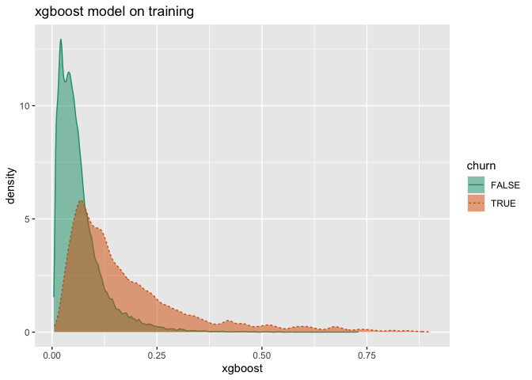
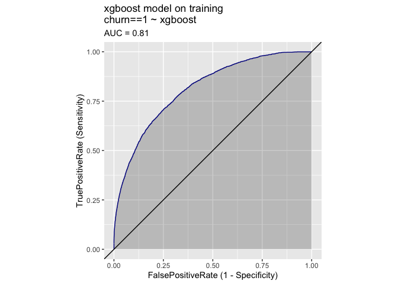
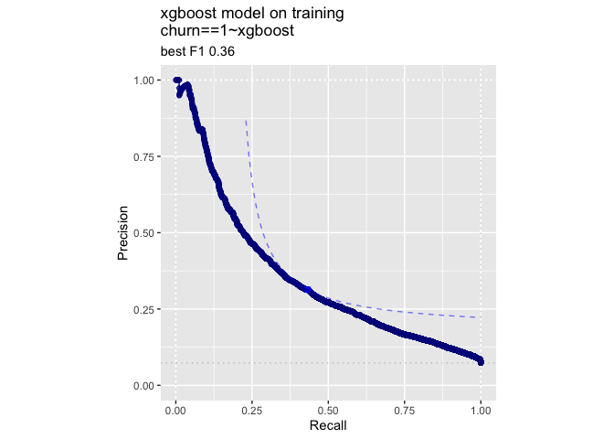
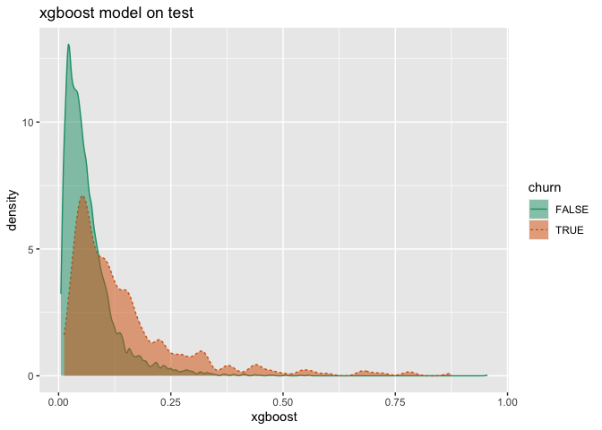
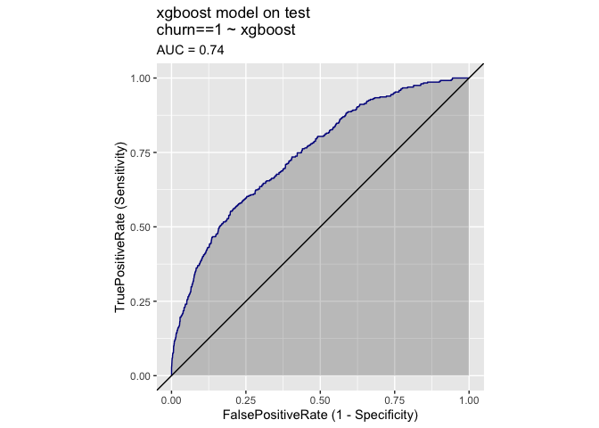
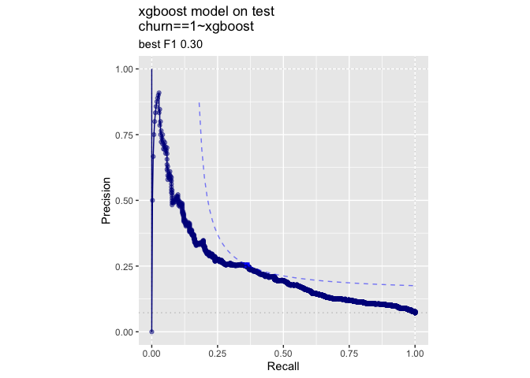
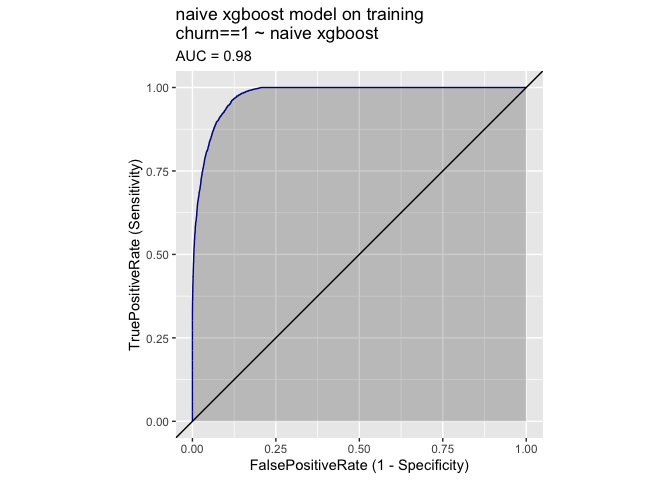

KDD2009Example
================

Load packages

``` r
#load some libraries
library('vtreat')
```

    ## Loading required package: wrapr

``` r
library('WVPlots') 
library('sigr')
library('parallel')
library('xgboost')
```

Read in explanatory variables

``` r
d <- read.table('orange_small_train.data.gz',  
   header = TRUE,
   sep = '\t',
   na.strings = c('NA', ''))    
```

Read in dependent variables we are trying to predict

``` r
churn <- read.table('orange_small_train_churn.labels.txt',
   header = FALSE, sep = '\t')
colnames(churn) <- "churn"

d$churn = churn$churn

table(d$churn)
```

    ## 
    ##    -1     1 
    ## 46328  3672

Arrange test/train split. The reported performance runs of this example
were sensitive to the prevalance of the churn variable in the test set,
so we are cutting down on this source of evaluation variance by using a
stratified split.

``` r
set.seed(729375)    

plan <- kWayStratifiedY(nrow(d), 10, d, d["churn"])

# use the first fold as our test/train split
fold1 <- plan[[1]]
train_idx <- fold1$train # training set indices
test_idx <- fold1$app 

d_train <- d[train_idx, , drop = FALSE]
d_test <- d[test_idx, , drop = FALSE]
                                                
outcome <- 'churn' 
vars <- setdiff(colnames(d_train), outcome)
```

Try to use xgboost without data treatment. This fails.

``` r
model <- xgboost(data = as.matrix(d_train[, vars, drop = FALSE]),
                 label = d_train[[outcome]],
                 nrounds = 10,
                 params = list(objective = "binary:logistic"))
```

    ## Error in xgb.DMatrix(data, label = label, missing = missing): 'data' has class 'character' and length 10350000.
    ##   'data' accepts either a numeric matrix or a single filename.

Even if you fix this, you run into missing values, overly large
categoricals, etc.

``` r
dim(d_train)
```

    ## [1] 45000   231

``` r
# count the number of missing values in each column
nNAs <- vapply(d_train[, vars],
              function(v) sum(is.na(v)),
              numeric(1))
summary(nNAs)
```

    ##    Min. 1st Qu.  Median    Mean 3rd Qu.    Max. 
    ##       0    4989   43651   31399   44370   45000

``` r
is_categorical <- vapply(d_train[, vars],
                         function(v) !is.numeric(v),
                         logical(1))
                        
# count the number of levels in each categorical column
nlevels <- vapply(d_train[, is_categorical],
                  function(v) length(unique(v)),
                  numeric(1))
summary(nlevels)
```

    ##    Min. 1st Qu.  Median    Mean 3rd Qu.    Max. 
    ##       1       1       4    1209      35   14455

Use `vtreat` to prepare a clean data frame
------------------------------------------

The correct way, with cross-validated training data to avoid
nested-model bias.

``` r
yTarget <- 1

# not strictly necessary, just for speed
ncore <- parallel::detectCores()
cl <- parallel::makeCluster(ncore)

# fit the treatment plan and construct new
# treated training data
unpack[
  transform = treatments, # treatment plan
  d_prepared = crossFrame # treated training data
  ] <-  mkCrossFrameCExperiment(d_train,
                              vars,
                              outcomename=outcome,
                              outcometarge=yTarget,
                              parallelCluster=cl)
```

    ## [1] "vtreat 1.6.2 start initial treatment design Sat Oct 31 12:38:38 2020"
    ## [1] " start cross frame work Sat Oct 31 12:39:30 2020"
    ## [1] " vtreat::mkCrossFrameCExperiment done Sat Oct 31 12:40:03 2020"

``` r
scoreFrame <- transform$scoreFrame
# count the number of different types of synthetic variables
table(scoreFrame$code)
```

    ## 
    ##  catB  catP clean isBAD   lev 
    ##    33    33   173   171   136

``` r
selvars <- scoreFrame$varName

# training data
treatedTrainM <- d_prepared[,c(outcome,selvars),drop=FALSE]
# change the outcome to boolean
treatedTrainM[[outcome]] = treatedTrainM[[outcome]]==yTarget

# use the treatment plan to prepare the holdout data
treatedTest <- prepare(transform,
                      d_test,
                      parallelCluster=cl)
treatedTest[[outcome]] = treatedTest[[outcome]]==yTarget

# prepare plotting frames
treatedTrainP = treatedTrainM[, outcome, drop=FALSE]
treatedTestP = treatedTest[, outcome, drop=FALSE]
```

Note that the prepared data is all numeric with no missing variables.

``` r
# count the number of missing values in each column
nNAs <- vapply(treatedTrainM[, selvars],
              function(v) sum(is.na(v)),
              numeric(1))
summary(nNAs)
```

    ##    Min. 1st Qu.  Median    Mean 3rd Qu.    Max. 
    ##       0       0       0       0       0       0

``` r
is_categorical <- vapply(treatedTrainM[, selvars],
                         function(v) !is.numeric(v),
                         logical(1))
sum(is_categorical)
```

    ## [1] 0

Train the model
---------------

First, use only the recommended variables

``` r
nrow(scoreFrame) # total number of synthetic variables
```

    ## [1] 546

``` r
model_vars <- scoreFrame$varName[scoreFrame$recommended]
length(model_vars)
```

    ## [1] 241

Now fit the model.

``` r
mname = 'xgboost'
print(paste(mname,length(model_vars)))
```

    ## [1] "xgboost 241"

``` r
params <- list(max_depth = 5, 
              objective = "binary:logistic",
              nthread = ncore)

# cross-val to determine a good number of trees
model <- xgb.cv(data = as.matrix(treatedTrainM[, model_vars, drop = FALSE]),
                label = treatedTrainM[[outcome]],
                nrounds = 400,
                params = params,
                nfold = 5,
                early_stopping_rounds = 10,
                eval_metric = "logloss")
```

    ## [1]  train-logloss:0.503498+0.000599 test-logloss:0.504243+0.001283 
    ## Multiple eval metrics are present. Will use test_logloss for early stopping.
    ## Will train until test_logloss hasn't improved in 10 rounds.
    ## 
    ## [2]  train-logloss:0.400921+0.000969 test-logloss:0.402367+0.002096 
    ## [3]  train-logloss:0.339210+0.001054 test-logloss:0.341644+0.002953 
    ## [4]  train-logloss:0.300353+0.001269 test-logloss:0.303767+0.003580 
    ## [5]  train-logloss:0.275193+0.001353 test-logloss:0.279416+0.004239 
    ## [6]  train-logloss:0.258570+0.001416 test-logloss:0.264020+0.004690 
    ## [7]  train-logloss:0.247493+0.001663 test-logloss:0.254050+0.005111 
    ## [8]  train-logloss:0.239929+0.001543 test-logloss:0.247630+0.005650 
    ## [9]  train-logloss:0.234523+0.001503 test-logloss:0.243457+0.005940 
    ## [10] train-logloss:0.230602+0.001442 test-logloss:0.240882+0.006321 
    ## [11] train-logloss:0.227488+0.001402 test-logloss:0.238963+0.006605 
    ## [12] train-logloss:0.224846+0.001412 test-logloss:0.237905+0.006657 
    ## [13] train-logloss:0.222666+0.001562 test-logloss:0.237205+0.006759 
    ## [14] train-logloss:0.220568+0.001522 test-logloss:0.236592+0.007079 
    ## [15] train-logloss:0.218848+0.001715 test-logloss:0.236225+0.007098 
    ## [16] train-logloss:0.217135+0.001854 test-logloss:0.236136+0.007203 
    ## [17] train-logloss:0.215687+0.001831 test-logloss:0.236058+0.007321 
    ## [18] train-logloss:0.214166+0.001730 test-logloss:0.236091+0.007534 
    ## [19] train-logloss:0.212856+0.001717 test-logloss:0.236157+0.007494 
    ## [20] train-logloss:0.211784+0.001629 test-logloss:0.235991+0.007680 
    ## [21] train-logloss:0.210554+0.001614 test-logloss:0.235943+0.007619 
    ## [22] train-logloss:0.209399+0.001528 test-logloss:0.235988+0.007783 
    ## [23] train-logloss:0.208375+0.001650 test-logloss:0.236022+0.007962 
    ## [24] train-logloss:0.207492+0.001610 test-logloss:0.236024+0.008047 
    ## [25] train-logloss:0.206567+0.001389 test-logloss:0.236176+0.008067 
    ## [26] train-logloss:0.205657+0.001511 test-logloss:0.236259+0.008083 
    ## [27] train-logloss:0.204670+0.001556 test-logloss:0.236395+0.008024 
    ## [28] train-logloss:0.203835+0.001764 test-logloss:0.236473+0.008116 
    ## [29] train-logloss:0.203150+0.001777 test-logloss:0.236632+0.008009 
    ## [30] train-logloss:0.202262+0.002178 test-logloss:0.236746+0.008136 
    ## [31] train-logloss:0.201510+0.002352 test-logloss:0.236816+0.008101 
    ## Stopping. Best iteration:
    ## [21] train-logloss:0.210554+0.001614 test-logloss:0.235943+0.007619

``` r
nrounds <- model$best_iteration
print(paste("nrounds", nrounds))
```

    ## [1] "nrounds 21"

``` r
# fit the model
model <- xgboost(data = as.matrix(treatedTrainM[, model_vars, drop = FALSE]),
                 label = treatedTrainM[[outcome]],
                 nrounds = nrounds,
                 params = params)
```

    ## [1]  train-error:0.072422 
    ## [2]  train-error:0.072600 
    ## [3]  train-error:0.072622 
    ## [4]  train-error:0.072467 
    ## [5]  train-error:0.072511 
    ## [6]  train-error:0.072467 
    ## [7]  train-error:0.071911 
    ## [8]  train-error:0.072089 
    ## [9]  train-error:0.071844 
    ## [10] train-error:0.071778 
    ## [11] train-error:0.071822 
    ## [12] train-error:0.071711 
    ## [13] train-error:0.071222 
    ## [14] train-error:0.070956 
    ## [15] train-error:0.070822 
    ## [16] train-error:0.070378 
    ## [17] train-error:0.070089 
    ## [18] train-error:0.070178 
    ## [19] train-error:0.070000 
    ## [20] train-error:0.070044 
    ## [21] train-error:0.069911

Get predictions on training and test data.

``` r
treatedTrainP[[mname]] = predict(
  model, 
  newdata = as.matrix(treatedTrainM[, model_vars, drop = FALSE]), 
  n.trees = nTrees,
  type = 'response')

treatedTestP[[mname]] = predict(
  model,
  newdata = as.matrix(treatedTest[, model_vars, drop = FALSE]), 
  n.trees = nTrees,
  type = "response")
```

``` r
calcAUC(treatedTestP[[mname]], treatedTestP[[outcome]]==yTarget)
```

    ## [1] 0.7433086

``` r
permTestAUC(treatedTestP, mname, outcome, yTarget = yTarget)
```

    ## [1] "AUC test alt. hyp. AUC>AUC(permuted): (AUC=0.7433, s.d.=0.01772, p<1e-05)."

``` r
wrapChiSqTest(treatedTestP, mname, outcome, yTarget = yTarget)
```

    ## [1] "Chi-Square Test summary: pseudo-R2=0.1159 (X2(1,N=5000)=301, p<1e-05)."

``` r
t1 = paste(mname,'model on training')
print(DoubleDensityPlot(treatedTrainP, mname, outcome, 
                        title=t1))
```

<!-- -->

``` r
print(ROCPlot(treatedTrainP, mname, outcome, yTarget,
              title=t1))
```

<!-- -->

``` r
print(WVPlots::PRPlot(treatedTrainP, mname, outcome, yTarget,
              title=t1))
```

<!-- -->

``` r
t2 = paste(mname,'model on test')
print(DoubleDensityPlot(treatedTestP, mname, outcome, 
                        title=t2))
```

<!-- -->

``` r
print(ROCPlot(treatedTestP, mname, outcome, yTarget,
              title=t2))
```

<!-- -->

``` r
print(WVPlots::PRPlot(treatedTestP, mname, outcome, yTarget,
              title=t2))
```

<!-- -->

Save predictions.

``` r
saveRDS(
  list(train_p = treatedTrainP, test_p = treatedTestP),
  file = 'predictions.RDS')
```

vtreat\` used incorrectly
-------------------------

What happens if you don’t account for nested model bias. Don’t do this!

``` r
# fit the treatment plan from the training data
# without creating cross-validated training data
transform <- designTreatmentsC(d_train,
                              vars,
                              outcomename=outcome,
                              outcometarge=yTarget,
                              parallelCluster=cl)
```

    ## [1] "vtreat 1.6.2 inspecting inputs Sat Oct 31 12:41:19 2020"
    ## [1] "designing treatments Sat Oct 31 12:41:19 2020"
    ## [1] " have initial level statistics Sat Oct 31 12:41:21 2020"
    ## [1] " scoring treatments Sat Oct 31 12:41:35 2020"
    ## [1] "have treatment plan Sat Oct 31 12:41:51 2020"
    ## [1] "rescoring complex variables Sat Oct 31 12:41:51 2020"
    ## [1] "done rescoring complex variables Sat Oct 31 12:42:10 2020"

``` r
# use the treatment plan to treat the treated data directly
# (this is the incorrect step)
d_prepared = prepare(transform, d_train, parallelCluster=cl)
```

    ## Warning in prepare.treatmentplan(transform, d_train, parallelCluster =
    ## cl): possibly called prepare() on same data frame as designTreatments*()/
    ## mkCrossFrame*Experiment(), this can lead to over-fit. To avoid this, please use
    ## mkCrossFrame*Experiment$crossFrame.

``` r
scoreFrame <- transform$scoreFrame
selvars <- scoreFrame$varName

# training data
treatedTrainM <- d_prepared[,c(outcome,selvars),drop=FALSE]
# change the outcome to boolean
treatedTrainM[[outcome]] = treatedTrainM[[outcome]]==yTarget

# use the treatment plan to prepare the holdout data
treatedTest <- prepare(transform,
                      d_test,
                      parallelCluster=cl)
treatedTest[[outcome]] = treatedTest[[outcome]]==yTarget

# prepare plotting frames
treatedTrainP = treatedTrainM[, outcome, drop=FALSE]
treatedTestP = treatedTest[, outcome, drop=FALSE]

# get recommended variables
model_vars <- scoreFrame$varName[scoreFrame$recommended]
```

Fit the model.

``` r
mname = 'naive xgboost'
print(paste(mname,length(model_vars)))
```

    ## [1] "naive xgboost 239"

``` r
params <- list(max_depth = 5, 
              objective = "binary:logistic",
              nthread = ncore)

# cross-val to determine a good number of trees
model <- xgb.cv(data = as.matrix(treatedTrainM[, model_vars, drop = FALSE]),
                label = treatedTrainM[[outcome]],
                nrounds = 400,
                params = params,
                nfold = 5,
                early_stopping_rounds = 10,
                eval_metric = "logloss")
```

    ## [1]  train-logloss:0.475643+0.000423 test-logloss:0.476183+0.001076 
    ## Multiple eval metrics are present. Will use test_logloss for early stopping.
    ## Will train until test_logloss hasn't improved in 10 rounds.
    ## 
    ## [2]  train-logloss:0.355252+0.000638 test-logloss:0.356124+0.001911 
    ## [3]  train-logloss:0.279937+0.000761 test-logloss:0.281289+0.002463 
    ## [4]  train-logloss:0.230113+0.000938 test-logloss:0.231920+0.002978 
    ## [5]  train-logloss:0.196000+0.000963 test-logloss:0.198114+0.003188 
    ## [6]  train-logloss:0.171620+0.000985 test-logloss:0.174160+0.003394 
    ## [7]  train-logloss:0.154207+0.000993 test-logloss:0.157074+0.003443 
    ## [8]  train-logloss:0.141461+0.000941 test-logloss:0.144759+0.003782 
    ## [9]  train-logloss:0.132160+0.000967 test-logloss:0.135650+0.003819 
    ## [10] train-logloss:0.125039+0.001017 test-logloss:0.129019+0.004016 
    ## [11] train-logloss:0.119761+0.001097 test-logloss:0.123855+0.004095 
    ## [12] train-logloss:0.115680+0.001054 test-logloss:0.119936+0.004268 
    ## [13] train-logloss:0.112462+0.001097 test-logloss:0.116986+0.004286 
    ## [14] train-logloss:0.109999+0.001069 test-logloss:0.114700+0.004429 
    ## [15] train-logloss:0.108040+0.001102 test-logloss:0.112819+0.004313 
    ## [16] train-logloss:0.106333+0.001183 test-logloss:0.111387+0.004409 
    ## [17] train-logloss:0.104984+0.001282 test-logloss:0.110464+0.004575 
    ## [18] train-logloss:0.103645+0.001211 test-logloss:0.109413+0.004702 
    ## [19] train-logloss:0.102685+0.001060 test-logloss:0.108697+0.004859 
    ## [20] train-logloss:0.101869+0.001088 test-logloss:0.108107+0.004899 
    ## [21] train-logloss:0.100760+0.001174 test-logloss:0.107626+0.004990 
    ## [22] train-logloss:0.100111+0.001243 test-logloss:0.107273+0.005084 
    ## [23] train-logloss:0.099398+0.001330 test-logloss:0.106924+0.005091 
    ## [24] train-logloss:0.098576+0.001436 test-logloss:0.106644+0.005014 
    ## [25] train-logloss:0.097981+0.001321 test-logloss:0.106452+0.005013 
    ## [26] train-logloss:0.097158+0.001002 test-logloss:0.106165+0.005109 
    ## [27] train-logloss:0.096480+0.000842 test-logloss:0.105982+0.005132 
    ## [28] train-logloss:0.095350+0.000791 test-logloss:0.105943+0.005196 
    ## [29] train-logloss:0.094721+0.000715 test-logloss:0.105813+0.005223 
    ## [30] train-logloss:0.094312+0.000633 test-logloss:0.105737+0.005250 
    ## [31] train-logloss:0.093584+0.000652 test-logloss:0.105731+0.005319 
    ## [32] train-logloss:0.093181+0.000668 test-logloss:0.105738+0.005375 
    ## [33] train-logloss:0.092482+0.000886 test-logloss:0.105699+0.005386 
    ## [34] train-logloss:0.091640+0.001195 test-logloss:0.105624+0.005415 
    ## [35] train-logloss:0.090954+0.001291 test-logloss:0.105444+0.005506 
    ## [36] train-logloss:0.090607+0.001384 test-logloss:0.105367+0.005513 
    ## [37] train-logloss:0.089845+0.001625 test-logloss:0.105482+0.005632 
    ## [38] train-logloss:0.089292+0.001662 test-logloss:0.105430+0.005650 
    ## [39] train-logloss:0.088902+0.001638 test-logloss:0.105449+0.005723 
    ## [40] train-logloss:0.088390+0.001693 test-logloss:0.105390+0.005730 
    ## [41] train-logloss:0.087826+0.001617 test-logloss:0.105469+0.005767 
    ## [42] train-logloss:0.087340+0.001460 test-logloss:0.105512+0.005670 
    ## [43] train-logloss:0.086781+0.001388 test-logloss:0.105682+0.005755 
    ## [44] train-logloss:0.086465+0.001314 test-logloss:0.105655+0.005786 
    ## [45] train-logloss:0.086140+0.001301 test-logloss:0.105572+0.005850 
    ## [46] train-logloss:0.085855+0.001268 test-logloss:0.105487+0.005875 
    ## Stopping. Best iteration:
    ## [36] train-logloss:0.090607+0.001384 test-logloss:0.105367+0.005513

``` r
nrounds <- model$best_iteration
print(paste("nrounds", nrounds))
```

    ## [1] "nrounds 36"

``` r
# fit the model
model <- xgboost(data = as.matrix(treatedTrainM[, model_vars, drop = FALSE]),
                 label = treatedTrainM[[outcome]],
                 nrounds = nrounds,
                 params = params)
```

    ## [1]  train-error:0.048867 
    ## [2]  train-error:0.048356 
    ## [3]  train-error:0.048133 
    ## [4]  train-error:0.048244 
    ## [5]  train-error:0.048289 
    ## [6]  train-error:0.048022 
    ## [7]  train-error:0.047556 
    ## [8]  train-error:0.047133 
    ## [9]  train-error:0.047133 
    ## [10] train-error:0.046800 
    ## [11] train-error:0.046467 
    ## [12] train-error:0.046111 
    ## [13] train-error:0.046000 
    ## [14] train-error:0.045422 
    ## [15] train-error:0.045133 
    ## [16] train-error:0.045089 
    ## [17] train-error:0.044422 
    ## [18] train-error:0.044044 
    ## [19] train-error:0.043844 
    ## [20] train-error:0.043622 
    ## [21] train-error:0.043756 
    ## [22] train-error:0.043333 
    ## [23] train-error:0.043222 
    ## [24] train-error:0.042733 
    ## [25] train-error:0.041689 
    ## [26] train-error:0.041422 
    ## [27] train-error:0.041200 
    ## [28] train-error:0.041156 
    ## [29] train-error:0.040822 
    ## [30] train-error:0.040556 
    ## [31] train-error:0.040511 
    ## [32] train-error:0.039733 
    ## [33] train-error:0.039622 
    ## [34] train-error:0.039467 
    ## [35] train-error:0.039178 
    ## [36] train-error:0.039178

``` r
treatedTrainP[[mname]] = predict(
  model, 
  newdata = as.matrix(treatedTrainM[, model_vars, drop = FALSE]), 
  n.trees = nTrees,
  type = 'response')

treatedTestP[[mname]] = predict(
  model,
  newdata = as.matrix(treatedTest[, model_vars, drop = FALSE]), 
  n.trees = nTrees,
  type = "response")
```

Look at the ROC Plots

``` r
t1 = paste(mname,'model on training')
print(ROCPlot(treatedTrainP, mname, outcome, yTarget,
              title=t1))
```

<!-- -->

``` r
t2 = paste(mname,'model on test')
print(ROCPlot(treatedTestP, mname, outcome, yTarget,
              title=t2))
```

<!-- -->

``` r
if(!is.null(cl)) {
    parallel::stopCluster(cl)
    cl = NULL
}
```
