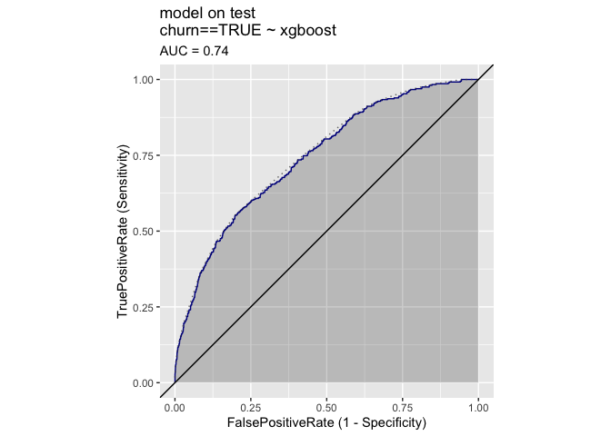

Prediction Plot
================

``` r
library(wrapr)
library(ggplot2)
library(WVPlots)
```

``` r
unpack[
  train_p,
  test_p
] <- readRDS('predictions.RDS')
```

``` r
ROCPlot(
  test_p,
  xvar = 'xgboost',
  truthVar = 'churn',
  truthTarget = TRUE,
  title = 'model on test',
  add_convex_hull = TRUE)
```

<!-- -->
