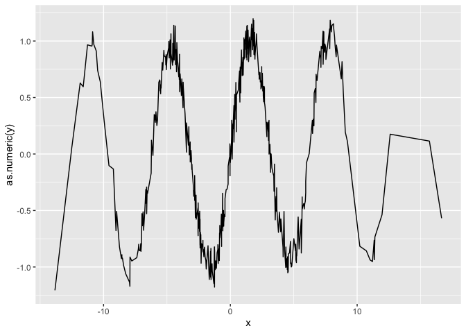

Regression
================

# Using vtreat with Regression Problems

## Preliminaries

Load modules/packages.

``` r
library(vtreat)
suppressPackageStartupMessages(library(ggplot2))
library(WVPlots)
library(rqdatatable)
```

    ## Loading required package: rquery

Generate example data.

  - `y` is a noisy sinusoidal plus linear function of the variable `x`,
    and is the output to be predicted
  - Input `xc` is a categorical variable that represents a
    discretization of `y`, along with some `NaN`s
  - Input `x2` is a pure noise variable with no relationship to the
    output

<!-- end list -->

``` r
make_data <- function(nrows) {
    d <- data.frame(x = 5*rnorm(nrows))
    d['y'] = sin(d[['x']]) + 0.01*d[['x']] + 0.1*rnorm(n = nrows)
    d[4:10, 'x'] = NA                  # introduce NAs
    d['xc'] = paste0('level_', 5*round(d$y/5, 1))
    d['x2'] = rnorm(n = nrows)
    d[d['xc']=='level_-1', 'xc'] = NA  # introduce a NA level
    return(d)
}

d = make_data(500)

d %.>%
  head(.) %.>%
  knitr::kable(.)
```

|          x |           y | xc          |          x2 |
| ---------: | ----------: | :---------- | ----------: |
| \-0.108996 | \-0.0574472 | level\_0    | \-1.2146403 |
| \-1.942013 | \-0.7880678 | NA          |   0.8473818 |
| \-1.604480 | \-0.8829876 | NA          | \-1.1320916 |
|         NA | \-0.5308607 | level\_-0.5 |   0.6155707 |
|         NA |   0.4796438 | level\_0.5  | \-0.6380502 |
|         NA | \-0.6684030 | level\_-0.5 |   0.0152671 |

### Some quick data exploration

Check how many levels `xc` has, and their disribution (including `NaN`)

``` r
unique(d['xc'])
```

    ##            xc
    ## 1     level_0
    ## 2        <NA>
    ## 4  level_-0.5
    ## 5   level_0.5
    ## 18    level_1

``` r
table(d$xc, useNA = 'always')
```

    ## 
    ## level_-0.5    level_0  level_0.5    level_1       <NA> 
    ##        102         83         86        119        110

Find the mean value of `y`

``` r
mean(d[['y']])
```

    ## [1] 0.003644412

Plot of `y` versus `x`.

``` r
ggplot(d, aes(x=x, y=as.numeric(y))) + 
  geom_line()
```

    ## Warning: Removed 7 rows containing missing values (geom_path).

<!-- -->

## Build a transform appropriate for regression problems.

Now that we have the data, we want to treat it prior to modeling: we
want training data where all the input variables are numeric and have no
missing values or `NaN`s.

First create the data treatment transform object, in this case a
treatment for a regression problem.

``` r
transform_design = vtreat::mkCrossFrameNExperiment(
    dframe = d,                              # data to learn transform from
    varlist = setdiff(colnames(d), c('y')),  # columns to transform
    outcomename = 'y'                        # outcome variable
)
```

    ## [1] "vtreat 1.4.6 start initial treatment design Wed Sep 25 08:32:00 2019"
    ## [1] " start cross frame work Wed Sep 25 08:32:00 2019"
    ## [1] " vtreat::mkCrossFrameNExperiment done Wed Sep 25 08:32:00 2019"

``` r
transform <- transform_design$treatments
d_prepared <- transform_design$crossFrame
score_frame <- transform$scoreFrame
score_frame$recommended <- score_frame$varMoves & (score_frame$sig < 1/nrow(score_frame))
```

Note that for the training data `d`: `transform_design$crossFrame` is
**not** the same as `transform.prepare(d)`; the second call can lead to
nested model bias in some situations, and is **not** recommended. For
other, later data, not seen during transform design
`transform.preprare(o)` is an appropriate step.

Use the training data `d_prepared` to fit the transform and the return a
treated training set: completely numeric, with no missing values.

Now examine the score frame, which gives information about each new
variable, including its type, which original variable it is derived
from, its (cross-validated) correlation with the outcome, and its
(cross-validated) significance as a one-variable linear model for the
outcome.

``` r
knitr::kable(score_frame)
```

| varName                        | varMoves |       rsq |       sig | needsSplit | extraModelDegrees | origName | code  | recommended |
| :----------------------------- | :------- | --------: | --------: | :--------- | ----------------: | :------- | :---- | :---------- |
| x                              | TRUE     | 0.0063226 | 0.0756718 | FALSE      |                 0 | x        | clean | TRUE        |
| x\_isBAD                       | TRUE     | 0.0027628 | 0.2407147 | FALSE      |                 0 | x        | isBAD | FALSE       |
| xc\_catP                       | TRUE     | 0.0050321 | 0.1131391 | TRUE       |                 4 | xc       | catP  | FALSE       |
| xc\_catN                       | TRUE     | 0.9664960 | 0.0000000 | TRUE       |                 4 | xc       | catN  | TRUE        |
| xc\_catD                       | TRUE     | 0.0128980 | 0.0110422 | TRUE       |                 4 | xc       | catD  | TRUE        |
| x2                             | TRUE     | 0.0004279 | 0.6444716 | FALSE      |                 0 | x2       | clean | FALSE       |
| xc\_lev\_NA                    | TRUE     | 0.4687717 | 0.0000000 | FALSE      |                 0 | xc       | lev   | TRUE        |
| xc\_lev\_x\_level\_minus\_0\_5 | TRUE     | 0.1363393 | 0.0000000 | FALSE      |                 0 | xc       | lev   | TRUE        |
| xc\_lev\_x\_level\_0           | TRUE     | 0.0000623 | 0.8602880 | FALSE      |                 0 | xc       | lev   | FALSE       |
| xc\_lev\_x\_level\_0\_5        | TRUE     | 0.1147696 | 0.0000000 | FALSE      |                 0 | xc       | lev   | TRUE        |
| xc\_lev\_x\_level\_1           | TRUE     | 0.5213946 | 0.0000000 | FALSE      |                 0 | xc       | lev   | TRUE        |

Notice that the variable `xc` has been converted to multiple variables:

  - an indicator variable for each common possible level (`xc_lev_*`)
  - the value of a (cross-validated) one-variable model for `y` as a
    function of `xc` (`xc_catN`)
  - a variable indicating when `xc` was `NaN` in the original data
    (`x_isBAD`)
  - a variable that returns how prevalent this particular value of `xc`
    is in the training data (`xc_catP`)
  - a variable that returns standard deviation of `y` conditioned on
    `xc` (`xc_catD`)

Any or all of these new variables are available for downstream modeling.

The `recommended` column indicates which variables are non constant
(`has_range` == True) and have a significance value smaller than
`default_threshold`. See the section *Deriving the Default Threholds*
below for the reasoning behind the default thresholds. Recommended
columns are intended as advice about which variables appear to be most
likely to be useful in a downstream model. This advice is attempts to be
conservative, to reduce the possibility of mistakenly eliminating
variables that may in fact be useful (although, obviously, it can still
mistakenly eliminate variables that have a real but non-linear
relationship to the output).

Let’s look at the recommended and not recommended variables:

``` r
# recommended variables
score_frame[score_frame[['recommended']], 'varName', drop = FALSE]  %.>%
  knitr::kable(.)
```

|    | varName                        |
| -- | :----------------------------- |
| 1  | x                              |
| 4  | xc\_catN                       |
| 5  | xc\_catD                       |
| 7  | xc\_lev\_NA                    |
| 8  | xc\_lev\_x\_level\_minus\_0\_5 |
| 10 | xc\_lev\_x\_level\_0\_5        |
| 11 | xc\_lev\_x\_level\_1           |

``` r
# not recommended variables
score_frame[!score_frame[['recommended']], 'varName', drop = FALSE] %.>%
  knitr::kable(.)
```

|   | varName              |
| - | :------------------- |
| 2 | x\_isBAD             |
| 3 | xc\_catP             |
| 6 | x2                   |
| 9 | xc\_lev\_x\_level\_0 |

Let’s look at the top of `d_prepared`. Notice that the new treated data
frame included only recommended variables (along with
    `y`).

``` r
head(d_prepared)
```

    ##             x x_isBAD   xc_catP      xc_catN   xc_catD          x2
    ## 1 -0.10899603       0 0.1681682 -0.009845557 0.1522322 -1.21464030
    ## 2 -1.94201325       0 0.2192192 -0.922236782 0.1100821  0.84738179
    ## 3 -1.60448008       0 0.2215569 -0.922573559 0.1096481 -1.13209163
    ## 4  0.04876132       1 0.2042042 -0.523070574 0.1507950  0.61557066
    ## 5 -0.07632554       1 0.1741742  0.529823273 0.1449899 -0.63805019
    ## 6  0.04876132       1 0.2042042 -0.523070574 0.1507950  0.01526706
    ##   xc_lev_NA xc_lev_x_level_minus_0_5 xc_lev_x_level_0 xc_lev_x_level_0_5
    ## 1         0                        0                1                  0
    ## 2         1                        0                0                  0
    ## 3         1                        0                0                  0
    ## 4         0                        1                0                  0
    ## 5         0                        0                0                  1
    ## 6         0                        1                0                  0
    ##   xc_lev_x_level_1           y
    ## 1                0 -0.05744715
    ## 2                0 -0.78806777
    ## 3                0 -0.88298756
    ## 4                0 -0.53086074
    ## 5                0  0.47964379
    ## 6                0 -0.66840298

This is `vtreat`’s default behavior; to include all variables in the
prepared data, set the parameter `filter_to_recommended` to False, as we
show later, in the *Parameters for `NumericOutcomeTreatment`* section
below.

## A Closer Look at the `impact_code` variables

Variables of type `impact_code` are the outputs of a one-variable
hierarchical linear regression of a categorical variable (in our
example, `xc`) against the centered output on the (cross-validated)
treated training data.

Let’s look at the relationship between `xc_catN` and `y` (actually
`y_centered`, a centered version of `y`).

\#%%

import matplotlib.pyplot

d\_prepared\[‘y\_centered’\] = d\_prepared.y - d\_prepared.y.mean()

ax = seaborn.scatterplot(x = ‘xc\_catN’, y = ‘y\_centered’, data =
d\_prepared) \# add the line “x = y”
matplotlib.pyplot.plot(d\_prepared.xc\_catN, d\_prepared.xc\_catN,
color=“darkgray”) ax.set\_title(‘Relationship between xc\_catN and y’)
plt.show()

\#%% md

This indicates that `xc_catN` is strongly predictive of the outcome.
Note that the score frame also reported the Pearson correlation between
`xc_catN` and `y`, which is fairly
large.

\#%%

transform.score\_frame\_.PearsonR\[transform.score\_frame\_.variable==‘xc\_catN’\]

\#%% md

Note also that the impact code values are jittered; this is because
`d_prepared` is a “cross-frame”: that is, the result of a
cross-validated estimation process. Hence, the impact coding of `xc` is
a function of both the value of `xc` and the cross-validation fold of
the datum’s row. When `transform` is applied to new data, there will be
only one value of impact code for each (common) level of `xc`. We can
see this by applying the transform to the data frame `d` as if it were
new data.

\#%%

dtmp = transform.transform(d) dtmp\[‘y\_centered’\] = dtmp.y -
dtmp.y.mean() ax = seaborn.scatterplot(x = ‘xc\_catN’, y =
‘y\_centered’, data = dtmp) \# add the line “x = y”
matplotlib.pyplot.plot(d\_prepared.xc\_catN, dtmp.xc\_catN,
color=“darkgray”) ax.set\_title(‘Relationship between xc\_catN and y’)
plt.show()

\#%% md

Variables of type `impact_code` are useful when dealing with categorical
variables with a very large number of possible levels. For example, a
categorical variable with 10,000 possible values potentially converts to
10,000 indicator variables, which may be unwieldy for some modeling
methods. Using a single numerical variable of type `impact_code` may be
a preferable alternative.

\#%% md

## Using the Prepared Data in a Model

Of course, what we really want to do with the prepared training data is
to fit a model jointly with all the (recommended) variables. Let’s try
fitting a linear regression model to `d_prepared`.

\#%%

import sklearn.linear\_model import seaborn import sklearn.metrics

not\_variables = \[‘y’, ‘y\_centered’, ‘prediction’\] model\_vars = \[v
for v in d\_prepared.columns if v not in set(not\_variables)\]

fitter = sklearn.linear\_model.LinearRegression()
fitter.fit(d\_prepared\[model\_vars\], d\_prepared\[‘y’\])

# now predict

d\_prepared\[‘prediction’\] = fitter.predict(d\_prepared\[model\_vars\])

# get R-squared

r2 = sklearn.metrics.r2\_score(y\_true=d\_prepared.y,
y\_pred=d\_prepared.prediction)

title = ‘Prediction vs. outcome (training data); R-sqr =
{:04.2f}’.format(r2)

# compare the predictions to the outcome (on the training data)

ax = seaborn.scatterplot(x=‘prediction’, y=‘y’, data=d\_prepared)
matplotlib.pyplot.plot(d\_prepared.prediction, d\_prepared.prediction,
color=“darkgray”) ax.set\_title(title) plt.show()

\#%% md

Now apply the model to new data.

\#%%

# create the new data

dtest = make\_data(450)

# prepare the new data with vtreat

dtest\_prepared = transform.transform(dtest)

# apply the model to the prepared data

dtest\_prepared\[‘prediction’\] =
fitter.predict(dtest\_prepared\[model\_vars\])

# get R-squared

r2 = sklearn.metrics.r2\_score(y\_true=dtest\_prepared.y,
y\_pred=dtest\_prepared.prediction)

title = ‘Prediction vs. outcome (test data); R-sqr =
{:04.2f}’.format(r2)

# compare the predictions to the outcome (on the training data)

ax = seaborn.scatterplot(x=‘prediction’, y=‘y’, data=dtest\_prepared)
matplotlib.pyplot.plot(dtest\_prepared.prediction,
dtest\_prepared.prediction, color=“darkgray”) ax.set\_title(title)
plt.show()

\#%% md

## Parameters for `NumericOutcomeTreatment`

We’ve tried to set the defaults for all parameters so that `vtreat` is
usable out of the box for most applications.

\#%%

vtreat.vtreat\_parameters()

\#%% md

**use\_hierarchical\_estimate:**: When True, uses hierarchical smoothing
when estimating `impact_code` variables; when False, uses unsmoothed
linear regression.

**coders**: The types of synthetic variables that `vtreat` will
(potentially) produce. See *Types of prepared variables* below.

**filter\_to\_recommended**: When True, prepared data only includes
variables marked as “recommended” in score frame. When False, prepared
data includes all variables. See the Example below.

**indicator\_min\_fraction**: For categorical variables, indicator
variables (type `indicator_code`) are only produced for levels that are
present at least `indicator_min_fraction` of the time. A consequence of
this is that 1/`indicator_min_fraction` is the maximum number of
indicators that will be produced for a given categorical variable. To
make sure that *all* possible indicator variables are produced, set
`indicator_min_fraction = 0`

**cross\_validation\_plan**: The cross validation method used by
`vtreat`. Most people won’t have to change this. *TODO: make some
examples of OrderedCrossPlan and StratifiedCrossPlan to link to here*

**cross\_validation\_k**: The number of folds to use for
cross-validation

**user\_transforms**: For passing in user-defined transforms for custom
data preparation. Won’t be needed in most situations, but see
[here](https://github.com/WinVector/pyvtreat/blob/master/Examples/UserCoders/UserCoders.ipynb)
for an example of applying a GAM transform to input variables.

### Example: Use all variables to model, not just recommended

\#%%

transform\_all = vtreat.NumericOutcomeTreatment( outcome\_name=‘y’, \#
outcome variable params = vtreat.vtreat\_parameters({
‘filter\_to\_recommended’: False }) )

transform\_all.fit\_transform(d, d\[‘y’\]).columns

\#%%

transform\_all.score\_frame\_

\#%% md

Note that the prepared data produced by `fit_transform()` includes all
the variables, including those that were not marked as “recommended”.

## Types of prepared variables

**clean\_copy**: Produced from numerical variables: a clean numerical
variable with no `NaNs` or missing values

**indicator\_code**: Produced from categorical variables, one for each
(common) level: for each level of the variable, indicates if that level
was “on”

**prevalence\_code**: Produced from categorical variables: indicates how
often each level of the variable was “on”

**deviation\_code**: Produced from categorical variables: standard
deviation of outcome conditioned on levels of the variable

**impact\_code**: Produced from categorical variables: score from a
one-dimensional model of the output as a function of the variable

**missing\_indicator**: Produced for both numerical and categorical
variables: an indicator variable that marks when the original variable
was missing or `NaN`

**logit\_code**: not used by `NumericOutcomeTreatment`

### Example: Produce only a subset of variable types

In this example, suppose you only want to use indicators and continuous
variables in your model; in other words, you only want to use variables
of types (`clean_copy`, `missing_indicator`, and `indicator_code`), and
no `impact_code`, `deviance_code`, or `prevalence_code` variables.

\#%%

transform\_thin = vtreat.NumericOutcomeTreatment( outcome\_name=‘y’, \#
outcome variable params = vtreat.vtreat\_parameters({
‘filter\_to\_recommended’: False, ‘coders’: {‘clean\_copy’,
‘missing\_indicator’, ‘indicator\_code’, } }) )

transform\_thin.fit\_transform(d, d\[‘y’\]).head()

\#%%

transform\_thin.score\_frame\_

\#%% md

## Deriving the Default Thresholds

While machine learning algorithms are generally tolerant to a reasonable
number of irrelevant or noise variables, too many irrelevant variables
can lead to serious overfit; see [this
article](http://www.win-vector.com/blog/2014/02/bad-bayes-an-example-of-why-you-need-hold-out-testing/)
for an extreme example, one we call “Bad Bayes”. The default threshold
is an attempt to eliminate obviously irrelevant variables early.

Imagine that you have a pure noise dataset, where none of the *n* inputs
are related to the output. If you treat each variable as a one-variable
model for the output, and look at the significances of each model, these
significance-values will be uniformly distributed in the range \[0:1\].
You want to pick a weakest possible significance threshold that
eliminates as many noise variables as possible. A moment’s thought
should convince you that a threshold of *1/n* allows only one variable
through, in expectation.

This leads to the general-case heuristic that a significance threshold
of *1/n* on your variables should allow only one irrelevant variable
through, in expectation (along with all the relevant variables). Hence,
*1/n* used to be our recommended threshold, when we developed the R
version of `vtreat`.

We noticed, however, that this biases the filtering against numerical
variables, since there are at most two derived variables (of types
*clean\_copy* and *missing\_indicator* for every numerical variable in
the original data. Categorical variables, on the other hand, are
expanded to many derived variables: several indicators (one for every
common level), plus a *logit\_code* and a *prevalence\_code*. So we now
reweight the thresholds.

Suppose you have a (treated) data set with *ntreat* different types of
`vtreat` variables (`clean_copy`, `indicator_code`, etc). There are *nT*
variables of type *T*. Then the default threshold for all the variables
of type *T* is *1/(ntreat nT)*. This reweighting helps to reduce the
bias against any particular type of variable. The heuristic is still
that the set of recommended variables will allow at most one noise
variable into the set of candidate variables.

As noted above, because `vtreat` estimates variable significances using
linear methods by default, some variables with a non-linear relationship
to the output may fail to pass the threshold. Setting the
`filter_to_recommended` parameter to False will keep all derived
variables in the treated frame, for the data scientist to filter (or
not) as they will.
