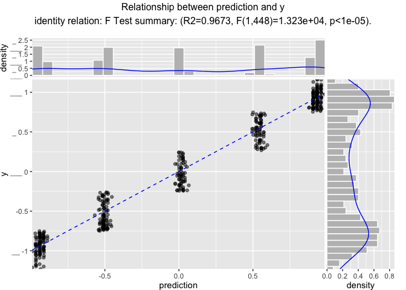
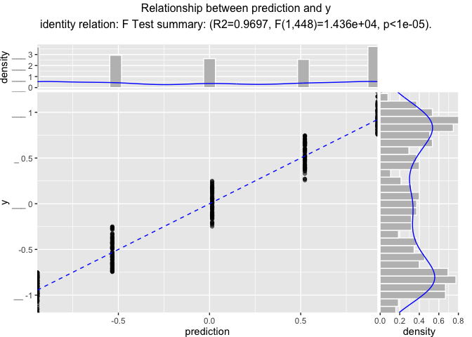

Regression
================

# Using vtreat with Regression Problems

Nina Zumel and John Mount September 2019

Note this is a description of the [`R` version of
`vtreat`](https://github.com/WinVector/vtreat), the same example for the
[`Python` version of `vtreat`](https://github.com/WinVector/pyvtreat)
can be found
[here](https://github.com/WinVector/pyvtreat/blob/master/Examples/Regression/Regression.md).

## Preliminaries

Load modules/packages.

``` r
library(vtreat)
```

    ## Loading required package: wrapr

``` r
packageVersion('vtreat')
```

    ## [1] '1.5.2'

``` r
suppressPackageStartupMessages(library(ggplot2))
library(WVPlots)
library(rqdatatable)
```

    ## Loading required package: rquery

    ## 
    ## Attaching package: 'rquery'

    ## The following object is masked from 'package:ggplot2':
    ## 
    ##     arrow

Generate example data.

  - `y` is a noisy sinusoidal plus linear function of the variable `x`,
    and is the output to be predicted
  - Input `xc` is a categorical variable that represents a
    discretization of `y`, along with some `NaN`s
  - Input `x2` is a pure noise variable with no relationship to the
    output

<!-- end list -->

``` r
set.seed(2020)

make_data <- function(nrows) {
    d <- data.frame(x = 5*rnorm(nrows))
    d['y'] = sin(d[['x']]) + 0.01*d[['x']] + 0.1*rnorm(n = nrows)
    d[4:10, 'x'] = NA                  # introduce NAs
    d['xc'] = paste0('level_', 5*round(d$y/5, 1))
    d['x2'] = rnorm(n = nrows)
    d[d['xc']=='level_-1', 'xc'] = NA  # introduce a NA level
    return(d)
}

d = make_data(500)

d %.>%
  head(.) %.>%
  knitr::kable(.)
```

|          x |           y | xc          |          x2 |
| ---------: | ----------: | :---------- | ----------: |
|   1.884861 |   1.0906132 | level\_1    |   0.0046504 |
|   1.507742 |   1.0108804 | level\_1    | \-1.2287497 |
| \-5.490116 |   0.7766693 | level\_1    | \-0.1405980 |
|         NA |   0.5442452 | level\_0.5  | \-0.2073270 |
|         NA | \-0.9738103 | NA          | \-0.9215306 |
|         NA | \-0.4968719 | level\_-0.5 |   0.3604742 |

### Some quick data exploration

Check how many levels `xc` has, and their distribution (including `NaN`)

``` r
unique(d['xc'])
```

    ##            xc
    ## 1     level_1
    ## 4   level_0.5
    ## 5        <NA>
    ## 6  level_-0.5
    ## 13    level_0
    ## 91 level_-1.5

``` r
table(d$xc, useNA = 'always')
```

    ## 
    ## level_-0.5 level_-1.5    level_0  level_0.5    level_1       <NA> 
    ##         91          2         92         91        106        118

Find the mean value of `y`

``` r
mean(d[['y']])
```

    ## [1] -0.0324356

Plot of `y` versus `x`.

``` r
ggplot(d, aes(x=x, y=as.numeric(y))) + 
  geom_line()
```

    ## Warning: Removed 7 rows containing missing values (geom_path).

<!-- -->

## Build a transform appropriate for regression problems.

Now that we have the data, we want to treat it prior to modeling: we
want training data where all the input variables are numeric and have no
missing values or `NaN`s.

First create the data treatment transform object, in this case a
treatment for a regression problem.

``` r
unpack[
  transform = treatments,
  d_prepared = crossFrame
  ] <- vtreat::mkCrossFrameNExperiment(
    dframe = d,                              # data to learn transform from
    varlist = setdiff(colnames(d), c('y')),  # columns to transform
    outcomename = 'y'                        # outcome variable
  )
```

    ## [1] "vtreat 1.5.2 start initial treatment design Sun Feb  9 15:35:44 2020"
    ## [1] " start cross frame work Sun Feb  9 15:35:44 2020"
    ## [1] " vtreat::mkCrossFrameNExperiment done Sun Feb  9 15:35:44 2020"

``` r
score_frame <- transform$scoreFrame
score_frame$recommended <- score_frame$varMoves & (score_frame$sig < 1/nrow(score_frame))
```

Note that for the training data `d`: `crossFrame` is **not** the same as
`prepare(transform, d)`; the second call can lead to nested model bias
in some situations, and is **not** recommended. For other, later data,
not seen during transform design `transform.preprare(o)` is an
appropriate step.

`vtreat` version `1.5.1` and newer issue a warning if you call the
incorrect transform pattern on your original training
    data:

``` r
d_prepared_wrong <- prepare(transform, d)
```

    ## Warning in prepare.treatmentplan(transform, d): possibly called prepare() on
    ## same data frame as designTreatments*()/mkCrossFrame*Experiment(), this can lead
    ## to over-fit. To avoid this, please use mkCrossFrame*Experiment$crossFrame.

The prepared data should be clean: completely numeric, with no missing
values.

Now examine the score frame, which gives information about each new
variable, including its type, which original variable it is derived
from, its (cross-validated) correlation with the outcome, and its
(cross-validated) significance as a one-variable linear model for the
outcome.

``` r
knitr::kable(score_frame)
```

| varName                        | varMoves |       rsq |       sig | needsSplit | extraModelDegrees | origName | code  | recommended |
| :----------------------------- | :------- | --------: | --------: | :--------- | ----------------: | :------- | :---- | :---------- |
| x                              | TRUE     | 0.0000545 | 0.8692659 | FALSE      |                 0 | x        | clean | FALSE       |
| x\_isBAD                       | TRUE     | 0.0016526 | 0.3643472 | FALSE      |                 0 | x        | isBAD | FALSE       |
| xc\_catP                       | TRUE     | 0.0648011 | 0.0000000 | TRUE       |                 5 | xc       | catP  | TRUE        |
| xc\_catN                       | TRUE     | 0.9701400 | 0.0000000 | TRUE       |                 5 | xc       | catN  | TRUE        |
| xc\_catD                       | TRUE     | 0.1064961 | 0.0000000 | TRUE       |                 5 | xc       | catD  | TRUE        |
| x2                             | TRUE     | 0.0001760 | 0.7672865 | FALSE      |                 0 | x2       | clean | FALSE       |
| xc\_lev\_NA                    | TRUE     | 0.5015468 | 0.0000000 | FALSE      |                 0 | xc       | lev   | TRUE        |
| xc\_lev\_x\_level\_minus\_0\_5 | TRUE     | 0.1092110 | 0.0000000 | FALSE      |                 0 | xc       | lev   | TRUE        |
| xc\_lev\_x\_level\_0           | TRUE     | 0.0009315 | 0.4959262 | FALSE      |                 0 | xc       | lev   | FALSE       |
| xc\_lev\_x\_level\_0\_5        | TRUE     | 0.1334055 | 0.0000000 | FALSE      |                 0 | xc       | lev   | TRUE        |
| xc\_lev\_x\_level\_1           | TRUE     | 0.4771728 | 0.0000000 | FALSE      |                 0 | xc       | lev   | TRUE        |

Notice that the variable `xc` has been converted to multiple variables:

  - an indicator variable for each common possible level (`xc_lev_*`)
  - the value of a (cross-validated) one-variable model for `y` as a
    function of `xc` (`xc_catN`)
  - a variable indicating when `xc` was `NaN` in the original data
    (`x_isBAD`)
  - a variable that returns how prevalent this particular value of `xc`
    is in the training data (`xc_catP`)
  - a variable that returns standard deviation of `y` conditioned on
    `xc` (`xc_catD`)

Any or all of these new variables are available for downstream modeling.

The `recommended` column indicates which variables are non constant
(`has_range` == True) and have a significance value smaller than
`default_threshold`. See the section *Deriving the Default Thresholds*
below for the reasoning behind the default thresholds. Recommended
columns are intended as advice about which variables appear to be most
likely to be useful in a downstream model. This advice is attempts to be
conservative, to reduce the possibility of mistakenly eliminating
variables that may in fact be useful (although, obviously, it can still
mistakenly eliminate variables that have a real but non-linear
relationship to the output).

Let’s look at the recommended and not recommended variables:

``` r
# recommended variables
score_frame[score_frame[['recommended']], 'varName', drop = FALSE]  %.>%
  knitr::kable(.)
```

|    | varName                        |
| -- | :----------------------------- |
| 3  | xc\_catP                       |
| 4  | xc\_catN                       |
| 5  | xc\_catD                       |
| 7  | xc\_lev\_NA                    |
| 8  | xc\_lev\_x\_level\_minus\_0\_5 |
| 10 | xc\_lev\_x\_level\_0\_5        |
| 11 | xc\_lev\_x\_level\_1           |

``` r
# not recommended variables
score_frame[!score_frame[['recommended']], 'varName', drop = FALSE] %.>%
  knitr::kable(.)
```

|   | varName              |
| - | :------------------- |
| 1 | x                    |
| 2 | x\_isBAD             |
| 6 | x2                   |
| 9 | xc\_lev\_x\_level\_0 |

Let’s look at the top of `d_prepared`. Notice that the new treated data
frame included only recommended variables (along with `y`).

``` r
d_prepared %.>%
  head(.) %.>%
  knitr::kable(.)
```

|           x | x\_isBAD |  xc\_catP |    xc\_catN |  xc\_catD |          x2 | xc\_lev\_NA | xc\_lev\_x\_level\_minus\_0\_5 | xc\_lev\_x\_level\_0 | xc\_lev\_x\_level\_0\_5 | xc\_lev\_x\_level\_1 |           y |
| ----------: | -------: | --------: | ----------: | --------: | ----------: | ----------: | -----------------------------: | -------------------: | ----------------------: | -------------------: | ----------: |
|   1.8848606 |        0 | 0.2132132 |   0.9515171 | 0.1173878 |   0.0046504 |           0 |                              0 |                    0 |                       0 |                    1 |   1.0906132 |
|   1.5077419 |        0 | 0.2102102 |   0.9544223 | 0.1174762 | \-1.2287497 |           0 |                              0 |                    0 |                       0 |                    1 |   1.0108804 |
| \-5.4901159 |        0 | 0.2125749 |   0.9550836 | 0.1227090 | \-0.1405980 |           0 |                              0 |                    0 |                       0 |                    1 |   0.7766693 |
| \-0.3704472 |        1 | 0.1801802 |   0.5530813 | 0.1300380 | \-0.2073270 |           0 |                              0 |                    0 |                       1 |                    0 |   0.5442452 |
| \-0.3704472 |        1 | 0.2372372 | \-0.9120600 | 0.1079478 | \-0.9215306 |           1 |                              0 |                    0 |                       0 |                    0 | \-0.9738103 |
| \-0.2175061 |        1 | 0.1801802 | \-0.5032241 | 0.1308212 |   0.3604742 |           0 |                              1 |                    0 |                       0 |                    0 | \-0.4968719 |

This is `vtreat`’s default behavior; to include all variables in the
prepared data, set the parameter `filter_to_recommended` to False, as we
show later, in the *Parameters for `NumericOutcomeTreatment`* section
below.

## A Closer Look at the `impact_code` variables

Variables of type `impact_code` are the outputs of a one-variable
hierarchical linear regression of a categorical variable (in our
example, `xc`) against the centered output on the (cross-validated)
treated training data.

Let’s look at the relationship between `xc_catN` and `y` (actually
`y_centered`, a centered version of `y`).

``` r
d_prepared['y_centered'] <- d_prepared$y - mean(d_prepared$y)

WVPlots::ScatterHist(
  d_prepared, 
  xvar = 'xc_catN',
  yvar = 'y_centered',
  smoothmethod = 'identity',
  estimate_sig = TRUE,
  title = 'Relationship between xc_catN and y')
```

<!-- -->

This indicates that `xc_catN` is strongly predictive of the outcome.
Note that the score frame also reported the Pearson correlation between
`xc_catN` and `y`, which is fairly large.

``` r
score_frame[score_frame$varName == 'xc_catN', ]$rsq
```

    ## [1] 0.97014

Note also that the impact code values are jittered; this is because
`d_prepared` is a “cross-frame”: that is, the result of a
cross-validated estimation process. Hence, the impact coding of `xc` is
a function of both the value of `xc` and the cross-validation fold of
the datum’s row. When `transform` is applied to new data, there will be
only one value of impact code for each (common) level of `xc`. We can
see this by applying the transform to the data frame `d` as if it were
new data.

``` r
# jittered
summary(d_prepared$xc_catN[(!is.na(d$xc)) & (d$xc == 'level_1')])
```

    ##    Min. 1st Qu.  Median    Mean 3rd Qu.    Max. 
    ##  0.9515  0.9515  0.9544  0.9537  0.9551  0.9551

``` r
dtmp = prepare(transform, d)
```

    ## Warning in prepare.treatmentplan(transform, d): possibly called prepare() on
    ## same data frame as designTreatments*()/mkCrossFrame*Experiment(), this can lead
    ## to over-fit. To avoid this, please use mkCrossFrame*Experiment$crossFrame.

``` r
dtmp['y_centered'] = dtmp$y - mean(dtmp$y)

# constant
summary(dtmp$xc_catN[(!is.na(d$xc)) & (d$xc == 'level_1')])
```

    ##    Min. 1st Qu.  Median    Mean 3rd Qu.    Max. 
    ##  0.9537  0.9537  0.9537  0.9537  0.9537  0.9537

Variables of type `impact_code` are useful when dealing with categorical
variables with a very large number of possible levels. For example, a
categorical variable with 10,000 possible values potentially converts to
10,000 indicator variables, which may be unwieldy for some modeling
methods. Using a single numerical variable of type `impact_code` may be
a preferable alternative.

## Using the Prepared Data in a Model

Of course, what we really want to do with the prepared training data is
to fit a model jointly with all the (recommended) variables. Let’s try
fitting a linear regression model to `d_prepared`.

``` r
model_vars <- score_frame$varName[score_frame$recommended]
f <- wrapr::mk_formula('y', model_vars)

model = lm(f, data = d_prepared)

# now predict
d_prepared['prediction'] = predict(
  model,
  newdata = d_prepared)

# look at the fit (on the training data)
WVPlots::ScatterHist(
  d_prepared, 
  xvar = 'prediction',
  yvar = 'y',
  smoothmethod = 'identity',
  estimate_sig = TRUE,
  title = 'Relationship between prediction and y')
```

<!-- -->

Now apply the model to new data.

``` r
# create the new data
dtest <- make_data(450)

# prepare the new data with vtreat
dtest_prepared = prepare(transform, dtest)
# dtest %.>% transform is an alias for prepare(transform, dtest)

# apply the model to the prepared data
dtest_prepared['prediction'] = predict(
  model,
  newdata = dtest_prepared)

# compare the predictions to the outcome (on the test data)
WVPlots::ScatterHist(
  dtest_prepared, 
  xvar = 'prediction',
  yvar = 'y',
  smoothmethod = 'identity',
  estimate_sig = TRUE,
  title = 'Relationship between prediction and y')
```

<!-- -->

``` r
# get r-squared
sigr::wrapFTest(dtest_prepared, 
                predictionColumnName = 'prediction',
                yColumnName = 'y',
                nParameters = length(model_vars) + 1)
```

    ## [1] "F Test summary: (R2=0.9697, F(8,441)=1767, p<1e-05)."

## Parameters for `mkCrossFrameNExperiment`

We’ve tried to set the defaults for all parameters so that `vtreat` is
usable out of the box for most applications.

``` r
suppressPackageStartupMessages(library(printr))
help("mkCrossFrameNExperiment")
```

    ## Run a numeric cross frame experiment.
    ## 
    ## Description:
    ## 
    ##      Builds a 'designTreatmentsN' treatment plan and a data frame
    ##      prepared from 'dframe' that is "cross" in the sense each row is
    ##      treated using a treatment plan built from a subset of dframe
    ##      disjoint from the given row. The goal is to try to and supply a
    ##      method of breaking nested model bias other than splitting into
    ##      calibration, training, test sets.
    ## 
    ## Usage:
    ## 
    ##      mkCrossFrameNExperiment(
    ##        dframe,
    ##        varlist,
    ##        outcomename,
    ##        ...,
    ##        weights = c(),
    ##        minFraction = 0.02,
    ##        smFactor = 0,
    ##        rareCount = 0,
    ##        rareSig = 1,
    ##        collarProb = 0,
    ##        codeRestriction = NULL,
    ##        customCoders = NULL,
    ##        scale = FALSE,
    ##        doCollar = FALSE,
    ##        splitFunction = NULL,
    ##        ncross = 3,
    ##        forceSplit = FALSE,
    ##        verbose = TRUE,
    ##        parallelCluster = NULL,
    ##        use_parallel = TRUE,
    ##        missingness_imputation = NULL,
    ##        imputation_map = NULL
    ##      )
    ##      
    ## Arguments:
    ## 
    ##   dframe: Data frame to learn treatments from (training data), must
    ##           have at least 1 row.
    ## 
    ##  varlist: Names of columns to treat (effective variables).
    ## 
    ## outcomename: Name of column holding outcome variable.
    ##           dframe[[outcomename]] must be only finite non-missing values
    ##           and there must be a cut such that dframe[[outcomename]] is
    ##           both above the cut at least twice and below the cut at least
    ##           twice.
    ## 
    ##      ...: no additional arguments, declared to forced named binding of
    ##           later arguments
    ## 
    ##  weights: optional training weights for each row
    ## 
    ## minFraction: optional minimum frequency a categorical level must have
    ##           to be converted to an indicator column.
    ## 
    ## smFactor: optional smoothing factor for impact coding models.
    ## 
    ## rareCount: optional integer, allow levels with this count or below to
    ##           be pooled into a shared rare-level.  Defaults to 0 or off.
    ## 
    ##  rareSig: optional numeric, suppress levels from pooling at this
    ##           significance value greater.  Defaults to NULL or off.
    ## 
    ## collarProb: what fraction of the data (pseudo-probability) to collar
    ##           data at if doCollar is set during 'prepare.treatmentplan'.
    ## 
    ## codeRestriction: what types of variables to produce (character array of
    ##           level codes, NULL means no restriction).
    ## 
    ## customCoders: map from code names to custom categorical variable
    ##           encoding functions (please see <URL:
    ##           https://github.com/WinVector/vtreat/blob/master/extras/CustomLevelCoders.md>).
    ## 
    ##    scale: optional if TRUE replace numeric variables with regression
    ##           ("move to outcome-scale").
    ## 
    ## doCollar: optional if TRUE collar numeric variables by cutting off
    ##           after a tail-probability specified by collarProb during
    ##           treatment design.
    ## 
    ## splitFunction: (optional) see vtreat::buildEvalSets .
    ## 
    ##   ncross: optional scalar>=2 number of cross-validation rounds to
    ##           design.
    ## 
    ## forceSplit: logical, if TRUE force cross-validated significance
    ##           calculations on all variables.
    ## 
    ##  verbose: if TRUE print progress.
    ## 
    ## parallelCluster: (optional) a cluster object created by package
    ##           parallel or package snow.
    ## 
    ## use_parallel: logical, if TRUE use parallel methods.
    ## 
    ## missingness_imputation: function of signature f(values: numeric,
    ##           weights: numeric), simple missing value imputer.
    ## 
    ## imputation_map: map from column names to functions of signature
    ##           f(values: numeric, weights: numeric), simple missing value
    ##           imputers.
    ## 
    ## Value:
    ## 
    ##      named list containing: treatments, crossFrame, crossWeights,
    ##      method, and evalSets
    ## 
    ## See Also:
    ## 
    ##      'designTreatmentsC', 'designTreatmentsN', 'prepare.treatmentplan'
    ## 
    ## Examples:
    ## 
    ##      # numeric example
    ##      set.seed(23525)
    ##      
    ##      # we set up our raw training and application data
    ##      dTrainN <- data.frame(
    ##        x = c('a', 'a', 'a', 'a', 'b', 'b', NA, NA),
    ##        z = c(1, 2, 3, 4, 5, NA, 7, NA), 
    ##        y = c(0, 0, 0, 1, 0, 1, 1, 1))
    ##      
    ##      dTestN <- data.frame(
    ##        x = c('a', 'b', 'c', NA), 
    ##        z = c(10, 20, 30, NA))
    ##      
    ##      # we perform a vtreat cross frame experiment
    ##      # and unpack the results into treatmentsN
    ##      # and dTrainNTreated
    ##      unpack[
    ##        treatmentsN = treatments,
    ##        dTrainNTreated = crossFrame
    ##        ] <- mkCrossFrameNExperiment(
    ##          dframe = dTrainN,
    ##          varlist = setdiff(colnames(dTrainN), 'y'),
    ##          outcomename = 'y',
    ##          verbose = FALSE)
    ##      
    ##      # the treatments include a score frame relating new
    ##      # derived variables to original columns
    ##      treatmentsN$scoreFrame[, c('origName', 'varName', 'code', 'rsq', 'sig', 'extraModelDegrees')] %.>%
    ##        print(.)
    ##      
    ##      # the treated frame is a "cross frame" which
    ##      # is a transform of the training data built 
    ##      # as if the treatment were learned on a different
    ##      # disjoint training set to avoid nested model
    ##      # bias and over-fit.
    ##      dTrainNTreated %.>%
    ##        head(.) %.>%
    ##        print(.)
    ##      
    ##      # Any future application data is prepared with
    ##      # the prepare method.
    ##      dTestNTreated <- prepare(treatmentsN, dTestN, pruneSig=NULL)
    ##      
    ##      dTestNTreated %.>%
    ##        head(.) %.>%
    ##        print(.)

Some parameters of note include:

**codeRestriction**: The types of synthetic variables that `vtreat` will
(potentially) produce. See *Types of prepared variables* below.

**minFraction**: For categorical variables, indicator variables (type
`indicator_code`) are only produced for levels that are present at least
`minFraction` of the time. A consequence of this is that 1/`minFraction`
is the maximum number of indicators that will be produced for a given
categorical variable. To make sure that *all* possible indicator
variables are produced, set `minFraction = 0`

**splitFunction**: The cross validation method used by `vtreat`. Most
people won’t have to change this.

**ncross**: The number of folds to use for cross-validation

**customCoders**: For passing in user-defined transforms for custom data
preparation. Won’t be needed in most situations, but see
[here](http://www.win-vector.com/blog/2017/09/custom-level-coding-in-vtreat/)
for an example of applying a GAM transform to input variables.

## Types of prepared variables

**clean**: Produced from numerical variables: a clean numerical variable
with no `NAs` or missing values

**lev**: Produced from categorical variables, one for each (common)
level: for each level of the variable, indicates if that level was “on”

**catP**: Produced from categorical variables: indicates how often each
level of the variable was “on”

**catN**: Produced from categorical variables: score from a
one-dimensional model of the centered output as a function of the
explanatory variable

**catD**: Produced from categorical variables: deviation of outcome as a
function of the explanatory variable

**is\_BAD**: Produced for both numerical and categorical variables: an
indicator variable that marks when the original variable was missing or
`NaN`.

More on the coding types can be found
[here](https://winvector.github.io/vtreat/articles/vtreatVariableTypes.html).

### Example: Produce only a subset of variable types

In this example, suppose you only want to use indicators and continuous
variables in your model; in other words, you only want to use variables
of types (`clean`, `is_BAD`, and `lev`), and no `catN`, `deviance_code`,
`catP`, or `catD` variables.

``` r
unpack[
  transform_thin = treatments,
  d_prepared_thin = crossFrame
  ] <- vtreat::mkCrossFrameNExperiment(
    dframe = d,                                    # data to learn transform from
    varlist = setdiff(colnames(d), c('y', 'y_centered')),  # columns to transform
    outcomename = 'y',                             # outcome variable
    codeRestriction = c('lev',                     # transforms we want
                        'clean',
                        'isBAD')
  )
```

    ## [1] "vtreat 1.5.2 start initial treatment design Sun Feb  9 15:35:48 2020"
    ## [1] " start cross frame work Sun Feb  9 15:35:48 2020"
    ## [1] " vtreat::mkCrossFrameNExperiment done Sun Feb  9 15:35:48 2020"

``` r
score_frame_thin <- transform_thin$scoreFrame

d_prepared_thin %.>%
  head(.) %.>%
  knitr::kable(.)
```

|           x | x\_isBAD |          x2 | xc\_lev\_NA | xc\_lev\_x\_level\_minus\_0\_5 | xc\_lev\_x\_level\_0 | xc\_lev\_x\_level\_0\_5 | xc\_lev\_x\_level\_1 |           y |
| ----------: | -------: | ----------: | ----------: | -----------------------------: | -------------------: | ----------------------: | -------------------: | ----------: |
|   1.8848606 |        0 |   0.0046504 |           0 |                              0 |                    0 |                       0 |                    1 |   1.0906132 |
|   1.5077419 |        0 | \-1.2287497 |           0 |                              0 |                    0 |                       0 |                    1 |   1.0108804 |
| \-5.4901159 |        0 | \-0.1405980 |           0 |                              0 |                    0 |                       0 |                    1 |   0.7766693 |
| \-0.1587674 |        1 | \-0.2073270 |           0 |                              0 |                    0 |                       1 |                    0 |   0.5442452 |
| \-0.3316281 |        1 | \-0.9215306 |           1 |                              0 |                    0 |                       0 |                    0 | \-0.9738103 |
| \-0.3212205 |        1 |   0.3604742 |           0 |                              1 |                    0 |                       0 |                    0 | \-0.4968719 |

``` r
knitr::kable(score_frame_thin)
```

| varName                        | varMoves |       rsq |       sig | needsSplit | extraModelDegrees | origName | code  |
| :----------------------------- | :------- | --------: | --------: | :--------- | ----------------: | :------- | :---- |
| x                              | TRUE     | 0.0000545 | 0.8692659 | FALSE      |                 0 | x        | clean |
| x\_isBAD                       | TRUE     | 0.0016526 | 0.3643472 | FALSE      |                 0 | x        | isBAD |
| x2                             | TRUE     | 0.0001760 | 0.7672865 | FALSE      |                 0 | x2       | clean |
| xc\_lev\_NA                    | TRUE     | 0.5015468 | 0.0000000 | FALSE      |                 0 | xc       | lev   |
| xc\_lev\_x\_level\_minus\_0\_5 | TRUE     | 0.1092110 | 0.0000000 | FALSE      |                 0 | xc       | lev   |
| xc\_lev\_x\_level\_0           | TRUE     | 0.0009315 | 0.4959262 | FALSE      |                 0 | xc       | lev   |
| xc\_lev\_x\_level\_0\_5        | TRUE     | 0.1334055 | 0.0000000 | FALSE      |                 0 | xc       | lev   |
| xc\_lev\_x\_level\_1           | TRUE     | 0.4771728 | 0.0000000 | FALSE      |                 0 | xc       | lev   |

## Deriving the Default Thresholds

While machine learning algorithms are generally tolerant to a reasonable
number of irrelevant or noise variables, too many irrelevant variables
can lead to serious overfit; see [this
article](http://www.win-vector.com/blog/2014/02/bad-bayes-an-example-of-why-you-need-hold-out-testing/)
for an extreme example, one we call “Bad Bayes”. The default threshold
is an attempt to eliminate obviously irrelevant variables early.

Imagine that you have a pure noise dataset, where none of the *n* inputs
are related to the output. If you treat each variable as a one-variable
model for the output, and look at the significances of each model, these
significance-values will be uniformly distributed in the range \[0:1\].
You want to pick a weakest possible significance threshold that
eliminates as many noise variables as possible. A moment’s thought
should convince you that a threshold of *1/n* allows only one variable
through, in expectation.

This leads to the general-case heuristic that a significance threshold
of *1/n* on your variables should allow only one irrelevant variable
through, in expectation (along with all the relevant variables). Hence,
*1/n* used to be our recommended threshold, when we developed the R
version of `vtreat`.

As noted above, because `vtreat` estimates variable significances using
linear methods by default, some variables with a non-linear relationship
to the output may fail to pass the threshold. Setting the
`filter_to_recommended` parameter to False will keep all derived
variables in the treated frame, for the data scientist to filter (or
not) as they will.

## Conclusion

In all cases (classification, regression, unsupervised, and multinomial
classification) the intent is that `vtreat` transforms are essentially
one liners.

The preparation commands are organized as follows:

  - **Regression**: [`R` regression
    example](https://github.com/WinVector/vtreat/blob/master/Examples/Regression/Regression.md),
    [`Python` regression
    example](https://github.com/WinVector/pyvtreat/blob/master/Examples/Regression/Regression.md).
  - **Classification**: [`R` classification
    example](https://github.com/WinVector/vtreat/blob/master/Examples/Classification/Classification.md),
    [`Python` classification
    example](https://github.com/WinVector/pyvtreat/blob/master/Examples/Classification/Classification.md).
  - **Unsupervised tasks**: [`R` unsupervised
    example](https://github.com/WinVector/vtreat/blob/master/Examples/Unsupervised/Unsupervised.md),
    [`Python` unsupervised
    example](https://github.com/WinVector/pyvtreat/blob/master/Examples/Unsupervised/Unsupervised.md).
  - **Multinomial classification**: [`R` multinomial classification
    example](https://github.com/WinVector/vtreat/blob/master/Examples/Multinomial/MultinomialExample.md),
    [`Python` multinomial classification
    example](https://github.com/WinVector/pyvtreat/blob/master/Examples/Multinomial/MultinomialExample.md).

These current revisions of the examples are designed to be small, yet
complete. So as a set they have some overlap, but the user can rely
mostly on a single example for a single task type.
