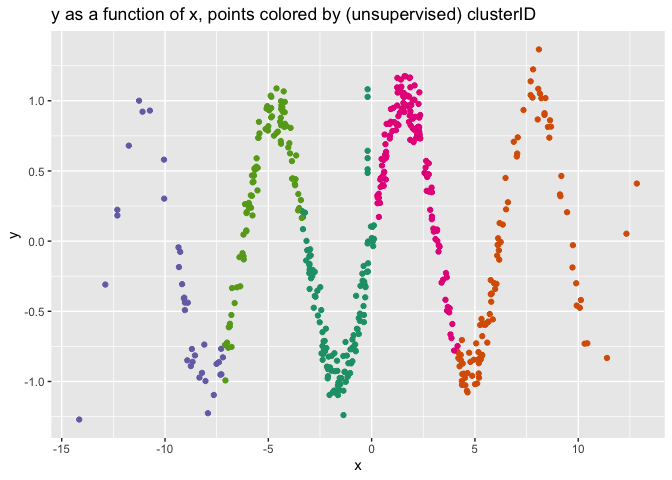
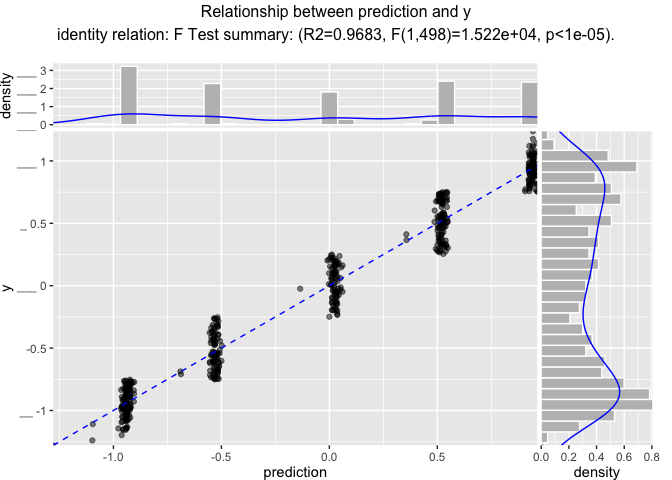
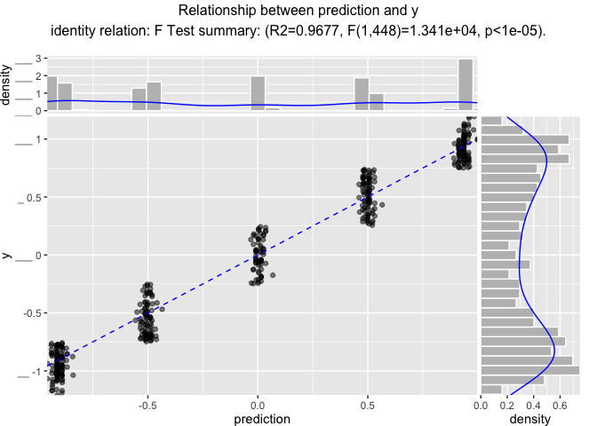

Unsupervised Fit Transform Notation
================

# Using vtreat with Unsupervised Problems and Non-Y-aware data treatment

Nina Zumel and John Mount December 2019

This is the [“fit\_transform”
variation](https://github.com/WinVector/vtreat/blob/master/Examples/fit_transform/fit_transform_api.md)
(a notation closer to that used in
[`pyvtreat`](https://github.com/WinVector/pyvtreat)) of the description
of the [`R` version of `vtreat`](https://github.com/WinVector/vtreat).
The original `vtreat` notation version can be found
[here](https://github.com/WinVector/vtreat/blob/master/Examples/Unsupervised/Unsupervised.md).
The same example for the [`Python` version of
`vtreat`](https://github.com/WinVector/pyvtreat) can be found
[here](https://github.com/WinVector/pyvtreat/blob/master/Examples/Unsupervised/Unsupervised.md).

## Preliminaries

Load modules/packages.

``` r
library(vtreat)
suppressPackageStartupMessages(library(ggplot2))
library(WVPlots)
library(rqdatatable)
```

    ## Loading required package: rquery

    ## 
    ## Attaching package: 'rquery'

    ## The following object is masked from 'package:ggplot2':
    ## 
    ##     arrow

Generate example data.

  - `y` is a noisy sinusoidal plus linear function of the variable `x`
  - Input `xc` is a categorical variable that represents a
    discretization of `y`, along with some `NaN`s
  - Input `x2` is a pure noise variable with no relationship to the
    output
  - Input `x3` is a constant variable

<!-- end list -->

``` r
make_data <- function(nrows) {
    d <- data.frame(x = 5*rnorm(nrows))
    d['y'] = sin(d[['x']]) + 0.01*d[['x']] + 0.1*rnorm(n = nrows)
    d[4:10, 'x'] = NA                  # introduce NAs
    d['xc'] = paste0('level_', 5*round(d$y/5, 1))
    d['x2'] = rnorm(n = nrows)
    d['x3'] = 1
    d[d['xc']=='level_-1', 'xc'] = NA  # introduce a NA level
    return(d)
}

d = make_data(500)

d %.>%
  head(.) %.>%
  knitr::kable(.)
```

|           x |           y | xc          |          x2 | x3 |
| ----------: | ----------: | :---------- | ----------: | -: |
|    3.685058 | \-0.4694790 | level\_-0.5 |   0.1983434 |  1 |
|  \-2.160786 | \-0.8939346 | NA          |   0.1470104 |  1 |
| \-12.306036 |   0.1827176 | level\_0    | \-0.2532391 |  1 |
|          NA |   0.5116525 | level\_0.5  | \-1.6476550 |  1 |
|          NA | \-0.0165443 | level\_0    | \-0.9109115 |  1 |
|          NA |   0.5911219 | level\_0.5  |   0.2693518 |  1 |

### Some quick data exploration

Check how many levels `xc` has, and their distribution (including `NaN`)

``` r
unique(d['xc'])
```

    ##             xc
    ## 1   level_-0.5
    ## 2         <NA>
    ## 3      level_0
    ## 4    level_0.5
    ## 8      level_1
    ## 108 level_-1.5
    ## 441  level_1.5

``` r
table(d$xc, useNA = 'always')
```

    ## 
    ## level_-0.5 level_-1.5    level_0  level_0.5    level_1  level_1.5       <NA> 
    ##         95          1         82         92        125          1        104

## Build a transform appropriate for unsupervised (or non-y-aware) problems.

The `vtreat` package is primarily intended for data treatment prior to
supervised learning, as detailed in the
[Classification](https://github.com/WinVector/pyvtreat/blob/master/Examples/Classification/Classification.ipynb)
and
[Regression](https://github.com/WinVector/pyvtreat/blob/master/Examples/Regression/Regression.ipynb)
examples. In these situations, `vtreat` specifically uses the
relationship between the inputs and the outcomes in the training data to
create certain types of synthetic variables. We call these more complex
synthetic variables *y-aware variables*.

However, you may also want to use `vtreat` for basic data treatment for
unsupervised problems, when there is no outcome variable. Or, you may
not want to create any y-aware variables when preparing the data for
supervised modeling. For these applications, `vtreat` is a convenient
alternative to: `pandas.get_dummies()` or
`sklearn.preprocessing.OneHotEncoder()`.

In any case, we still want training data where all the input variables
are numeric and have no missing values or `NaN`s.

First create the data treatment transform object, in this case a
treatment for an unsupervised problem.

``` r
transform_design = vtreat::UnsupervisedTreatment(
    var_list = setdiff(colnames(d), c('y'))   # columns to transform
)

# learn transform from data
d_prepared <-  transform_design$fit_transform(d)
```

Use the training data `d` to fit the transform and the return a treated
training set: completely numeric, with no missing values.

``` r
d_prepared = transform_design$transform(d)
d_prepared$y = d$y
```

Now examine the score frame, which gives information about each new
variable, including its type and which original variable it is derived
from. Some of the columns of the score frame (`y_aware`, `PearsonR`,
`significance` and `recommended`) are not relevant to the unsupervised
case; those columns are used by the Regression and Classification
transforms.

``` r
score_frame <- transform_design$score_frame()
knitr::kable(score_frame)
```

| varName                        | varMoves | rsq | sig | needsSplit | extraModelDegrees | origName | code  |
| :----------------------------- | :------- | --: | --: | :--------- | ----------------: | :------- | :---- |
| x                              | TRUE     |   0 |   1 | FALSE      |                 0 | x        | clean |
| x\_isBAD                       | TRUE     |   0 |   1 | FALSE      |                 0 | x        | isBAD |
| xc\_catP                       | TRUE     |   0 |   1 | TRUE       |                 6 | xc       | catP  |
| x2                             | TRUE     |   0 |   1 | FALSE      |                 0 | x2       | clean |
| xc\_lev\_NA                    | TRUE     |   0 |   1 | FALSE      |                 0 | xc       | lev   |
| xc\_lev\_x\_level\_minus\_0\_5 | TRUE     |   0 |   1 | FALSE      |                 0 | xc       | lev   |
| xc\_lev\_x\_level\_0           | TRUE     |   0 |   1 | FALSE      |                 0 | xc       | lev   |
| xc\_lev\_x\_level\_0\_5        | TRUE     |   0 |   1 | FALSE      |                 0 | xc       | lev   |
| xc\_lev\_x\_level\_1           | TRUE     |   0 |   1 | FALSE      |                 0 | xc       | lev   |

Notice that the variable `xc` has been converted to multiple variables:

  - an indicator variable for each possible level, including `NA` or
    missing (`xc_lev*`)
  - a variable indicating when `xc` was `NaN` in the original data
    (`xd_isBAD`)
  - a variable that returns how prevalent this particular value of `xc`
    is in the training data (`xc_catP`)

Any or all of these new variables are available for downstream modeling.

Also note that the variable `x3` did not show up in the score frame, as
it had no range (didn’t vary), so the unsupervised treatment dropped it.

Let’s look at the top of `d_prepared`, which includes all the new
variables, plus `y` (and excluding `x3`).

``` r
d_prepared %.>%
  head(.) %.>%
  knitr::kable(.)
```

|            x | x\_isBAD | xc\_catP |          x2 | xc\_lev\_NA | xc\_lev\_x\_level\_minus\_0\_5 | xc\_lev\_x\_level\_0 | xc\_lev\_x\_level\_0\_5 | xc\_lev\_x\_level\_1 |           y |
| -----------: | -------: | -------: | ----------: | ----------: | -----------------------------: | -------------------: | ----------------------: | -------------------: | ----------: |
|    3.6850581 |        0 |    0.190 |   0.1983434 |           0 |                              1 |                    0 |                       0 |                    0 | \-0.4694790 |
|  \-2.1607860 |        0 |    0.208 |   0.1470104 |           1 |                              0 |                    0 |                       0 |                    0 | \-0.8939346 |
| \-12.3060357 |        0 |    0.164 | \-0.2532391 |           0 |                              0 |                    1 |                       0 |                    0 |   0.1827176 |
|  \-0.1947655 |        1 |    0.184 | \-1.6476550 |           0 |                              0 |                    0 |                       1 |                    0 |   0.5116525 |
|  \-0.1947655 |        1 |    0.164 | \-0.9109115 |           0 |                              0 |                    1 |                       0 |                    0 | \-0.0165443 |
|  \-0.1947655 |        1 |    0.184 |   0.2693518 |           0 |                              0 |                    0 |                       1 |                    0 |   0.5911219 |

## Using the Prepared Data to Model

Of course, what we really want to do with the prepared training data is
to model.

### K-means clustering

Let’s start with an unsupervised analysis: clustering.

``` r
# don't use y to cluster
not_variables <- c('y')
model_vars <- setdiff(colnames(d_prepared), not_variables)

clusters = kmeans(d_prepared[, model_vars, drop = FALSE], centers = 5)

d_prepared['clusterID'] <- clusters$cluster
head(d_prepared$clusterID)
```

    ## [1] 4 1 3 1 1 1

``` r
ggplot(data = d_prepared, aes(x=x, y=y, color=as.character(clusterID))) +
  geom_point() +
  ggtitle('y as a function of x, points colored by (unsupervised) clusterID') +
  theme(legend.position="none") +
  scale_colour_brewer(palette = "Dark2")
```

<!-- -->

### Supervised modeling with non-y-aware variables

Since in this case we have an outcome variable, `y`, we can try fitting
a linear regression model to `d_prepared`.

``` r
f <- wrapr::mk_formula('y', model_vars)

model = lm(f, data = d_prepared)

# now predict
d_prepared['prediction'] = predict(
  model,
  newdata = d_prepared)
```

    ## Warning in predict.lm(model, newdata = d_prepared): prediction from a rank-
    ## deficient fit may be misleading

``` r
# look at the fit (on the training data)
WVPlots::ScatterHist(
  d_prepared, 
  xvar = 'prediction',
  yvar = 'y',
  smoothmethod = 'identity',
  estimate_sig = TRUE,
  title = 'Relationship between prediction and y')
```

<!-- -->

Now apply the model to new data.

``` r
# create the new data
dtest <- make_data(450)

# prepare the new data with vtreat
dtest_prepared = transform_design$transform(dtest)
dtest_prepared$y = dtest$y

# apply the model to the prepared data
dtest_prepared['prediction'] = predict(
  model,
  newdata = dtest_prepared)
```

    ## Warning in predict.lm(model, newdata = dtest_prepared): prediction from a rank-
    ## deficient fit may be misleading

``` r
# compare the predictions to the outcome (on the test data)
WVPlots::ScatterHist(
  dtest_prepared, 
  xvar = 'prediction',
  yvar = 'y',
  smoothmethod = 'identity',
  estimate_sig = TRUE,
  title = 'Relationship between prediction and y')
```

<!-- -->

``` r
# get r-squared
sigr::wrapFTest(dtest_prepared, 
                predictionColumnName = 'prediction',
                yColumnName = 'y',
                nParameters = length(model_vars) + 1)
```

    ## [1] "F Test summary: (R2=0.9677, F(10,439)=1314, p<1e-05)."

## Parameters for `UnsupervisedTreatment`

We’ve tried to set the defaults for all parameters so that `vtreat` is
usable out of the box for most applications. Notice that the parameter
object for unsupervised treatment defines a different set of parameters
than the parameter object for supervised treatments
(`vtreat.vtreat_parameters`).

    vtreat.unsupervised_parameters()

**coders**: The types of synthetic variables that `vtreat` will
(potentially) produce. See *Types of prepared variables* below.

**indicator\_min\_fraction**: By default, `UnsupervisedTreatment`
creates indicators for all possible levels (`indicator_min_fraction=0`).
If `indicator_min_fraction` \> 0, then indicator variables (type
`indicator_code`) are only produced for levels that are present at least
`indicator_min_fraction` of the time. A consequence of this is that
1/`indicator_min_fraction` is the maximum number of indicators that will
be produced for a given categorical variable. See the Example below.

**user\_transforms**: For passing in user-defined transforms for custom
data preparation. Won’t be needed in most situations, but see
[here](https://github.com/WinVector/pyvtreat/blob/master/Examples/UserCoders/UserCoders.ipynb)
for an example of applying a GAM transform to input variables.

**sparse\_indicators**: When True, use a (Pandas) sparse representation
for indicator variables. This representation is compatible with
`sklearn`; however, it may not be compatible with other modeling
packages. When False, use a dense representation.

## Types of prepared variables

**clean**: Produced from numerical variables: a clean numerical variable
with no `NaNs` or missing values

**lev**: Produced from categorical variables, one for each level: for
each level of the variable, indicates if that level was “on”

**catP**: Produced from categorical variables: indicates how often each
level of the variable was “on”

**isBAD**: Produced for both numerical and categorical variables: an
indicator variable that marks when the original variable was missing or
`NaN`

## Conclusion

In all cases (classification, regression, unsupervised, and multinomial
classification) the intent is that `vtreat` transforms are essentially
one liners.

The preparation commands are organized as follows:

  - **Regression**: [`R` regression
    example](https://github.com/WinVector/vtreat/blob/master/Examples/Regression/Regression.md),
    [`Python` regression
    example](https://github.com/WinVector/pyvtreat/blob/master/Examples/Regression/Regression.md).
  - **Classification**: [`R` classification
    example](https://github.com/WinVector/vtreat/blob/master/Examples/Classification/Classification.md),
    [`Python` classification
    example](https://github.com/WinVector/pyvtreat/blob/master/Examples/Classification/Classification.md).
  - **Unsupervised tasks**: [`R` unsupervised
    example](https://github.com/WinVector/vtreat/blob/master/Examples/Unsupervised/Unsupervised.md),
    [`Python` unsupervised
    example](https://github.com/WinVector/pyvtreat/blob/master/Examples/Unsupervised/Unsupervised.md).
  - **Multinomial classification**: [`R` multinomial classification
    example](https://github.com/WinVector/vtreat/blob/master/Examples/Multinomial/MultinomialExample.md),
    [`Python` multinomial classification
    example](https://github.com/WinVector/pyvtreat/blob/master/Examples/Multinomial/MultinomialExample.md).

These current revisions of the examples are designed to be small, yet
complete. So as a set they have some overlap, but the user can rely
mostly on a single example for a single task type.
