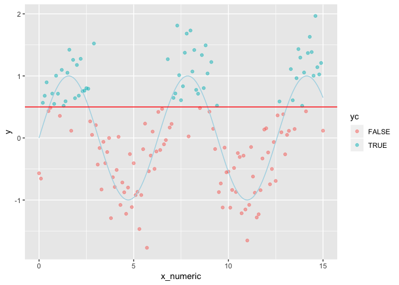
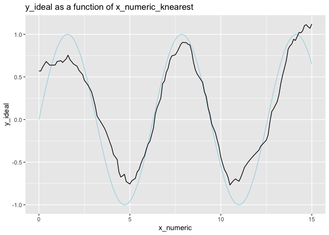
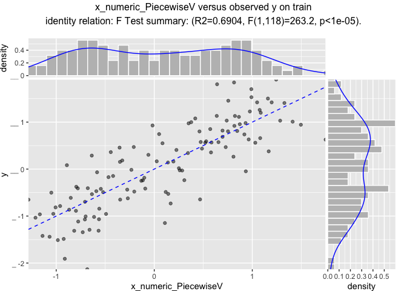
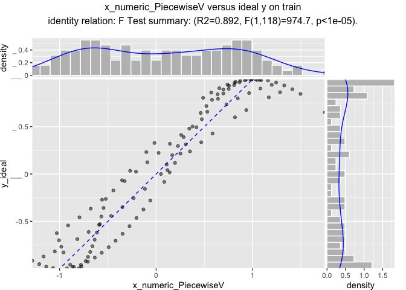
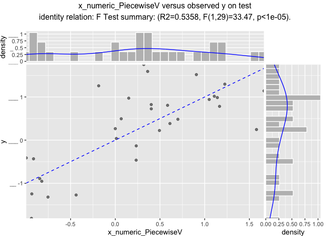
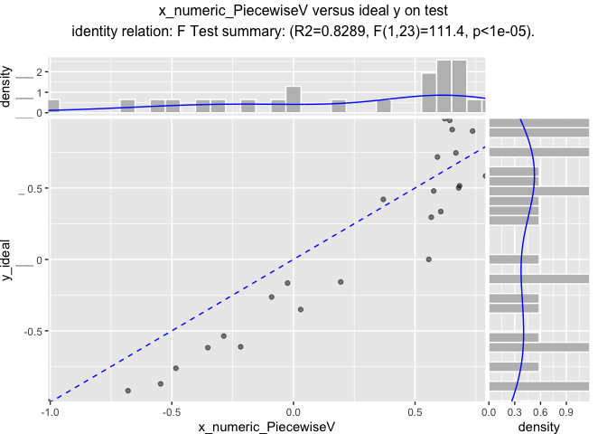

CustomCoders2
================

``` r
library("ggplot2")
```

``` r
customCoders = list('c.PiecewiseV.num' = vtreat::solve_piecewise,
                    'n.PiecewiseV.num' = vtreat::solve_piecewise,
                    'c.knearest.num' = vtreat::square_window,
                    'n.knearest.num' = vtreat::square_window,
                    'n.poolN.center' = vtreat::ppCoderN, 
                    'c.poolC.center' = vtreat::ppCoderC,
                    'n.NonDecreasingV.num' = vtreat::solveNonDecreasing,
                    'n.NonIncreasingV.num' = vtreat::solveNonIncreasing, 
                    'c.NonDecreasingV.num' = vtreat::solveNonDecreasing,
                    'c.NonIncreasingV.num' = vtreat::solveNonIncreasing)
codeRestriction = c("PiecewiseV", 
                    "knearest",
                    "poolN", "poolC",
                    "NonDecreasingV", "NonIncreasingV",
                    "clean", "isBAD", "catB", "catP")
```

``` r
d <- data.frame(x_numeric = seq(0, 15, by = 0.1))
d$x_cat <- paste0("l_", round(d$x_numeric, digits = 1))
d$y_ideal <- sin(d$x_numeric)
d$x_numeric_noise <- d$x_numeric[sample.int(nrow(d), nrow(d), replace = FALSE)]
d$x_cat_noise <- d$x_cat[sample.int(nrow(d), nrow(d), replace = FALSE)]
d$y <- d$y_ideal + 0.5*rnorm(nrow(d))
d$yc <- d$y>0.5
d$is_train <- runif(nrow(d))>=0.2

head(d)
```

    ##   x_numeric x_cat    y_ideal x_numeric_noise x_cat_noise          y    yc
    ## 1       0.0   l_0 0.00000000             5.5      l_11.6 -0.5686398 FALSE
    ## 2       0.1 l_0.1 0.09983342             9.6       l_4.2 -0.6545754 FALSE
    ## 3       0.2 l_0.2 0.19866933            14.0       l_3.9  0.5670252  TRUE
    ## 4       0.3 l_0.3 0.29552021             3.7       l_0.6  0.6804519  TRUE
    ## 5       0.4 l_0.4 0.38941834            14.1      l_14.8  0.8965580  TRUE
    ## 6       0.5 l_0.5 0.47942554            10.8       l_5.7  0.4329189 FALSE
    ##   is_train
    ## 1    FALSE
    ## 2     TRUE
    ## 3     TRUE
    ## 4    FALSE
    ## 5     TRUE
    ## 6    FALSE

``` r
summary(d)
```

    ##    x_numeric        x_cat              y_ideal        x_numeric_noise
    ##  Min.   : 0.00   Length:151         Min.   :-1.0000   Min.   : 0.00  
    ##  1st Qu.: 3.75   Class :character   1st Qu.:-0.5813   1st Qu.: 3.75  
    ##  Median : 7.50   Mode  :character   Median : 0.2315   Median : 7.50  
    ##  Mean   : 7.50                      Mean   : 0.1186   Mean   : 7.50  
    ##  3rd Qu.:11.25                      3rd Qu.: 0.8011   3rd Qu.:11.25  
    ##  Max.   :15.00                      Max.   : 0.9996   Max.   :15.00  
    ##  x_cat_noise              y               yc           is_train      
    ##  Length:151         Min.   :-1.7697   Mode :logical   Mode :logical  
    ##  Class :character   1st Qu.:-0.5072   FALSE:93        FALSE:25       
    ##  Mode  :character   Median : 0.1448   TRUE :58        TRUE :126      
    ##                     Mean   : 0.1604                                  
    ##                     3rd Qu.: 0.7842                                  
    ##                     Max.   : 1.9670

``` r
ggplot(data=d) +
  geom_point(aes(x = x_numeric, y = y, color = yc), alpha=0.5) + 
  geom_line(aes(x = x_numeric, y = y_ideal), color = "lightblue") +
  geom_hline(yintercept = 0.5, color = "red")
```



``` r
cfn <- vtreat::mkCrossFrameNExperiment(
  d[d$is_train, , drop=FALSE], 
  c('x_numeric', 'x_numeric_noise', 'x_cat', 'x_cat_noise'), 'y',
  customCoders = customCoders,
  codeRestriction = codeRestriction,
  verbose = FALSE)

cfn$treatments
```

    ##                           varName varMoves          rsq          sig
    ## 1            x_numeric_PiecewiseV     TRUE 0.5617943087 5.767040e-24
    ## 2              x_numeric_knearest     TRUE 0.5344920255 2.505602e-22
    ## 3        x_numeric_NonDecreasingV     TRUE 0.1245440581 5.054224e-05
    ## 4        x_numeric_NonIncreasingV     TRUE 0.0322826229 4.409931e-02
    ## 5                 x_numeric_clean     TRUE 0.0066397184 3.643779e-01
    ## 6      x_numeric_noise_PiecewiseV     TRUE 0.0034862081 5.113503e-01
    ## 7        x_numeric_noise_knearest     TRUE 0.0518797630 1.031596e-02
    ## 8  x_numeric_noise_NonDecreasingV     TRUE 0.0024573023 5.814769e-01
    ## 9  x_numeric_noise_NonIncreasingV     TRUE 0.0002236983 8.679815e-01
    ## 10          x_numeric_noise_clean     TRUE 0.0008698979 7.430315e-01
    ##    needsSplit extraModelDegrees        origName           code
    ## 1        TRUE               126       x_numeric     PiecewiseV
    ## 2        TRUE               126       x_numeric       knearest
    ## 3        TRUE               126       x_numeric NonDecreasingV
    ## 4        TRUE               126       x_numeric NonIncreasingV
    ## 5       FALSE                 0       x_numeric          clean
    ## 6        TRUE               126 x_numeric_noise     PiecewiseV
    ## 7        TRUE               126 x_numeric_noise       knearest
    ## 8        TRUE               126 x_numeric_noise NonDecreasingV
    ## 9        TRUE               126 x_numeric_noise NonIncreasingV
    ## 10      FALSE                 0 x_numeric_noise          clean

``` r
vtreat::variable_values(cfn$treatments$scoreFrame)
```

    ##                        rsq count          sig             var
    ## x_numeric       0.56179431     5 2.883520e-23       x_numeric
    ## x_numeric_noise 0.05187976     5 5.157978e-02 x_numeric_noise

``` r
# or directly
vtreat::value_variables_N(
  d[d$is_train, , drop=FALSE], 
  c('x_numeric', 'x_numeric_noise', 'x_cat', 'x_cat_noise'), 'y')
```

    ##                        rsq count          sig             var
    ## x_numeric       0.60989841     3 1.229382e-26       x_numeric
    ## x_numeric_noise 0.02931223     3 1.657779e-01 x_numeric_noise

``` r
prepared <- vtreat::prepare(cfn$treatments, d)
d$x_numeric_PiecewiseV <- prepared$x_numeric_PiecewiseV
d$x_numeric_knearest <- prepared$x_numeric_knearest

ggplot(data=d) +
  # geom_point(aes(x = x_numeric, y = y)) + 
  geom_line(aes(x = x_numeric, y = y_ideal), color = "lightblue") + 
  geom_line(aes(x = x_numeric, y = x_numeric_PiecewiseV)) +
  ggtitle("y_ideal as a function of x_numeric_PiecewiseV")
```


``` r
ggplot(data=d) +
  # geom_point(aes(x = x_numeric, y = y)) + 
  geom_line(aes(x = x_numeric, y = y_ideal), color = "lightblue") + 
  geom_line(aes(x = x_numeric, y = x_numeric_knearest)) +
  ggtitle("y_ideal as a function of x_numeric_knearest")
```



``` r
WVPlots::ScatterHist(d[d$is_train, , drop=FALSE], 
                     "x_numeric_PiecewiseV", "y",
                     "x_numeric_PiecewiseV versus observed y on train",
                     smoothmethod = "identity",
                     estimate_sig = TRUE)
```



``` r
WVPlots::ScatterHist(d[d$is_train, , drop=FALSE], 
                     "x_numeric_PiecewiseV", "y_ideal",
                     "x_numeric_PiecewiseV versus ideal y on train",
                     smoothmethod = "identity",
                     estimate_sig = TRUE)
```



``` r
WVPlots::ScatterHist(d[!d$is_train, , drop=FALSE], 
                     "x_numeric_PiecewiseV", "y",
                     "x_numeric_PiecewiseV versus observed y on test",
                     smoothmethod = "identity",
                     estimate_sig = TRUE)
```



``` r
WVPlots::ScatterHist(d[!d$is_train, , drop=FALSE], 
                     "x_numeric_PiecewiseV", "y_ideal",
                     "x_numeric_PiecewiseV versus ideal y on test",
                     smoothmethod = "identity",
                     estimate_sig = TRUE)
```



``` r
cfc <- vtreat::mkCrossFrameCExperiment(
  d[d$is_train, , drop=FALSE], 
  c('x_numeric', 'x_numeric_noise', 'x_cat', 'x_cat_noise'), 'yc', TRUE,
  customCoders = customCoders,
  codeRestriction = codeRestriction,
  verbose = FALSE)
```

    ## Warning in checkConv(attr(opt, "derivs"), opt$par, ctrl = control$checkConv, : Model is nearly unidentifiable: large eigenvalue ratio
    ##  - Rescale variables?

    ## Warning in checkConv(attr(opt, "derivs"), opt$par, ctrl = control$checkConv, : Model is nearly unidentifiable: large eigenvalue ratio
    ##  - Rescale variables?

    ## Warning in checkConv(attr(opt, "derivs"), opt$par, ctrl = control$checkConv, : Model is nearly unidentifiable: large eigenvalue ratio
    ##  - Rescale variables?

    ## Warning in checkConv(attr(opt, "derivs"), opt$par, ctrl = control$checkConv, : Model is nearly unidentifiable: large eigenvalue ratio
    ##  - Rescale variables?

    ## Warning in checkConv(attr(opt, "derivs"), opt$par, ctrl = control$checkConv, : Model is nearly unidentifiable: large eigenvalue ratio
    ##  - Rescale variables?

    ## Warning in checkConv(attr(opt, "derivs"), opt$par, ctrl = control$checkConv, : Model is nearly unidentifiable: large eigenvalue ratio
    ##  - Rescale variables?

    ## Warning in checkConv(attr(opt, "derivs"), opt$par, ctrl = control$checkConv, : Model is nearly unidentifiable: large eigenvalue ratio
    ##  - Rescale variables?

    ## Warning in checkConv(attr(opt, "derivs"), opt$par, ctrl = control$checkConv, : Model is nearly unidentifiable: large eigenvalue ratio
    ##  - Rescale variables?

    ## Warning in checkConv(attr(opt, "derivs"), opt$par, ctrl = control$checkConv, : Model is nearly unidentifiable: large eigenvalue ratio
    ##  - Rescale variables?

    ## Warning in checkConv(attr(opt, "derivs"), opt$par, ctrl = control$checkConv, : Model is nearly unidentifiable: large eigenvalue ratio
    ##  - Rescale variables?

``` r
cfc$treatments
```

    ##                           varName varMoves          rsq          sig
    ## 1            x_numeric_PiecewiseV     TRUE 0.3336698513 7.715998e-14
    ## 2              x_numeric_knearest     TRUE 0.3393407328 4.760339e-14
    ## 3        x_numeric_NonDecreasingV     TRUE 0.0457608621 5.635948e-03
    ## 4        x_numeric_NonIncreasingV     TRUE 0.0390361564 1.056510e-02
    ## 5                 x_numeric_clean     TRUE 0.0009314007 6.928910e-01
    ## 6      x_numeric_noise_PiecewiseV     TRUE 0.0066756833 2.903673e-01
    ## 7        x_numeric_noise_knearest     TRUE 0.0208473705 6.169864e-02
    ## 8  x_numeric_noise_NonDecreasingV     TRUE 0.0035748240 4.390958e-01
    ## 9  x_numeric_noise_NonIncreasingV     TRUE 0.0129334417 1.411066e-01
    ## 10          x_numeric_noise_clean     TRUE 0.0008188136 7.111616e-01
    ##    needsSplit extraModelDegrees        origName           code
    ## 1        TRUE               126       x_numeric     PiecewiseV
    ## 2        TRUE               126       x_numeric       knearest
    ## 3        TRUE               126       x_numeric NonDecreasingV
    ## 4        TRUE               126       x_numeric NonIncreasingV
    ## 5       FALSE                 0       x_numeric          clean
    ## 6        TRUE               126 x_numeric_noise     PiecewiseV
    ## 7        TRUE               126 x_numeric_noise       knearest
    ## 8        TRUE               126 x_numeric_noise NonDecreasingV
    ## 9        TRUE               126 x_numeric_noise NonIncreasingV
    ## 10      FALSE                 0 x_numeric_noise          clean

``` r
vtreat::variable_values(cfc$treatments$scoreFrame)
```

    ##                        rsq count          sig             var
    ## x_numeric       0.33934073     5 2.380169e-13       x_numeric
    ## x_numeric_noise 0.02084737     5 3.084932e-01 x_numeric_noise

``` r
# or directly
vtreat::value_variables_C(
  d[d$is_train, , drop=FALSE], 
  c('x_numeric', 'x_numeric_noise', 'x_cat', 'x_cat_noise'), 'yc', TRUE)
```

    ##                         rsq count          sig             var
    ## x_numeric       0.351839821     3 4.927672e-14       x_numeric
    ## x_numeric_noise 0.005440856     3 1.000000e+00 x_numeric_noise
