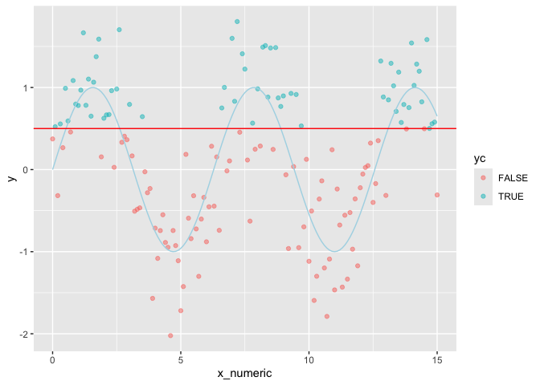
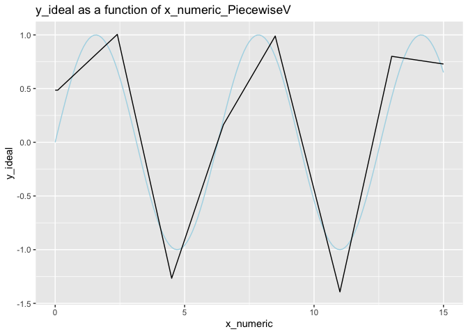
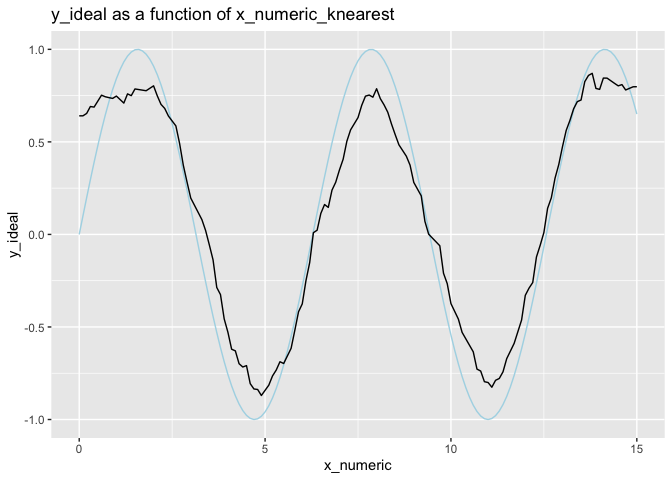
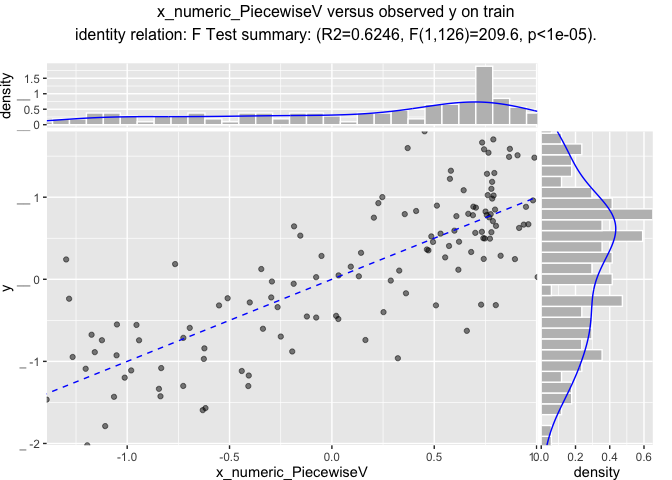
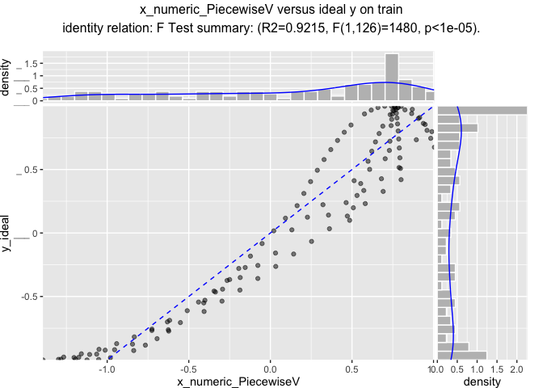
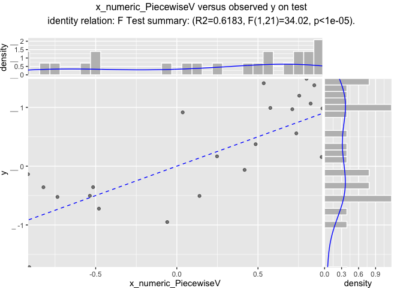
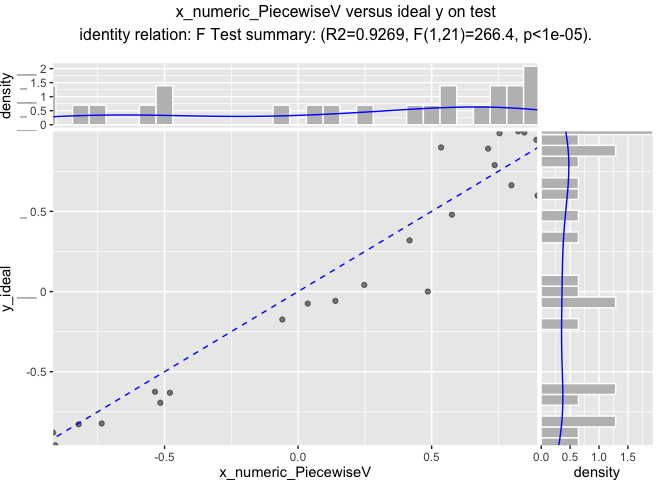

CustomCoders2
================

``` r
library("ggplot2")
```

    ## Warning: package 'ggplot2' was built under R version 4.3.2

``` r
customCoders = list('c.PiecewiseV.num' = vtreat::solve_piecewise,
                    'n.PiecewiseV.num' = vtreat::solve_piecewise,
                    'c.knearest.num' = vtreat::square_window,
                    'n.knearest.num' = vtreat::square_window)
codeRestriction = c("PiecewiseV", 
                    "knearest",
                    "clean", "isBAD", "catB", "catP")
```

``` r
d <- data.frame(x_numeric = seq(0, 15, by = 0.1))
d$x_cat <- paste0("l_", round(d$x_numeric, digits = 1))
d$y_ideal <- sin(d$x_numeric)
d$x_numeric_noise <- d$x_numeric[sample.int(nrow(d), nrow(d), replace = FALSE)]
d$x_cat_noise <- d$x_cat[sample.int(nrow(d), nrow(d), replace = FALSE)]
d$y <- d$y_ideal + 0.5*rnorm(nrow(d))
d$yc <- d$y>0.5
d$is_train <- runif(nrow(d))>=0.2

head(d)
```

    ##   x_numeric x_cat    y_ideal x_numeric_noise x_cat_noise          y    yc
    ## 1       0.0   l_0 0.00000000            14.2      l_11.6  0.3734971 FALSE
    ## 2       0.1 l_0.1 0.09983342            13.7       l_6.7  0.5224157  TRUE
    ## 3       0.2 l_0.2 0.19866933            11.0         l_4 -0.3172854 FALSE
    ## 4       0.3 l_0.3 0.29552021             3.3       l_8.9  0.5562089  TRUE
    ## 5       0.4 l_0.4 0.38941834             4.1       l_8.6  0.2665816 FALSE
    ## 6       0.5 l_0.5 0.47942554             0.0       l_7.9  0.9899354  TRUE
    ##   is_train
    ## 1    FALSE
    ## 2     TRUE
    ## 3     TRUE
    ## 4     TRUE
    ## 5     TRUE
    ## 6    FALSE

``` r
summary(d)
```

    ##    x_numeric        x_cat              y_ideal        x_numeric_noise
    ##  Min.   : 0.00   Length:151         Min.   :-1.0000   Min.   : 0.00  
    ##  1st Qu.: 3.75   Class :character   1st Qu.:-0.5813   1st Qu.: 3.75  
    ##  Median : 7.50   Mode  :character   Median : 0.2315   Median : 7.50  
    ##  Mean   : 7.50                      Mean   : 0.1186   Mean   : 7.50  
    ##  3rd Qu.:11.25                      3rd Qu.: 0.8011   3rd Qu.:11.25  
    ##  Max.   :15.00                      Max.   : 0.9996   Max.   :15.00  
    ##  x_cat_noise              y               yc           is_train      
    ##  Length:151         Min.   :-2.0224   Mode :logical   Mode :logical  
    ##  Class :character   1st Qu.:-0.5152   FALSE:89        FALSE:23       
    ##  Mode  :character   Median : 0.2483   TRUE :62        TRUE :128      
    ##                     Mean   : 0.1469                                  
    ##                     3rd Qu.: 0.8285                                  
    ##                     Max.   : 1.8031

``` r
ggplot(data=d) +
  geom_point(aes(x = x_numeric, y = y, color = yc), alpha=0.5) + 
  geom_line(aes(x = x_numeric, y = y_ideal), color = "lightblue") +
  geom_hline(yintercept = 0.5, color = "red")
```

<!-- -->

``` r
cfn <- vtreat::mkCrossFrameNExperiment(
  d[d$is_train, , drop=FALSE], 
  c('x_numeric', 'x_numeric_noise', 'x_cat', 'x_cat_noise'), 'y',
  customCoders = customCoders,
  codeRestriction = codeRestriction,
  verbose = FALSE)

cfn$treatments
```

    ## [1] "treatmentplan"
    ##          origName                    varName       code          rsq
    ## 1       x_numeric       x_numeric_PiecewiseV PiecewiseV 5.334440e-01
    ## 2       x_numeric         x_numeric_knearest   knearest 4.925440e-01
    ## 3       x_numeric                  x_numeric      clean 2.820451e-04
    ## 4 x_numeric_noise x_numeric_noise_PiecewiseV PiecewiseV 3.929442e-05
    ## 5 x_numeric_noise   x_numeric_noise_knearest   knearest 1.335695e-02
    ## 6 x_numeric_noise            x_numeric_noise      clean 2.960446e-03
    ##            sig extraModelDegrees recommended
    ## 1 1.334651e-22               128        TRUE
    ## 2 2.762734e-20               128        TRUE
    ## 3 8.507559e-01                 0       FALSE
    ## 4 9.440144e-01               128       FALSE
    ## 5 1.939158e-01               128       FALSE
    ## 6 5.418670e-01                 0       FALSE

``` r
vtreat::variable_values(cfn$treatments$scoreFrame)
```

    ##          rsq count          sig             var
    ## 1 0.53344399     3 4.003954e-22       x_numeric
    ## 2 0.01335695     3 5.817473e-01 x_numeric_noise

``` r
# or directly
vtreat::value_variables_N(
  d[d$is_train, , drop=FALSE], 
  c('x_numeric', 'x_numeric_noise', 'x_cat', 'x_cat_noise'), 'y')
```

    ##           rsq count         sig             var
    ## 1 0.588661027     3 1.36563e-25       x_numeric
    ## 2 0.002960446     3 1.00000e+00 x_numeric_noise

``` r
prepared <- vtreat::prepare(cfn$treatments, d)
d$x_numeric_PiecewiseV <- prepared$x_numeric_PiecewiseV
d$x_numeric_knearest <- prepared$x_numeric_knearest

ggplot(data=d) +
  # geom_point(aes(x = x_numeric, y = y)) + 
  geom_line(aes(x = x_numeric, y = y_ideal), color = "lightblue") + 
  geom_line(aes(x = x_numeric, y = x_numeric_PiecewiseV)) +
  ggtitle("y_ideal as a function of x_numeric_PiecewiseV")
```

<!-- -->

``` r
ggplot(data=d) +
  # geom_point(aes(x = x_numeric, y = y)) + 
  geom_line(aes(x = x_numeric, y = y_ideal), color = "lightblue") + 
  geom_line(aes(x = x_numeric, y = x_numeric_knearest)) +
  ggtitle("y_ideal as a function of x_numeric_knearest")
```

<!-- -->

``` r
WVPlots::ScatterHist(d[d$is_train, , drop=FALSE], 
                     "x_numeric_PiecewiseV", "y",
                     "x_numeric_PiecewiseV versus observed y on train",
                     smoothmethod = "identity",
                     estimate_sig = TRUE)
```

<!-- -->

``` r
WVPlots::ScatterHist(d[d$is_train, , drop=FALSE], 
                     "x_numeric_PiecewiseV", "y_ideal",
                     "x_numeric_PiecewiseV versus ideal y on train",
                     smoothmethod = "identity",
                     estimate_sig = TRUE)
```

<!-- -->

``` r
WVPlots::ScatterHist(d[!d$is_train, , drop=FALSE], 
                     "x_numeric_PiecewiseV", "y",
                     "x_numeric_PiecewiseV versus observed y on test",
                     smoothmethod = "identity",
                     estimate_sig = TRUE)
```

<!-- -->

``` r
WVPlots::ScatterHist(d[!d$is_train, , drop=FALSE], 
                     "x_numeric_PiecewiseV", "y_ideal",
                     "x_numeric_PiecewiseV versus ideal y on test",
                     smoothmethod = "identity",
                     estimate_sig = TRUE)
```

<!-- -->

``` r
cfc <- vtreat::mkCrossFrameCExperiment(
  d[d$is_train, , drop=FALSE], 
  c('x_numeric', 'x_numeric_noise', 'x_cat', 'x_cat_noise'), 'yc', TRUE,
  customCoders = customCoders,
  codeRestriction = codeRestriction,
  verbose = FALSE)

cfc$treatments
```

    ## [1] "treatmentplan"
    ##          origName                    varName       code          rsq
    ## 1       x_numeric       x_numeric_PiecewiseV PiecewiseV 1.877662e-01
    ## 2       x_numeric         x_numeric_knearest   knearest 2.496124e-01
    ## 3       x_numeric                  x_numeric      clean 5.736466e-05
    ## 4 x_numeric_noise x_numeric_noise_PiecewiseV PiecewiseV 2.303475e-03
    ## 5 x_numeric_noise   x_numeric_noise_knearest   knearest 9.806091e-04
    ## 6 x_numeric_noise            x_numeric_noise      clean 1.160522e-02
    ##            sig extraModelDegrees recommended
    ## 1 1.211510e-08               128        TRUE
    ## 2 5.037179e-11               128        TRUE
    ## 3 9.206648e-01                 0       FALSE
    ## 4 5.279610e-01               128       FALSE
    ## 5 6.804979e-01               128       FALSE
    ## 6 1.565991e-01                 0        TRUE

``` r
vtreat::variable_values(cfc$treatments$scoreFrame)
```

    ##          rsq count          sig             var
    ## 1 0.24961236     3 1.511154e-10       x_numeric
    ## 2 0.01160522     3 4.697974e-01 x_numeric_noise

``` r
# or directly
vtreat::value_variables_C(
  d[d$is_train, , drop=FALSE], 
  c('x_numeric', 'x_numeric_noise', 'x_cat', 'x_cat_noise'), 'yc', TRUE)
```

    ##          rsq count          sig             var
    ## 1 0.24719323     3 1.871417e-10       x_numeric
    ## 2 0.01160522     3 4.697974e-01 x_numeric_noise
