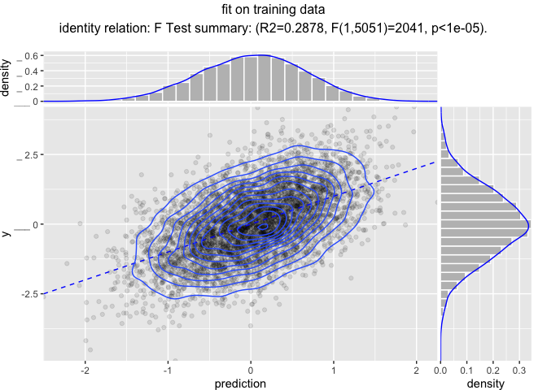
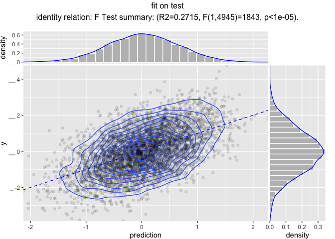

Modeling Pipelines
================

Reusable modeling pipelines are a practical idea that gets re-developed many times in many contexts. [`wrapr`](https://github.com/WinVector/wrapr) supplies a particularly powerful pipeline notation, and as of version `1.8.0` pipeline re-use system (notes [here](https://winvector.github.io/wrapr/articles/Function_Objects.html)). We will demonstrate this with the [`vtreat`](https://github.com/WinVector/vtreat) data preparation system.

``` r
library("wrapr")
library("vtreat")
library("glmnet")
```

    ## Loading required package: Matrix

    ## Loading required package: foreach

    ## Loaded glmnet 2.0-16

``` r
library("ggplot2")
library("WVPlots")
library("doParallel")
```

    ## Loading required package: iterators

    ## Loading required package: parallel

``` r
library("rqdatatable")
```

    ## Loading required package: rquery

``` r
ncore <- parallel::detectCores()
cl <- parallel::makeCluster(ncore)
registerDoParallel(cl)

# function to make practice data
mk_data <- function(nrows, n_var_cols, n_noise_cols) {
  d <- data.frame(y = rnorm(nrows))
  for(i in seq_len(n_var_cols)) {
    vari = paste0("var_", sprintf("%03g", i))
    d[[vari]] <- rnorm(nrows)
    d$y <- d$y + (2/n_var_cols)*d[[vari]]
    d[[vari]][d[[vari]]>abs(2*rnorm(nrows))] <- NA
    d[[vari]] <- rlnorm(1, meanlog=10, sdlog = 10)*d[[vari]]
  }
  for(i in seq_len(n_noise_cols)) {
    vari = paste0("noise_", sprintf("%03g", i))
    d[[vari]] <- rnorm(nrows)
    d[[vari]][d[[vari]]>abs(2*rnorm(nrows))] <- NA
    d[[vari]] <- rlnorm(1, meanlog=10, sdlog = 10)*d[[vari]]
  }
  d
}

set.seed(2018)
d <- mk_data(10000, 10, 200)
is_train <- runif(nrow(d))<=0.5
dTrain <- d[is_train, , drop = FALSE]
dTest <- d[!is_train, , drop = FALSE]
outcome_name <- "y"
vars <- setdiff(colnames(dTrain), outcome_name)
```

Suppose our analysis plan is the following:

-   Fix missing values with `vtreat`.
-   Scale and center the data.
-   Model `y` as a function of the other columns using `glmnet`.

Now both `vtreat` and `glmnet` can scale, but we are going to keep the scaling as a separate step to show how composite data preparation pipelines work.

First we combine the pre-processing steps, and a fit model as follows.

``` r
# design a treatment plan using cross-validation methods
ncross <- 5
cplan <- vtreat::kWayStratifiedY(
  nrow(dTrain), ncross, dTrain, dTrain[[outcome_name]])
cp <- vtreat::mkCrossFrameNExperiment(
  dTrain, vars, outcome_name,
  splitFunction = pre_comp_xval(nrow(dTrain), ncross, cplan),
  ncross = ncross,
  parallelCluster = cl)
```

    ## [1] "vtreat 1.3.3 start initial treatment design Tue Dec  4 15:44:09 2018"
    ## [1] " start cross frame work Tue Dec  4 15:44:11 2018"
    ## [1] " vtreat::mkCrossFrameNExperiment done Tue Dec  4 15:44:16 2018"

``` r
print(cp$method)
```

    ## [1] "kwaycrossystratified ( pre-computed 5053 5 )"

``` r
# get the list of new variables
sf <- cp$treatments$scoreFrame
newvars <- sf$varName[sf$sig <= 1/nrow(sf)]
print(newvars)
```

    ##  [1] "var_001_clean"   "var_001_isBAD"   "var_002_clean"  
    ##  [4] "var_002_isBAD"   "var_003_clean"   "var_003_isBAD"  
    ##  [7] "var_004_clean"   "var_004_isBAD"   "var_005_clean"  
    ## [10] "var_005_isBAD"   "var_006_clean"   "var_006_isBAD"  
    ## [13] "var_007_clean"   "var_007_isBAD"   "var_008_clean"  
    ## [16] "var_008_isBAD"   "var_009_clean"   "var_009_isBAD"  
    ## [19] "var_010_clean"   "var_010_isBAD"   "noise_156_isBAD"

``` r
# learn a centering and scaling of the cross-validated 
# training frame
tfs <- scale(cp$crossFrame[, newvars, drop = FALSE], 
             center = TRUE, scale = TRUE)
centering <- attr(tfs, "scaled:center")
scaling <- attr(tfs, "scaled:scale")

# apply the centering and scaling to the cross-validated 
# training frame
tfs <- scale(cp$crossFrame[, newvars, drop = FALSE],
             center = centering,
             scale = scaling)

# build a cross-validation strategy to help us
# search for a good alpha hyper-parameter value
# convert the plan to cv.glmnet group notation
foldid <- numeric(nrow(dTrain))
for(i in seq_len(length(cplan))) {
  cpi <- cplan[[i]]
  foldid[cpi$app] <- i
}

# search for best cross-validated alpha
alphas <- seq(0, 1, by=0.05)
cross_scores <- lapply(
  alphas,
  function(alpha) {
    model <- cv.glmnet(as.matrix(tfs), 
                       cp$crossFrame[[outcome_name]],
                       alpha = alpha,
                       family = "gaussian", 
                       standardize = FALSE,
                       foldid = foldid, 
                       parallel = TRUE)
    index <- which(model$lambda == model$lambda.min)[[1]]
    score <- model$cvm[[index]]
    res <- data.frame(score = score, best_lambda = model$lambda.min)
    res$lambdas <- list(model$lambda)
    res$cvm <- list(model$cvm)
    res
  })
cross_scores <- do.call(rbind, cross_scores)
cross_scores$alpha = alphas
best_i <- which(cross_scores$score==min(cross_scores$score))[[1]]
alpha <- alphas[[best_i]]
s <- cross_scores$best_lambda[[best_i]]
lambdas <- cross_scores$lambdas[[best_i]]
lambdas <- lambdas[lambdas>=s]
print(length(newvars))
```

    ## [1] 21

``` r
print(alpha)
```

    ## [1] 0

``` r
print(s)
```

    ## [1] 0.02292036

``` r
# show cross-val results
ggplot(data = cross_scores,
       aes(x = alpha, y = score)) +
  geom_point() +
  geom_line() +
  ggtitle("best cross validated mean loss as function of alpha")
```


``` r
pf <- data.frame(s = cross_scores$lambdas[[best_i]],
                 cvm = cross_scores$cvm[[best_i]])
ggplot(data = pf,
       aes(x = s, y = cvm)) +
  geom_point() +
  geom_line() +
  scale_x_log10() +
  ggtitle("cross validated  mean loss as function of lambda/s",
          subtitle = paste("alpha =", alpha))
```


``` r
# re-fit model with chosen alpha
model <- glmnet(as.matrix(tfs), 
                cp$crossFrame[[outcome_name]],
                alpha = alpha,
                family = "gaussian", 
                standardize = FALSE,
                lambda = lambdas)
```

The question then is: how do we share such a model? Roughly we need to share the model, any fit parameters (such as centering and scaling choices), *and* the code sequence to apply all of these steps in the proper order. In this case the modeling pipeline consists of the following pieces:

-   The treatment plan `cp$treatments`.
-   The list of chosen variables `newvars`.
-   The centering and scaling vectors `centering` and `scaling`.
-   The `glmnet` model `model` and final chosen lambda/s value `s`.

These values are needed to run any data through the sequence of operations:

-   Using `vtreat` to prepare the data.
-   Restricting down to only modeling variables to make sure we have the right data for the scaling step.
-   Rescaling and centering the data.
-   Applying the `glmnet` model.
-   Converting the matrix of predictions into a vector of predictions.

The problem is: having worked had to build the model (taking a lot of steps and optimizing parameters/hyperparemeters) has left us with a lot of items and steps we need to share to have the full prediction process.

A really neat way to simply share of these things is the following.

Use `wrapr`'s ["function object" abstraction](https://winvector.github.io/wrapr/articles/Function_Objects.html), which treats names of functions, plus arguments as an efficient notation for partial evaluation. We can use this system to encode our model prediction pipeline as follows.

``` r
pipeline <-
  pkgfn("vtreat::prepare",
        arg_name = "dframe", 
        args = list(treatmentplan = cp$treatments,
                    varRestriction = newvars)) %.>%
  pkgfn("subset",
        arg_name = "x",
        args = list(select = newvars))  %.>%
  pkgfn("scale",
        arg_name = "x",
        args = list(center = centering,
                    scale = scaling))  %.>%
  pkgfn("glmnet::predict.glmnet",
        arg_name = "newx",
        args = list(object = model,
                    s = s))  %.>%
  srcfn(".[, cname, drop = TRUE]",
        arg_name = ".",
        args = list(cname = "1"))

cat(format(pipeline))
```

    ## UnaryFnList(
    ##    vtreat::prepare(dframe=., treatmentplan, varRestriction),
    ##    base::subset(x=., select),
    ##    base::scale(x=., center, scale),
    ##    glmnet::predict.glmnet(newx=., object, s),
    ##    SrcFunction{ .[, cname, drop = TRUE] }(.=., cname))

And you can then pipe data into the pipeline to get predictions.

``` r
dTrain %.>% pipeline %.>% head(.)
```

    ##          1          2          3          4          5          6 
    ## -0.6006445  0.4624558  0.1524533  0.4016349  0.4334204  0.1031797

``` r
dTest %.>% pipeline %.>% head(.)
```

    ##           1           2           3           4           5           6 
    ##  0.53640371 -0.05179475 -1.33273081  0.01080681 -1.12037319  0.65583570

Or you can use a functional notation [`ApplyTo()`](https://winvector.github.io/wrapr/reference/ApplyTo.html).

``` r
ApplyTo(pipeline, dTrain) %.>% head(.)
```

    ##          1          2          3          4          5          6 
    ## -0.6006445  0.4624558  0.1524533  0.4016349  0.4334204  0.1031797

The pipeline itself is a simple list of steps (with some class annotations added).

``` r
pipeline@items
```

    ## [[1]]
    ## [1] "vtreat::prepare(dframe=., treatmentplan, varRestriction)"
    ## 
    ## [[2]]
    ## [1] "base::subset(x=., select)"
    ## 
    ## [[3]]
    ## [1] "base::scale(x=., center, scale)"
    ## 
    ## [[4]]
    ## [1] "glmnet::predict.glmnet(newx=., object, s)"
    ## 
    ## [[5]]
    ## [1] "SrcFunction{ .[, cname, drop = TRUE] }(.=., cname)"

``` r
str(pipeline@items[[3]])
```

    ## Formal class 'PartialNamedFn' [package "wrapr"] with 4 slots
    ##   ..@ fn_name   : chr "scale"
    ##   ..@ fn_package: chr "base"
    ##   ..@ arg_name  : chr "x"
    ##   ..@ args      :List of 2
    ##   .. ..$ center: Named num [1:21] -3.98e-02 1.45e-01 -4.99e+05 1.47e-01 -7.73e+03 ...
    ##   .. .. ..- attr(*, "names")= chr [1:21] "var_001_clean" "var_001_isBAD" "var_002_clean" "var_002_isBAD" ...
    ##   .. ..$ scale : Named num [1:21] 1.68e-01 3.53e-01 1.95e+06 3.54e-01 3.57e+04 ...
    ##   .. .. ..- attr(*, "names")= chr [1:21] "var_001_clean" "var_001_isBAD" "var_002_clean" "var_002_isBAD" ...

If you do not like pipe notation you can also build the pipeline using [`fnlist()`](https://winvector.github.io/wrapr/reference/fnlist.html) list notation.

The pipeline can be saved, and contains the required parameters in simple lists.

``` r
saveRDS(dTrain, "dTrain.RDS")
saveRDS(pipeline, "pipeline.RDS")
```

Now the processing pipeline can be read back and used as follows.

``` r
# Fresh R session , not part of this markdown
library("wrapr")

pipeline <- readRDS("pipeline.RDS")
dTrain <- readRDS("dTrain.RDS")
dTrain %.>% pipeline %.>% head(.)
```

    ##          1          2          3          4          5          6 
    ## -0.6006445  0.4624558  0.1524533  0.4016349  0.4334204  0.1031797

We can use this pipeline on different data, as we do to create performance plots below.

``` r
dTrain$prediction <- dTrain %.>% pipeline

WVPlots::ScatterHist(
  dTrain, "prediction", "y", "fit on training data",
  smoothmethod = "identity",
  estimate_sig = TRUE,
  point_alpha = 0.1,
  contour = TRUE)
```



``` r
dTest$prediction <- dTest %.>% pipeline

WVPlots::ScatterHist(
  dTest, "prediction", "y", "fit on test",
  smoothmethod = "identity",
  estimate_sig = TRUE,
  point_alpha = 0.1,
  contour = TRUE)
```



`wrapr` `UnaryFn` pipelines can also be placed inside (stricter, table oriented) `rqdatatable` pipelines.

``` r
p_table <- 
  pkgfn("vtreat::prepare",
        arg_name = "dframe", 
        args = list(treatmentplan = cp$treatments,
                    varRestriction = newvars)) %.>%
  pkgfn("subset",
        arg_name = "x",
        args = list(select = newvars))  %.>%
  pkgfn("scale",
        arg_name = "x",
        args = list(center = centering,
                    scale = scaling))  %.>%
  pkgfn("glmnet::predict.glmnet",
        arg_name = "newx",
        args = list(object = model,
                    s = s)) %.>%
  pkgfn("base::data.frame",
        arg_name = "")


ops <- mk_td("d", vars) %.>%
  rq_ufn(., p_table, 
         columns_produced = "X1") %.>%
  rename_columns(., "prob" %:=% "X1")

columns_used(ops)
```

    ## $d
    ##   [1] "var_001"   "var_002"   "var_003"   "var_004"   "var_005"  
    ##   [6] "var_006"   "var_007"   "var_008"   "var_009"   "var_010"  
    ##  [11] "noise_001" "noise_002" "noise_003" "noise_004" "noise_005"
    ##  [16] "noise_006" "noise_007" "noise_008" "noise_009" "noise_010"
    ##  [21] "noise_011" "noise_012" "noise_013" "noise_014" "noise_015"
    ##  [26] "noise_016" "noise_017" "noise_018" "noise_019" "noise_020"
    ##  [31] "noise_021" "noise_022" "noise_023" "noise_024" "noise_025"
    ##  [36] "noise_026" "noise_027" "noise_028" "noise_029" "noise_030"
    ##  [41] "noise_031" "noise_032" "noise_033" "noise_034" "noise_035"
    ##  [46] "noise_036" "noise_037" "noise_038" "noise_039" "noise_040"
    ##  [51] "noise_041" "noise_042" "noise_043" "noise_044" "noise_045"
    ##  [56] "noise_046" "noise_047" "noise_048" "noise_049" "noise_050"
    ##  [61] "noise_051" "noise_052" "noise_053" "noise_054" "noise_055"
    ##  [66] "noise_056" "noise_057" "noise_058" "noise_059" "noise_060"
    ##  [71] "noise_061" "noise_062" "noise_063" "noise_064" "noise_065"
    ##  [76] "noise_066" "noise_067" "noise_068" "noise_069" "noise_070"
    ##  [81] "noise_071" "noise_072" "noise_073" "noise_074" "noise_075"
    ##  [86] "noise_076" "noise_077" "noise_078" "noise_079" "noise_080"
    ##  [91] "noise_081" "noise_082" "noise_083" "noise_084" "noise_085"
    ##  [96] "noise_086" "noise_087" "noise_088" "noise_089" "noise_090"
    ## [101] "noise_091" "noise_092" "noise_093" "noise_094" "noise_095"
    ## [106] "noise_096" "noise_097" "noise_098" "noise_099" "noise_100"
    ## [111] "noise_101" "noise_102" "noise_103" "noise_104" "noise_105"
    ## [116] "noise_106" "noise_107" "noise_108" "noise_109" "noise_110"
    ## [121] "noise_111" "noise_112" "noise_113" "noise_114" "noise_115"
    ## [126] "noise_116" "noise_117" "noise_118" "noise_119" "noise_120"
    ## [131] "noise_121" "noise_122" "noise_123" "noise_124" "noise_125"
    ## [136] "noise_126" "noise_127" "noise_128" "noise_129" "noise_130"
    ## [141] "noise_131" "noise_132" "noise_133" "noise_134" "noise_135"
    ## [146] "noise_136" "noise_137" "noise_138" "noise_139" "noise_140"
    ## [151] "noise_141" "noise_142" "noise_143" "noise_144" "noise_145"
    ## [156] "noise_146" "noise_147" "noise_148" "noise_149" "noise_150"
    ## [161] "noise_151" "noise_152" "noise_153" "noise_154" "noise_155"
    ## [166] "noise_156" "noise_157" "noise_158" "noise_159" "noise_160"
    ## [171] "noise_161" "noise_162" "noise_163" "noise_164" "noise_165"
    ## [176] "noise_166" "noise_167" "noise_168" "noise_169" "noise_170"
    ## [181] "noise_171" "noise_172" "noise_173" "noise_174" "noise_175"
    ## [186] "noise_176" "noise_177" "noise_178" "noise_179" "noise_180"
    ## [191] "noise_181" "noise_182" "noise_183" "noise_184" "noise_185"
    ## [196] "noise_186" "noise_187" "noise_188" "noise_189" "noise_190"
    ## [201] "noise_191" "noise_192" "noise_193" "noise_194" "noise_195"
    ## [206] "noise_196" "noise_197" "noise_198" "noise_199" "noise_200"

``` r
column_names(ops)
```

    ## [1] "prob"

``` r
cat(format(ops))
```

    ## table(d; 
    ##   var_001,
    ##   var_002,
    ##   var_003,
    ##   var_004,
    ##   var_005,
    ##   var_006,
    ##   var_007,
    ##   var_008,
    ##   var_009,
    ##   var_010,
    ##   noise_001,
    ##   noise_002,
    ##   noise_003,
    ##   noise_004,
    ##   noise_005,
    ##   noise_006,
    ##   noise_007,
    ##   noise_008,
    ##   noise_009,
    ##   noise_010,
    ##   ...) %.>%
    ##  non_sql_node(., UnaryFnList(
    ##    vtreat::prepare(dframe=., treatmentplan, varRestriction),
    ##    base::subset(x=., select),
    ##    base::scale(x=., center, scale),
    ##    glmnet::predict.glmnet(newx=., object, s),
    ##    base::data.frame(=., ))) %.>%
    ##  rename(.,
    ##   c('prob' = 'X1'))

``` r
dTest %.>% 
  ops %.>%
  head(.)
```

    ##           prob
    ## 1:  0.53640371
    ## 2: -0.05179475
    ## 3: -1.33273081
    ## 4:  0.01080681
    ## 5: -1.12037319
    ## 6:  0.65583570

Or `rqdatatable` pipelines can be stored in `UnaryFn` nodes.

``` r
d2 <- data.frame(x = 1)

ops <- mk_td("d", "x") %.>%
  extend(., y = x + 1)

cat(format(ops))
```

    ## table(d; 
    ##   x) %.>%
    ##  extend(.,
    ##   y := x + 1)

``` r
d2 %.>% ops
```

    ##    x y
    ## 1: 1 2

``` r
p <- rq_fn_wrapper(ops) %.>%
  srcfn(".[, cname, drop = TRUE]",
        arg_name = ".",
        args = list(cname = "y"))

cat(format(p))
```

    ## UnaryFnList(
    ##    rq_u_fn_w{ table(d; 
    ##   x) %.>%
    ##  extend(.,
    ##   y := x + 1)
    ##  },
    ##    SrcFunction{ .[, cname, drop = TRUE] }(.=., cname))

``` r
d2 %.>% p
```

    ## [1] 2

And that is how to effectively save, share, and deploy non-trivial modeling workflows.

(We have another run [here](https://github.com/WinVector/vtreat/blob/master/extras/ModelingPipelinesH.md) showing why we do not recommend always using the number of variables as "just another hyperparameter", but instead using simple threshold based filtering.)

``` r
parallel::stopCluster(cl)
```
