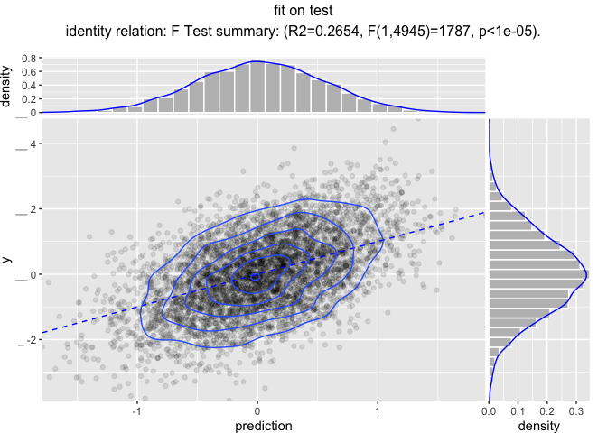

Modeling Pipelines
================

Reusable modeling pipelines are a practical idea that gets re-developed
many times in many contexts.
[`wrapr`](https://github.com/WinVector/wrapr) supplies a particularly
powerful pipeline notation and as of version `1.7.1` pipeline re-use
system (notes
[here](https://winvector.github.io/wrapr/articles/Function_Objects.html)).
We will demonstrate this with the
[`vtreat`](https://github.com/WinVector/vtreat) data preparation system.

``` r
library("wrapr")
library("vtreat")
library("glmnet")
```

    ## Loading required package: Matrix

    ## Loading required package: foreach

    ## Loaded glmnet 2.0-16

``` r
library("WVPlots")

ncore <- parallel::detectCores()
cl <- parallel::makeCluster(ncore)
library("doParallel")
```

    ## Loading required package: iterators

    ## Loading required package: parallel

``` r
registerDoParallel(cl)

# function to make practice data
mk_data <- function(nrows, n_var_cols, n_noise_cols) {
  d <- data.frame(y = rnorm(nrows))
  for(i in seq_len(n_var_cols)) {
    vari = paste0("var_", sprintf("%03g", i))
    d[[vari]] <- rnorm(nrows)
    d$y <- d$y + (2/n_var_cols)*d[[vari]]
    d[[vari]][d[[vari]]>abs(2*rnorm(nrows))] <- NA
    d[[vari]] <- rlnorm(1, meanlog=10, sdlog = 10)*d[[vari]]
  }
  for(i in seq_len(n_noise_cols)) {
    vari = paste0("noise_", sprintf("%03g", i))
    d[[vari]] <- rnorm(nrows)
    d[[vari]][d[[vari]]>abs(2*rnorm(nrows))] <- NA
    d[[vari]] <- rlnorm(1, meanlog=10, sdlog = 10)*d[[vari]]
  }
  d
}

set.seed(2018)
d <- mk_data(10000, 10, 200)
is_train <- runif(nrow(d))<=0.5
dTrain <- d[is_train, , drop = FALSE]
dTest <- d[!is_train, , drop = FALSE]
outcome_name <- "y"
vars <- setdiff(colnames(dTrain), outcome_name)
```

Suppose our analysis plan is the following:

  - Fix missing values with `vtreat`.
  - Scale and center the data.
  - Model `y` as a function of the other columns using `glmnet`.

Now both `vtreat` and `glmnet` can scale, but we are going to keep the
scaling as a separate step to show how composite data preparation
pipelines work.

First we combine the pre-processing steps, and a fit model as follows.

``` r
# design a treatment plan using cross-validation methods
cp <- vtreat::mkCrossFrameNExperiment(
  dTrain, vars, outcome_name,
  parallelCluster = cl)
```

    ## [1] "vtreat 1.3.3 start initial treatment design Fri Nov 23 08:49:37 2018"
    ## [1] " start cross frame work Fri Nov 23 08:49:40 2018"
    ## [1] " vtreat::mkCrossFrameNExperiment done Fri Nov 23 08:49:45 2018"

``` r
# get the list of new variables
sf <- cp$treatments$scoreFrame
newvars <- sf$varName[sf$sig <= 1/nrow(sf)]
print(newvars)
```

    ##  [1] "var_001_clean"   "var_001_isBAD"   "var_002_clean"  
    ##  [4] "var_002_isBAD"   "var_003_clean"   "var_003_isBAD"  
    ##  [7] "var_004_clean"   "var_004_isBAD"   "var_005_clean"  
    ## [10] "var_005_isBAD"   "var_006_clean"   "var_006_isBAD"  
    ## [13] "var_007_clean"   "var_007_isBAD"   "var_008_clean"  
    ## [16] "var_008_isBAD"   "var_009_clean"   "var_009_isBAD"  
    ## [19] "var_010_clean"   "var_010_isBAD"   "noise_156_isBAD"

``` r
# learn a centering and scaling of the cross-validated 
# training frame
tfs <- scale(cp$crossFrame[, newvars, drop = FALSE], 
             center = TRUE, scale = TRUE)
centering <- attr(tfs, "scaled:center")
scaling <- attr(tfs, "scaled:scale")

# apply the centering and scaling to the cross-validated 
# training frame
tfs <- scale(cp$crossFrame[, newvars, drop = FALSE],
             center = centering,
             scale = scaling)

# build a cross-validation strategy to help us
# search for a good alph hyper-parameter value
cplan <- vtreat::kWayStratifiedY(
  nrow(dTrain), 5, dTrain, dTrain[[outcome_name]])
# convert the plan to cv.glmnet group notation
foldid <- numeric(nrow(dTrain))
for(i in seq_len(length(cplan))) {
  cpi <- cplan[[i]]
  foldid[cpi$app] <- i
}

# search for best cross-validated alpha
alphas <- seq(0, 1, by=0.05)
cross_scores <- vapply(
  alphas,
  function(alpha) {
    model <- cv.glmnet(as.matrix(tfs), 
                       cp$crossFrame[[outcome_name]],
                       alpha = alpha,
                       family = "gaussian", 
                       standardize = FALSE,
                       foldid = foldid, 
                       parallel = TRUE)
    index <- which(model$lambda == model$lambda.1se)[[1]]
    score <- model$cvm[[index]]
  }, numeric(1))
best_i <- which(cross_scores==min(cross_scores))[[1]]
alpha <- alphas[[best_i]]
print(alpha)
```

    ## [1] 0.65

``` r
# re-fit model with chosen alpha
model <- cv.glmnet(as.matrix(tfs), 
                   cp$crossFrame[[outcome_name]],
                   alpha = alpha,
                   family = "gaussian", 
                   standardize = FALSE,
                   nfolds = 5, 
                   parallel = TRUE)
```

The question then is: how do we share such a model? Roughly we need to
share the model, any fit parameters (such as centering and scaling
choices), *and* the code sequence to apply all of these steps in the
proper order.

A not quite satisfactory way to do this is to wrap all of the steps into
a function which would then capture all of the needed parameters
(`cp$treatments`, `newvars`, `centering`, `scaling`, and `model`) in its
closure.

``` r
fn <- function(.) {
  . %.>%
    vtreat::prepare(cp$treatments, ., varRestriction = newvars) %.>%
    subset(., select = newvars) %.>%
    scale(., center = centering, scale = scaling) %.>%
    glmnet::predict.cv.glmnet(model, newx = .,  s = "lambda.1se") %.>%
    .[, "1", drop = TRUE]
}

fn(dTrain) %.>% head(.)
```

    ##           1           2           3           4           5           6 
    ## -0.47525463  0.37781506  0.10450622  0.31710969  0.37555403  0.02842425

``` r
print(fn)
```

    ## function(.) {
    ##   . %.>%
    ##     vtreat::prepare(cp$treatments, ., varRestriction = newvars) %.>%
    ##     subset(., select = newvars) %.>%
    ##     scale(., center = centering, scale = scaling) %.>%
    ##     glmnet::predict.cv.glmnet(model, newx = .,  s = "lambda.1se") %.>%
    ##     .[, "1", drop = TRUE]
    ## }

``` r
environment(fn)
```

    ## <environment: R_GlobalEnv>

It turns out this does not quite work, which is probably among the
reasons this is not a common method of sharing data processing
pipelines.

If we were to try to share such a function by saving it as follows.

``` r
saveRDS(fn, "fn.RDS")
saveRDS(dTrain, "dTrain.RDS")
```

And then if we read that function back in into a new `R` session and
tried to use it, we would see the following error.

``` r
# Fresh R session, not part of this markdown
library("wrapr")
fn <- readRDS("fn.RDS")
dTrain <- readRDS("dTrain.RDS")
#  Error in vtreat::prepare(cp$treatments, ., varRestriction = newvars) : 
#   object 'cp' not found 
```

`R`’s serialization rules do not save the `R_GlobalEnv` environment. One
can work around this by introducing an intermediate environment, but
using closures to store data is a bit problematic. For instance a *lot*
of extra stuff tends to leak as was noted
[here](http://www.win-vector.com/blog/2014/05/trimming-the-fat-from-glm-models-in-r/).

A better solution is given by `wrapr`’s [“function object”
abstraction](https://winvector.github.io/wrapr/articles/Function_Objects.html),
which treats names of functions, plus arguments as an efficient notation
for partial evaluation. We can use this system to encode our model
prediction pipeline as follows.

``` r
pipeline <-
  new("PartialNamedFn",
      fn_name = 'prepare',
      fn_package = "vtreat",
      arg_name = "dframe", 
      args = list(treatmentplan = cp$treatments,
                  varRestriction = newvars)) %.>%
  new("PartialNamedFn",
      fn_name ='subset',
      fn_package = "base",
      arg_name = "x",
      args = list(select = newvars))  %.>%
  new("PartialNamedFn",
      fn_name ='scale',
      fn_package = "base",
      arg_name = "x",
      args = list(center = centering,
                  scale = scaling))  %.>%
  new("PartialNamedFn",
      fn_name ="predict.cv.glmnet",
      fn_package = "glmnet",
      arg_name = "newx",
      args = list(object = model,
                  s = "lambda.1se"))  %.>%
  new("SrcFunction", 
      expr_src = ".[, cname, drop = TRUE]",
      arg_name = ".",
      args = list(cname = "1"))

cat(format(pipeline))
```

    ## UnaryFnList(
    ##    vtreat::prepare(dframe=., treatmentplan, varRestriction),
    ##    base::subset(x=., select),
    ##    base::scale(x=., center, scale),
    ##    glmnet::predict.cv.glmnet(newx=., object, s),
    ##    SrcFunction{ .[, cname, drop = TRUE] }(.=., cname))

``` r
dTrain %.>% pipeline %.>% head(.)
```

    ##           1           2           3           4           5           6 
    ## -0.47525463  0.37781506  0.10450622  0.31710969  0.37555403  0.02842425

This pipeline is just a list of steps and values with some extra class
annotations. It can be saved.

``` r
saveRDS(pipeline, "pipeline.RDS")
```

And this time the processing pipeline can be read back and used as
follows.

``` r
# Fresh R session , not part of this markdown
library("wrapr")

p <- readRDS("pipeline.RDS")
dTrain <- readRDS("dTrain.RDS")
```

    ##           1           2           3           4           5           6 
    ## -0.47525463  0.37781506  0.10450622  0.31710969  0.37555403  0.02842425

The `wrapr::UnaryFn` pipeline is very easy to use (so called as the
pipeline classes are derived from `wrapr::UnaryFn`). Once you have set
it up you pretty much want to use it (instead of repeating the steps by
hand). For example we can use it to evaluate our fit model performance
on both training and test data.

``` r
dTrain$prediction <- dTrain %.>% pipeline

WVPlots::ScatterHist(dTrain, "prediction", "y", "fit on training data",
                     smoothmethod = "identity",
                     estimate_sig = TRUE,
                     point_alpha = 0.1,
                     contour = TRUE)
```

<!-- -->

``` r
dTest$prediction <- dTest %.>% pipeline

WVPlots::ScatterHist(dTest, "prediction", "y", "fit on test",
                     smoothmethod = "identity",
                     estimate_sig = TRUE,
                     point_alpha = 0.1,
                     contour = TRUE)
```

<!-- -->

One can incorporate saved `UnaryFn` into a larger
[`rquery`](https://github.com/WinVector/rquery)/[`rqdatatable`](https://github.com/WinVector/rqdatatable/)
pipeline using the `rq_partial()` node, which takes a `UnaryFn` as an
argument. For example:

``` r
library("rqdatatable")
```

    ## Loading required package: rquery

``` r
# pipe line leaving result as a data.frame
# rquery/rqdatatable prefer to work over data.frames
pipeline <-
  new("PartialNamedFn",
      fn_name = 'prepare',
      fn_package = "vtreat",
      arg_name = "dframe", 
      args = list(treatmentplan = cp$treatments,
                  varRestriction = newvars)) %.>%
  new("PartialNamedFn",
      fn_name ='subset',
      fn_package = "base",
      arg_name = "x",
      args = list(select = newvars))  %.>%
  new("PartialNamedFn",
      fn_name ='scale',
      fn_package = "base",
      arg_name = "x",
      args = list(center = centering,
                  scale = scaling))  %.>%
  new("PartialNamedFn",
      fn_name ="predict.cv.glmnet",
      fn_package = "glmnet",
      arg_name = "newx",
      args = list(object = model,
                  s = "lambda.1se"))


ops <- mk_td("d", colnames(dTrain)) %.>%
  rq_partial(., 
             step = pipeline,
             columns_produced = "1") 

cat(format(ops))
```

    ## table(d; 
    ##   y,
    ##   var_001,
    ##   var_002,
    ##   var_003,
    ##   var_004,
    ##   var_005,
    ##   var_006,
    ##   var_007,
    ##   var_008,
    ##   var_009,
    ##   var_010,
    ##   noise_001,
    ##   noise_002,
    ##   noise_003,
    ##   noise_004,
    ##   noise_005,
    ##   noise_006,
    ##   noise_007,
    ##   noise_008,
    ##   noise_009,
    ##   ...) %.>%
    ##  non_sql_node(., UnaryFnList(
    ##    vtreat::prepare(dframe=., treatmentplan, varRestriction),
    ##    base::subset(x=., select),
    ##    base::scale(x=., center, scale),
    ##    glmnet::predict.cv.glmnet(newx=., object, s)))

``` r
dTest %.>% ops %.>% head
```

    ##                1
    ## 1:  3.839109e-01
    ## 2:  4.911605e-06
    ## 3: -1.113746e+00
    ## 4: -2.311193e-03
    ## 5: -9.336085e-01
    ## 6:  5.399154e-01

``` r
head(dTest$prediction)
```

    ## [1]  3.839109e-01  4.911605e-06 -1.113746e+00 -2.311193e-03 -9.336085e-01
    ## [6]  5.399154e-01

Obviously all we did is wrap the `UnaryFn` steps into an `rquery` node,
but the point is that node could then be part of a larger non-trivial
data processing pipeline (which also can be saved and shared).

And that is how to effectively save, share, and deploy non-trivial
modeling workflows.

``` r
parallel::stopCluster(cl)
```
