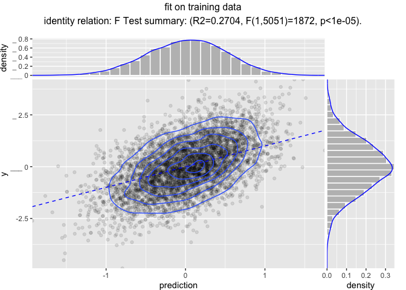
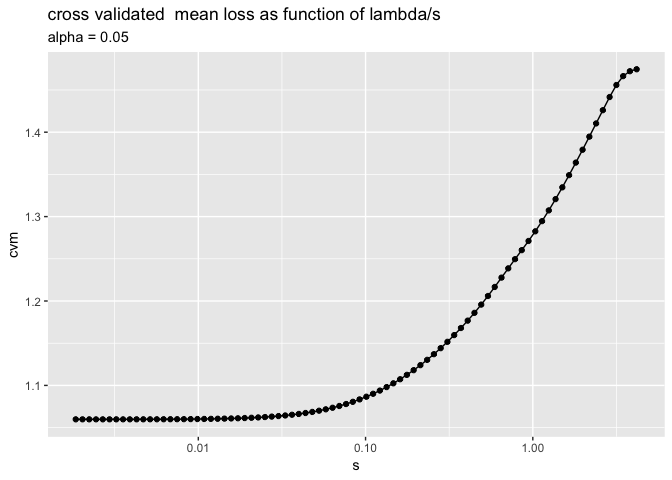
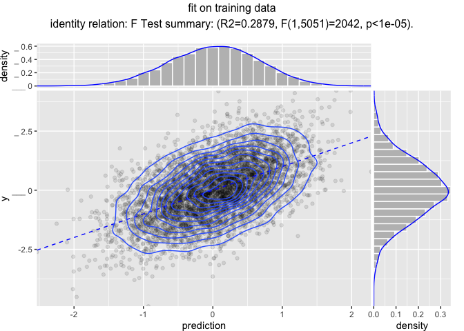

Modeling Pipelines
================

Reusable modeling pipelines are a practical idea that gets re-developed
many times in many contexts.
[`wrapr`](https://github.com/WinVector/wrapr) supplies a particularly
powerful pipeline notation, and, as of version `1.8.0`, a pipe-stage
re-use system (notes
[here](https://winvector.github.io/wrapr/articles/Function_Objects.html)).
We will demonstrate this with the
[`vtreat`](https://github.com/WinVector/vtreat) data preparation system.

Our example task is to fit a model on some arbitrary data. Our model
will try to predict `y` as a function of the other columns.

Our example data is 10,000 rows of 210 variables. Ten of the variables
are related to the outcome to predict (`y`) and 200 of them are
irrelevant pure noise. Since this is a synthetic example we know which
is which (and deliberately places this information in the column names).

The data looks like the following:

``` r
str(d)
```

    ## 'data.frame':    10000 obs. of  211 variables:
    ##  $ y        : num  -1.086 -1.246 -0.173 -1.087 1.661 ...
    ##  $ var_001  : num  0.0108 NA -0.0149 -0.2192 -0.1605 ...
    ##  $ var_002  : num  -3043966 NA -2151778 -4942298 455479 ...
    ##  $ var_003  : num  -60627 -34317 64535 -1940 NA ...
    ##  $ var_004  : num  -373812 NA -232051 21812 74992 ...
    ##  $ var_005  : num  29370 -296583 -57431 -52728 94272 ...
    ##  $ var_006  : num  -108112 NA -387325 -803572 -60534 ...
    ##  $ var_007  : num  19294 -85200 498536 -52584 -14377 ...
    ##  $ var_008  : num  -253 -1296 -163 -568 -862 ...
    ##  $ var_009  : num  -2.13e+09 3.96e+10 -4.20e+10 -1.11e+10 -6.93e+10 ...
    ##  $ var_010  : num  148.15 997.9 5.92 -552.88 NA ...
    ##  $ noise_001: num  1.61e-07 -5.21e-07 NA -8.80e-08 9.76e-07 ...
    ##  $ noise_002: num  854212 -221108 -654245 -1095501 NA ...
    ##  $ noise_003: num  -53443 -28367 NA 8445 21881 ...
    ##  $ noise_004: num  3422424 NA 2538108 -2222437 NA ...
    ##  $ noise_005: num  -1.08e+11 -2.91e+10 -2.16e+08 -1.18e+10 NA ...
    ##  $ noise_006: num  -1195818 516740 -613913 115611 349345 ...
    ##  $ noise_007: num  -19.8 -156.9 87.2 -79.5 16.5 ...
    ##  $ noise_008: num  NA 3494515 12338774 -12961245 23747 ...
    ##  $ noise_009: num  NA NA NA NA -661 ...
    ##  $ noise_010: num  -12346926 5326250 NA 12736368 -9012669 ...
    ##  $ noise_011: num  20824 7165 2359 NA 13719 ...
    ##  $ noise_012: num  -1344 -918 362 -913 -2071 ...
    ##  $ noise_013: num  -17681 NA -32382 -9147 -4498 ...
    ##  $ noise_014: num  1.59e+09 NA -2.00e+09 -2.92e+09 4.44e+09 ...
    ##  $ noise_015: num  0.01423 NA -0.00535 -0.0173 NA ...
    ##  $ noise_016: num  -8.77e-02 1.89e-01 -5.16e-05 -2.33e-01 6.50e-02 ...
    ##  $ noise_017: num  NA -0.02249 -0.01698 0.02827 -0.00993 ...
    ##  $ noise_018: num  -102 -142 -112 -220 -134 ...
    ##  $ noise_019: num  NA 896187 855862 673251 296873 ...
    ##  $ noise_020: num  -2653137 -3859781 4600525 -1914832 -2084442 ...
    ##  $ noise_021: num  NA -1924 847 -3229 -5315 ...
    ##  $ noise_022: num  -9.20e+08 -1.52e+08 NA -1.09e+09 -2.48e+08 ...
    ##  $ noise_023: num  19.1 -124.6 -24.3 23.6 43.8 ...
    ##  $ noise_024: num  9.80e+08 -2.39e+08 -5.22e+07 NA 2.86e+09 ...
    ##  $ noise_025: num  -0.836 -8.164 -22.926 16.277 -25.412 ...
    ##  $ noise_026: num  0.385 -1.565 -4.69 -2.622 4.701 ...
    ##  $ noise_027: num  -232929 NA -130598 59873 -754 ...
    ##  $ noise_028: num  NA 182 25766 NA -6591 ...
    ##  $ noise_029: num  -0.4044 0.0287 0.1374 -0.2345 NA ...
    ##  $ noise_030: num  -49516 -30440 NA 17546 -12363 ...
    ##  $ noise_031: num  -25.5 15.4 -32.4 36.3 26.5 ...
    ##  $ noise_032: num  8.56e+09 -1.53e+08 3.32e+09 4.93e+09 NA ...
    ##  $ noise_033: num  -6.33e+05 -1.51e+08 -8.96e+07 -6.76e+08 NA ...
    ##  $ noise_034: num  1.78e+12 2.47e+12 1.99e+12 NA -8.65e+12 ...
    ##  $ noise_035: num  -1.69e+08 NA -2.40e+07 -1.24e+07 -4.51e+08 ...
    ##  $ noise_036: num  -10766 -20081 14498 -34723 11277 ...
    ##  $ noise_037: num  0.0335 0.01535 -0.04664 0.00433 -0.01091 ...
    ##  $ noise_038: num  0.0416 -0.0159 0.0352 -0.1725 -0.1022 ...
    ##  $ noise_039: num  NA 14364 -900 -19183 -48893 ...
    ##  $ noise_040: num  -6.49 -4.3 NA 1.53 3.6 ...
    ##  $ noise_041: num  -7.37 -1.82 -11.09 -6.09 8.77 ...
    ##  $ noise_042: num  4.70e+09 3.28e+09 -1.00e+10 6.85e+09 -2.40e+09 ...
    ##  $ noise_043: num  0.0128 -0.0253 -0.0118 -0.0107 0.0283 ...
    ##  $ noise_044: num  7.97e+13 -2.16e+13 1.73e+13 6.76e+13 9.11e+13 ...
    ##  $ noise_045: num  -6.172 2.76 -1.188 -1.456 -0.892 ...
    ##  $ noise_046: num  -10.6 -38.9 44.8 NA NA ...
    ##  $ noise_047: num  -390219 -361772 -198386 NA -355588 ...
    ##  $ noise_048: num  29464 31082 NA -83909 -48837 ...
    ##  $ noise_049: num  -4416220 NA -76514944 NA -87672558 ...
    ##  $ noise_050: num  -0.00366 -0.01501 0.00339 -0.00966 0.00239 ...
    ##  $ noise_051: num  NA NA -0.00824 NA 0.03083 ...
    ##  $ noise_052: num  8.99e+10 4.09e+11 2.11e+09 -7.48e+10 -4.91e+11 ...
    ##  $ noise_053: num  2.18e+09 3.52e+09 3.75e+09 -8.47e+09 6.35e+09 ...
    ##  $ noise_054: num  -1.93e+09 1.92e+09 -4.84e+09 1.00e+09 -2.68e+09 ...
    ##  $ noise_055: num  -6.63e+10 4.31e+10 -6.45e+10 1.41e+10 -1.23e+10 ...
    ##  $ noise_056: num  397 8576 3117 1689 -10470 ...
    ##  $ noise_057: num  -0.00087 0.000608 0.000631 -0.001178 -0.000677 ...
    ##  $ noise_058: num  -4.83e+08 -1.31e+09 NA -1.27e+09 -1.76e+09 ...
    ##  $ noise_059: num  -1229297 3458252 -647142 -1329719 -3319333 ...
    ##  $ noise_060: num  0.302 0.486 -0.318 0.265 0.435 ...
    ##  $ noise_061: num  -5.46e+10 -5.26e+09 -2.33e+10 7.25e+09 1.84e+10 ...
    ##  $ noise_062: num  -6.32e+13 7.52e+12 -1.39e+12 -2.12e+12 NA ...
    ##  $ noise_063: num  NA -10979 13887 NA 1639 ...
    ##  $ noise_064: num  NA NA -239476 -40186 -139773 ...
    ##  $ noise_065: num  633472 23808 479990 361674 NA ...
    ##  $ noise_066: num  -2.384 NA NA -0.231 1.29 ...
    ##  $ noise_067: num  -0.0111 0.0798 NA 0.0749 NA ...
    ##  $ noise_068: num  -1.38e-05 -9.80e-05 -2.14e-04 -1.89e-04 -1.34e-04 ...
    ##  $ noise_069: num  56.3 NA -95.9 -75 56.5 ...
    ##  $ noise_070: num  276.4 NA -126.2 NA 10.4 ...
    ##  $ noise_071: num  -536121 -38844 -125493 NA -212179 ...
    ##  $ noise_072: num  -2.58e+10 5.01e+10 -7.29e+09 -2.04e+10 -3.72e+10 ...
    ##  $ noise_073: num  -118103 -27734 16525 72667 10807 ...
    ##  $ noise_074: num  NA -6.65e-06 1.92e-06 -9.56e-07 NA ...
    ##  $ noise_075: num  122372 -4171 NA -103158 -50090 ...
    ##  $ noise_076: num  549406 -2235095 -79563 -8068 -147866 ...
    ##  $ noise_077: num  -353847 NA -535406 -141596 122915 ...
    ##  $ noise_078: num  NA -22 50.9 -22.4 36.2 ...
    ##  $ noise_079: num  NA -35743 -41810 6710 -34836 ...
    ##  $ noise_080: num  -0.002032 -0.003641 -0.000156 -0.000648 NA ...
    ##  $ noise_081: num  -1.73e+15 2.08e+15 -2.34e+15 -7.22e+14 -2.67e+14 ...
    ##  $ noise_082: num  -5.44e+08 -7.76e+08 -1.32e+09 -3.57e+08 7.87e+08 ...
    ##  $ noise_083: num  -27.97 -13.71 -3.64 1.16 NA ...
    ##  $ noise_084: num  -838.4 492.7 424.1 -93.5 -190.3 ...
    ##  $ noise_085: num  -2.48 -41.999 65.737 0.416 6.859 ...
    ##  $ noise_086: num  -157364 -7086 674452 -205830 1137691 ...
    ##  $ noise_087: num  -2709049 -7325509 -1878743 2972455 1366560 ...
    ##  $ noise_088: num  -15510.4 NA -7367.8 -64.6 NA ...
    ##   [list output truncated]

Let’s start our example analysis.

We load our packages.

``` r
library("wrapr")
library("vtreat")
library("glmnet")
library("ggplot2")
library("WVPlots")
library("doParallel")
library("rqdatatable")
```

We will also need a couple of simple functions that are part of the
upcoming [`vtreat 1.3.3`](https://github.com/WinVector/vtreat).

``` r
# Always return the same cross-validation plan.

# will be released as:
# https://github.com/WinVector/vtreat/blob/master/R/pre_comp_xval.R
pre_comp_xval <- function(nRows, nSplits, splitplan) {
  force(splitplan)
  attr(splitplan, 'splitmethod') <- paste(attr(splitplan, 'splitmethod'),
                                          "( pre-computed", nRows, nSplits, ")")
  f <- function(nRows, nSplits, dframe, y) {
    return(splitplan)
  }
  f
}

# Center and scale some variables in a data.frame.
#
# will be released as:
# https://github.com/WinVector/vtreat/blob/master/R/center_scale.R
center_scale <- function(d, 
                         center,
                         scale) {
  for(ni in names(center)) {
    d[[ni]] <- d[[ni]] - center[[ni]]
  }
  for(ni in names(scale)) {
    d[[ni]] <- d[[ni]]/scale[[ni]]
  }
  d
}
```

We set up a parallel cluster to speed up some calculations.

``` r
ncore <- parallel::detectCores()
cl <- parallel::makeCluster(ncore)
registerDoParallel(cl)
```

We split our data into training and a test evaluation set.

``` r
is_train <- runif(nrow(d))<=0.5
dTrain <- d[is_train, , drop = FALSE]
dTest <- d[!is_train, , drop = FALSE]
outcome_name <- "y"
vars <- setdiff(colnames(dTrain), outcome_name)
```

Suppose our analysis plan is the following:

  - Fix missing values with `vtreat`.
  - Scale and center the original variables (but not the new indicator
    variables).
  - Model `y` as a function of the other columns using `glmnet`.

Now both `vtreat` and `glmnet` can scale, but we are going to keep the
scaling as a separate step to control which variables are scaled, and to
show how composite data preparation pipelines work.

We a fit model with cross-validated data treatment and hyper-parameters
as follows. The process described is intentionally long and involved,
simulating a number of steps (possibly some requiring domain knowledge)
taken by a data scientist to build a good model.

``` r
# design a cross-validation plan
ncross <- 5
cplan <- vtreat::kWayStratifiedY(
  nrow(dTrain), ncross, dTrain, dTrain[[outcome_name]])

# design a treatment plan using cross-validation methods
cp <- vtreat::mkCrossFrameNExperiment(
  dTrain, vars, outcome_name,
  splitFunction = pre_comp_xval(nrow(dTrain), ncross, cplan),
  ncross = ncross,
  parallelCluster = cl)
```

    ## [1] "vtreat 1.3.2 start initial treatment design Tue Dec 11 16:59:37 2018"
    ## [1] " start cross frame work Tue Dec 11 16:59:40 2018"
    ## [1] " vtreat::mkCrossFrameNExperiment done Tue Dec 11 16:59:48 2018"

``` r
print(cp$method)
```

    ## [1] "kwaycrossystratified ( pre-computed 5053 5 )"

``` r
# get the list of new variables
sf <- cp$treatments$scoreFrame
newvars <- sf$varName[sf$sig <= 1/nrow(sf)]
print(newvars)
```

    ##  [1] "var_001_clean"   "var_001_isBAD"   "var_002_clean"  
    ##  [4] "var_002_isBAD"   "var_003_clean"   "var_003_isBAD"  
    ##  [7] "var_004_clean"   "var_004_isBAD"   "var_005_clean"  
    ## [10] "var_005_isBAD"   "var_006_clean"   "var_006_isBAD"  
    ## [13] "var_007_clean"   "var_007_isBAD"   "var_008_clean"  
    ## [16] "var_008_isBAD"   "var_009_clean"   "var_009_isBAD"  
    ## [19] "var_010_clean"   "var_010_isBAD"   "noise_156_isBAD"

``` r
# learn a centering and scaling of the cross-validated 
# training frame
vars_to_scale = intersect(newvars, sf$varName[sf$code=="clean"])
print(vars_to_scale)
```

    ##  [1] "var_001_clean" "var_002_clean" "var_003_clean" "var_004_clean"
    ##  [5] "var_005_clean" "var_006_clean" "var_007_clean" "var_008_clean"
    ##  [9] "var_009_clean" "var_010_clean"

``` r
tfs <- scale(cp$crossFrame[, vars_to_scale, drop = FALSE], 
             center = TRUE, scale = TRUE)
centering <- attr(tfs, "scaled:center")
scaling <- attr(tfs, "scaled:scale")

# apply the centering and scaling to the cross-validated 
# training frame
tfs <- center_scale(cp$crossFrame[, newvars, drop = FALSE],
                    center = centering,
                    scale = scaling)

# convert the cross-validation plan to cv.glmnet group notation
foldid <- numeric(nrow(dTrain))
for(i in seq_len(length(cplan))) {
  cpi <- cplan[[i]]
  foldid[cpi$app] <- i
}

# search for best cross-validated alpha for cv.glmnet
alphas <- seq(0, 1, by=0.05)
cross_scores <- lapply(
  alphas,
  function(alpha) {
    model <- cv.glmnet(as.matrix(tfs), 
                       cp$crossFrame[[outcome_name]],
                       alpha = alpha,
                       family = "gaussian", 
                       standardize = FALSE,
                       foldid = foldid, 
                       parallel = TRUE)
    index <- which(model$lambda == model$lambda.min)[[1]]
    score <- model$cvm[[index]]
    res <- data.frame(score = score, best_lambda = model$lambda.min)
    res$lambdas <- list(model$lambda)
    res$cvm <- list(model$cvm)
    res
  })
cross_scores <- do.call(rbind, cross_scores)
cross_scores$alpha = alphas
best_i <- which(cross_scores$score==min(cross_scores$score))[[1]]
alpha <- alphas[[best_i]]
s <- cross_scores$best_lambda[[best_i]]
lambdas <- cross_scores$lambdas[[best_i]]
lambdas <- lambdas[lambdas>=s]
print(length(newvars))
```

    ## [1] 21

``` r
print(alpha)
```

    ## [1] 0.05

``` r
print(s)
```

    ## [1] 0.002446381

``` r
# show cross-val results
ggplot(data = cross_scores,
       aes(x = alpha, y = score)) +
  geom_point() +
  geom_line() +
  ggtitle("best cross validated mean loss as function of alpha")
```

<!-- -->

``` r
pf <- data.frame(s = cross_scores$lambdas[[best_i]],
                 cvm = cross_scores$cvm[[best_i]])
ggplot(data = pf,
       aes(x = s, y = cvm)) +
  geom_point() +
  geom_line() +
  scale_x_log10() +
  ggtitle("cross validated  mean loss as function of lambda/s",
          subtitle = paste("alpha =", alpha))
```

<!-- -->

``` r
# re-fit model with chosen alpha
model <- glmnet(as.matrix(tfs), 
                cp$crossFrame[[outcome_name]],
                alpha = alpha,
                family = "gaussian", 
                standardize = FALSE,
                lambda = lambdas)
```

At this point we have model that works on prepared data (data that has
gone through the `vtreat` and scaling steps). The point to remember: it
was a lot of steps to transform data and build the model, so it may also
be a fair number of steps to apply the model.

The question then is: how do we share such a model? Roughly we need to
share the model, any fit parameters (such as centering and scaling
choices), *and* the code sequence to apply all of these steps in the
proper order. In this case the modeling pipeline consists of the
following pieces:

  - The treatment plan `cp$treatments`.
  - The list of chosen variables `newvars`.
  - The centering and scaling vectors `centering` and `scaling`.
  - The `glmnet` model `model` and final chosen lambda/s value `s`.

These values are needed to run any news data through the sequence of
operations:

  - Using `vtreat` to prepare the data.
  - Rescaling and centering the chosen variables.
  - Converting from a `data.frame` to a matrix of only input-variable
    columns.
  - Applying the `glmnet` model.
  - Converting the matrix of predictions into a vector of predictions.

These are all steps we did in an ad-hoc manner while building the model.
Having worked hard to build the model (taking a lot of steps and
optimizing parameters/hyperparemeters) has left us with a lot of items
and steps we need to share to have the full prediction process.

A really neat way to simply share of these things is the following.

Use `wrapr`’s [“function object”
abstraction](https://winvector.github.io/wrapr/articles/Function_Objects.html),
which treats names of functions, plus arguments as an efficient notation
for partial evaluation. We can use this system to encode our model
prediction pipeline as follows.

``` r
pipeline <-
  pkgfn("vtreat::prepare",
        arg_name = "dframe", 
        args = list(treatmentplan = cp$treatments,
                    varRestriction = newvars)) %.>%
  wrapfn(center_scale,
        arg_name = "d",
        args = list(center = centering,
                    scale = scaling))  %.>%
  srcfn(qe(as.matrix(.[, newvars, drop = FALSE])),
        args = list(newvars = newvars)) %.>%
  pkgfn("glmnet::predict.glmnet",
        arg_name = "newx",
        args = list(object = model,
                    s = s))  %.>%
  srcfn(qe(.[, cname, drop = TRUE]),
        args = list(cname = "1"))

cat(format(pipeline))
```

    ## UnaryFnList(
    ##    vtreat::prepare(dframe=., treatmentplan, varRestriction),
    ##    PartialFunction{center_scale}(d=., center, scale),
    ##    SrcFunction{ as.matrix(.[, newvars, drop = FALSE]) }(.=., newvars),
    ##    glmnet::predict.glmnet(newx=., object, s),
    ##    SrcFunction{ .[, cname, drop = TRUE] }(.=., cname))

The above pipeline uses several `wrapr` abstractions:

  - [`pkgfn()`](https://winvector.github.io/wrapr/reference/pkgfn.html)
    which wraps a function specified by a package qualified
    name.
  - [`wrapfn()`](https://winvector.github.io/wrapr/reference/wrapfn.html)
    which wraps a function specified by value.
  - [`srcfn()`](https://winvector.github.io/wrapr/reference/srcfn.html)
    which wraps quoted code (here quoted by
    [`wrapr::qe()`](https://winvector.github.io/wrapr/reference/qe.html),
    but quote marks will also work).

Each of these captures the action and extra values needed to perform
each step of the model application. The steps can be chained together by
pipes (as shown above), or assembled directly as a list using
[`fnlist()`](https://winvector.github.io/wrapr/reference/fnlist.html) or
[as\_fnlist()](https://winvector.github.io/wrapr/reference/as_fnlist.html).
Function lists can be built all at once or concatenated together from
pieces. More details on `wrapr` function objects can be found
[here](https://winvector.github.io/wrapr/articles/Function_Objects.html).

After all this you can then pipe data into the pipeline to get
predictions.

``` r
dTrain %.>% pipeline %.>% head(.)
```

    ## [1] -0.60372843  0.46662315  0.15205810  0.39812493  0.44087441  0.09160836

``` r
dTest %.>% pipeline %.>% head(.)
```

    ## [1]  0.532070422 -0.046165380 -1.347887772  0.007668392 -1.133345162
    ## [6]  0.662722678

Or you can use a functional notation
[`ApplyTo()`](https://winvector.github.io/wrapr/reference/ApplyTo.html).

``` r
head(ApplyTo(pipeline, dTrain))
```

    ## [1] -0.60372843  0.46662315  0.15205810  0.39812493  0.44087441  0.09160836

The pipeline itself is an `R` `S4` class containing a simple list of
steps.

``` r
pipeline@items
```

    ## [[1]]
    ## [1] "vtreat::prepare(dframe=., treatmentplan, varRestriction)"
    ## 
    ## [[2]]
    ## [1] "PartialFunction{center_scale}(d=., center, scale)"
    ## 
    ## [[3]]
    ## [1] "SrcFunction{ as.matrix(.[, newvars, drop = FALSE]) }(.=., newvars)"
    ## 
    ## [[4]]
    ## [1] "glmnet::predict.glmnet(newx=., object, s)"
    ## 
    ## [[5]]
    ## [1] "SrcFunction{ .[, cname, drop = TRUE] }(.=., cname)"

``` r
str(pipeline@items[[3]])
```

    ## Formal class 'SrcFunction' [package "wrapr"] with 3 slots
    ##   ..@ expr_src: chr "as.matrix(.[, newvars, drop = FALSE])"
    ##   ..@ arg_name: chr "."
    ##   ..@ args    :List of 1
    ##   .. ..$ newvars: chr [1:21] "var_001_clean" "var_001_isBAD" "var_002_clean" "var_002_isBAD" ...

If you do not like pipe notation you can also build the pipeline using
[`fnlist()`](https://winvector.github.io/wrapr/reference/fnlist.html)
list notation.

The pipeline can be saved, and contains the required parameters in
simple lists.

``` r
saveRDS(dTrain, "dTrain.RDS")
saveRDS(pipeline, "pipeline.RDS")
```

Now the processing pipeline can be read back and used as follows.

``` r
# Fresh R session , not part of this markdown
library("wrapr")

pipeline <- readRDS("pipeline.RDS")
dTrain <- readRDS("dTrain.RDS")
dTrain %.>% pipeline %.>% head(.)
```

    ## [1] -0.60372843  0.46662315  0.15205810  0.39812493  0.44087441  0.09160836

We can use this pipeline on different data, as we do to create
performance plots below.

``` r
dTrain$prediction <- dTrain %.>% pipeline

WVPlots::ScatterHist(
  dTrain, "prediction", "y", "fit on training data",
  smoothmethod = "identity",
  estimate_sig = TRUE,
  point_alpha = 0.1,
  contour = TRUE)
```

<!-- -->

``` r
dTest$prediction <- dTest %.>% pipeline

WVPlots::ScatterHist(
  dTest, "prediction", "y", "fit on test",
  smoothmethod = "identity",
  estimate_sig = TRUE,
  point_alpha = 0.1,
  contour = TRUE)
```

<!-- -->

The idea is: the work was complicated, but sharing should not be
complicated.

And that is how to effectively save, share, and deploy non-trivial
modeling workflows.

(More on `wrapr` function objects can be found
[here](https://winvector.github.io/wrapr/articles/Function_Objects.html).
We also have another run
[here](https://github.com/WinVector/vtreat/blob/master/extras/ModelingPipelinesH.md)
showing why we do not recommend always using the number of variables as
“just another hyper-parameter”, but instead using simple threshold
based filtering. The coming version of `vtreat` also has a new
non-linear variable filter function called
[value\_variables\_\*()](https://winvector.github.io/vtreat/reference/value_variables_N.html)).

``` r
parallel::stopCluster(cl)
```
