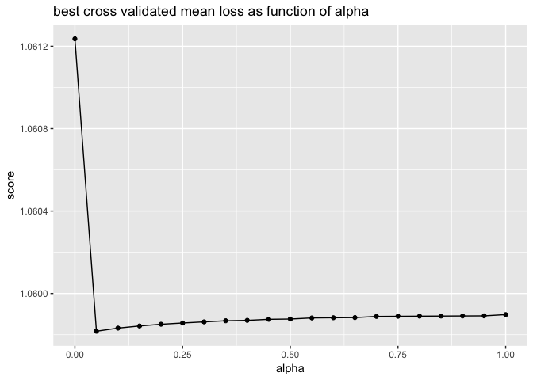
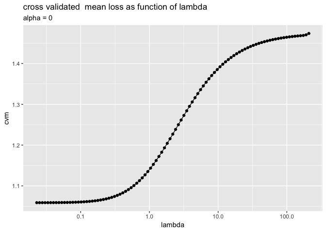
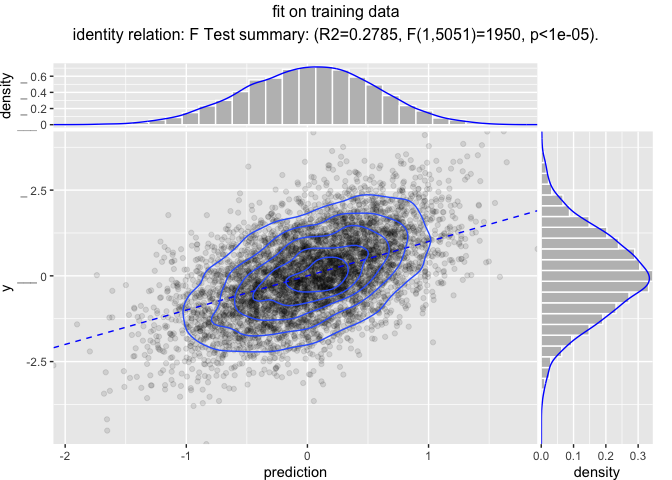

Modeling Pipelines
================

Reusable modeling pipelines are a practical idea that gets re-developed many times in many contexts. [`wrapr`](https://github.com/WinVector/wrapr) supplies a particularly powerful pipeline notation, and as of version `1.8.0` pipeline re-use system (notes [here](https://winvector.github.io/wrapr/articles/Function_Objects.html)). We will demonstrate this with the [`vtreat`](https://github.com/WinVector/vtreat) data preparation system.

``` r
library("wrapr")
library("vtreat")
library("glmnet")
```

    ## Loading required package: Matrix

    ## Loading required package: foreach

    ## Loaded glmnet 2.0-16

``` r
library("ggplot2")
library("WVPlots")

ncore <- parallel::detectCores()
cl <- parallel::makeCluster(ncore)
library("doParallel")
```

    ## Loading required package: iterators

    ## Loading required package: parallel

``` r
registerDoParallel(cl)

# function to make practice data
mk_data <- function(nrows, n_var_cols, n_noise_cols) {
  d <- data.frame(y = rnorm(nrows))
  for(i in seq_len(n_var_cols)) {
    vari = paste0("var_", sprintf("%03g", i))
    d[[vari]] <- rnorm(nrows)
    d$y <- d$y + (2/n_var_cols)*d[[vari]]
    d[[vari]][d[[vari]]>abs(2*rnorm(nrows))] <- NA
    d[[vari]] <- rlnorm(1, meanlog=10, sdlog = 10)*d[[vari]]
  }
  for(i in seq_len(n_noise_cols)) {
    vari = paste0("noise_", sprintf("%03g", i))
    d[[vari]] <- rnorm(nrows)
    d[[vari]][d[[vari]]>abs(2*rnorm(nrows))] <- NA
    d[[vari]] <- rlnorm(1, meanlog=10, sdlog = 10)*d[[vari]]
  }
  d
}

set.seed(2018)
d <- mk_data(10000, 10, 200)
is_train <- runif(nrow(d))<=0.5
dTrain <- d[is_train, , drop = FALSE]
dTest <- d[!is_train, , drop = FALSE]
outcome_name <- "y"
vars <- setdiff(colnames(dTrain), outcome_name)
```

Suppose our analysis plan is the following:

-   Fix missing values with `vtreat`.
-   Scale and center the data.
-   Model `y` as a function of the other columns using `glmnet`.

Now both `vtreat` and `glmnet` can scale, but we are going to keep the scaling as a separate step to show how composite data preparation pipelines work.

First we combine the pre-processing steps, and a fit model as follows.

``` r
# design a treatment plan using cross-validation methods
ncross <- 5
cplan <- vtreat::kWayStratifiedY(
  nrow(dTrain), ncross, dTrain, dTrain[[outcome_name]])
cp <- vtreat::mkCrossFrameNExperiment(
  dTrain, vars, outcome_name,
  splitFunction = pre_comp_xval(nrow(dTrain), ncross, cplan),
  ncross = ncross,
  parallelCluster = cl)
```

    ## [1] "vtreat 1.3.3 start initial treatment design Mon Nov 26 07:07:06 2018"
    ## [1] " start cross frame work Mon Nov 26 07:07:08 2018"
    ## [1] " vtreat::mkCrossFrameNExperiment done Mon Nov 26 07:07:15 2018"

``` r
print(cp$method)
```

    ## [1] "kwaycrossystratified (pre-computed 5053 5 )"

``` r
# get the list of new variables
sf <- cp$treatments$scoreFrame
newvars <- sf$varName[sf$sig <= 1/nrow(sf)]
print(newvars)
```

    ##  [1] "var_001_clean"   "var_001_isBAD"   "var_002_clean"  
    ##  [4] "var_002_isBAD"   "var_003_clean"   "var_003_isBAD"  
    ##  [7] "var_004_clean"   "var_004_isBAD"   "var_005_clean"  
    ## [10] "var_005_isBAD"   "var_006_clean"   "var_006_isBAD"  
    ## [13] "var_007_clean"   "var_007_isBAD"   "var_008_clean"  
    ## [16] "var_008_isBAD"   "var_009_clean"   "var_009_isBAD"  
    ## [19] "var_010_clean"   "var_010_isBAD"   "noise_156_isBAD"

``` r
# learn a centering and scaling of the cross-validated 
# training frame
tfs <- scale(cp$crossFrame[, newvars, drop = FALSE], 
             center = TRUE, scale = TRUE)
centering <- attr(tfs, "scaled:center")
scaling <- attr(tfs, "scaled:scale")

# apply the centering and scaling to the cross-validated 
# training frame
tfs <- scale(cp$crossFrame[, newvars, drop = FALSE],
             center = centering,
             scale = scaling)

# build a cross-validation strategy to help us
# search for a good alpha hyper-parameter value
# convert the plan to cv.glmnet group notation
foldid <- numeric(nrow(dTrain))
for(i in seq_len(length(cplan))) {
  cpi <- cplan[[i]]
  foldid[cpi$app] <- i
}

# search for best cross-validated alpha
alphas <- seq(0, 1, by=0.05)
cross_scores <- lapply(
  alphas,
  function(alpha) {
    model <- cv.glmnet(as.matrix(tfs), 
                       cp$crossFrame[[outcome_name]],
                       alpha = alpha,
                       family = "gaussian", 
                       standardize = FALSE,
                       foldid = foldid, 
                       parallel = TRUE)
    index <- which(model$lambda == model$lambda.min)[[1]]
    score <- model$cvm[[index]]
    res <- data.frame(score = score, best_lambda = model$lambda.min)
    res$lambdas <- list(model$lambda)
    res$cvm <- list(model$cvm)
    res
  })
cross_scores <- do.call(rbind, cross_scores)
cross_scores$alpha = alphas
best_i <- which(cross_scores$score==min(cross_scores$score))[[1]]
alpha <- alphas[[best_i]]
lambda <- cross_scores$best_lambda[[best_i]]
lambdas <- cross_scores$lambdas[[best_i]]
lambdas <- lambdas[lambdas>=lambda]
print(alpha)
```

    ## [1] 0

``` r
print(lambda)
```

    ## [1] 0.02292036

``` r
# show cross-val results
ggplot(data = cross_scores,
       aes(x = alpha, y = score)) +
  geom_point() +
  geom_line() +
  ggtitle("best cross validated mean loss as function of alpha")
```



``` r
pf <- data.frame(lambda = cross_scores$lambdas[[best_i]],
                 cvm = cross_scores$cvm[[best_i]])
ggplot(data = pf,
       aes(x = lambda, y = cvm)) +
  geom_point() +
  geom_line() +
  scale_x_log10() +
  ggtitle("cross validated  mean loss as function of lambda",
          subtitle = paste("alpha =", alpha))
```



``` r
# re-fit model with chosen alpha
model <- glmnet(as.matrix(tfs), 
                cp$crossFrame[[outcome_name]],
                alpha = alpha,
                family = "gaussian", 
                standardize = FALSE,
                lambda = lambdas)
```

The question then is: how do we share such a model? Roughly we need to share the model, any fit parameters (such as centering and scaling choices), *and* the code sequence to apply all of these steps in the proper order.

A really neat way to do this is the following.

Use `wrapr`'s ["function object" abstraction](https://winvector.github.io/wrapr/articles/Function_Objects.html), which treats names of functions, plus arguments as an efficient notation for partial evaluation. We can use this system to encode our model prediction pipeline as follows.

``` r
pipeline <-
  pkgfn("vtreat::prepare",
        arg_name = "dframe", 
        args = list(treatmentplan = cp$treatments,
                    varRestriction = newvars)) %.>%
  pkgfn("subset",
        arg_name = "x",
        args = list(select = newvars))  %.>%
  pkgfn("scale",
        arg_name = "x",
        args = list(center = centering,
                    scale = scaling))  %.>%
  pkgfn("glmnet::predict.glmnet",
        arg_name = "newx",
        args = list(object = model,
                    s = lambda))  %.>%
  srcfn(".[, cname, drop = TRUE]",
        arg_name = ".",
        args = list(cname = "1"))

cat(format(pipeline))
```

    ## UnaryFnList(
    ##    vtreat::prepare(dframe=., treatmentplan, varRestriction),
    ##    base::subset(x=., select),
    ##    base::scale(x=., center, scale),
    ##    glmnet::predict.glmnet(newx=., object, s),
    ##    SrcFunction{ .[, cname, drop = TRUE] }(.=., cname))

The pipeline is a simple list of steps (with some class annotations added).

``` r
pipeline@items
```

    ## [[1]]
    ## [1] "vtreat::prepare(dframe=., treatmentplan, varRestriction)"
    ## 
    ## [[2]]
    ## [1] "base::subset(x=., select)"
    ## 
    ## [[3]]
    ## [1] "base::scale(x=., center, scale)"
    ## 
    ## [[4]]
    ## [1] "glmnet::predict.glmnet(newx=., object, s)"
    ## 
    ## [[5]]
    ## [1] "SrcFunction{ .[, cname, drop = TRUE] }(.=., cname)"

``` r
str(pipeline@items[[3]])
```

    ## Formal class 'PartialNamedFn' [package "wrapr"] with 4 slots
    ##   ..@ fn_name   : chr "scale"
    ##   ..@ fn_package: chr "base"
    ##   ..@ arg_name  : chr "x"
    ##   ..@ args      :List of 2
    ##   .. ..$ center: Named num [1:21] -3.98e-02 1.45e-01 -4.99e+05 1.47e-01 -7.73e+03 ...
    ##   .. .. ..- attr(*, "names")= chr [1:21] "var_001_clean" "var_001_isBAD" "var_002_clean" "var_002_isBAD" ...
    ##   .. ..$ scale : Named num [1:21] 1.68e-01 3.53e-01 1.95e+06 3.54e-01 3.57e+04 ...
    ##   .. .. ..- attr(*, "names")= chr [1:21] "var_001_clean" "var_001_isBAD" "var_002_clean" "var_002_isBAD" ...

If you do not like pipe notation you can also build the pipeline using [`fnlist()`](https://winvector.github.io/wrapr/reference/fnlist.html) list notation.

And you can pipe data into the pipeline.

``` r
dTrain %.>% pipeline %.>% head(.)
```

    ##          1          2          3          4          5          6 
    ## -0.6006445  0.4624558  0.1524533  0.4016349  0.4334204  0.1031797

Or you can use a functional notation [`ApplyTo()`](https://winvector.github.io/wrapr/reference/ApplyTo.html).

``` r
ApplyTo(pipeline, dTrain) %.>% head(.)
```

    ##          1          2          3          4          5          6 
    ## -0.6006445  0.4624558  0.1524533  0.4016349  0.4334204  0.1031797

The pipeline can be saved, and contains the required parameters in lists.

``` r
saveRDS(dTrain, "dTrain.RDS")
saveRDS(pipeline, "pipeline.RDS")
```

Now the processing pipeline can be read back and used as follows.

``` r
# Fresh R session , not part of this markdown
library("wrapr")

pipeline <- readRDS("pipeline.RDS")
dTrain <- readRDS("dTrain.RDS")
dTrain %.>% pipeline %.>% head(.)
```

    ##          1          2          3          4          5          6 
    ## -0.6006445  0.4624558  0.1524533  0.4016349  0.4334204  0.1031797

We can use this pipeline on different data, as we do to create performance plots below.

``` r
dTrain$prediction <- dTrain %.>% pipeline

WVPlots::ScatterHist(
  dTrain, "prediction", "y", "fit on training data",
  smoothmethod = "identity",
  estimate_sig = TRUE,
  point_alpha = 0.1,
  contour = TRUE)
```



``` r
dTest$prediction <- dTest %.>% pipeline

WVPlots::ScatterHist(
  dTest, "prediction", "y", "fit on test",
  smoothmethod = "identity",
  estimate_sig = TRUE,
  point_alpha = 0.1,
  contour = TRUE)
```


And that is how to effectively save, share, and deploy non-trivial modeling workflows.

``` r
parallel::stopCluster(cl)
```
