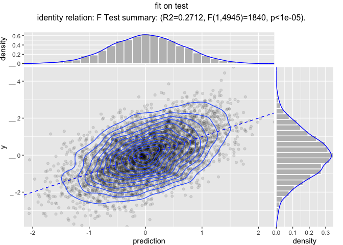

Modeling Pipelines
================

Reusable modeling pipelines are a practical idea that gets re-developed
many times in many contexts.
[`wrapr`](https://github.com/WinVector/wrapr) supplies a particularly
powerful pipeline notation, and as of version `1.8.0` pipeline re-use
system (notes
[here](https://winvector.github.io/wrapr/articles/Function_Objects.html)).
We will demonstrate this with the
[`vtreat`](https://github.com/WinVector/vtreat) data preparation system.

``` r
library("wrapr")
library("vtreat")
library("glmnet")
```

    ## Loading required package: Matrix

    ## Loading required package: foreach

    ## Loaded glmnet 2.0-16

``` r
library("ggplot2")
library("WVPlots")
library("doParallel")
```

    ## Loading required package: iterators

    ## Loading required package: parallel

``` r
library("rqdatatable")
```

    ## Loading required package: rquery

``` r
ncore <- parallel::detectCores()
cl <- parallel::makeCluster(ncore)
registerDoParallel(cl)

# function to make practice data
mk_data <- function(nrows, n_var_cols, n_noise_cols) {
  d <- data.frame(y = rnorm(nrows))
  for(i in seq_len(n_var_cols)) {
    vari = paste0("var_", sprintf("%03g", i))
    d[[vari]] <- rnorm(nrows)
    d$y <- d$y + (2/n_var_cols)*d[[vari]]
    d[[vari]][d[[vari]]>abs(2*rnorm(nrows))] <- NA
    d[[vari]] <- rlnorm(1, meanlog=10, sdlog = 10)*d[[vari]]
  }
  for(i in seq_len(n_noise_cols)) {
    vari = paste0("noise_", sprintf("%03g", i))
    d[[vari]] <- rnorm(nrows)
    d[[vari]][d[[vari]]>abs(2*rnorm(nrows))] <- NA
    d[[vari]] <- rlnorm(1, meanlog=10, sdlog = 10)*d[[vari]]
  }
  d
}

set.seed(2018)
d <- mk_data(10000, 10, 200)
is_train <- runif(nrow(d))<=0.5
dTrain <- d[is_train, , drop = FALSE]
dTest <- d[!is_train, , drop = FALSE]
outcome_name <- "y"
vars <- setdiff(colnames(dTrain), outcome_name)
```

Suppose our analysis plan is the following:

  - Fix missing values with `vtreat`.
  - Scale and center the original variables (but not the new indicator
    variables).
  - Model `y` as a function of the other columns using `glmnet`.

Now both `vtreat` and `glmnet` can scale, but we are going to keep the
scaling as a separate step to control which variables are scaled, and to
show how composite data preparation pipelines work.

First we combine the pre-processing steps, and a fit model as follows.

``` r
# design a cross-validation plan
ncross <- 5
cplan <- vtreat::kWayStratifiedY(
  nrow(dTrain), ncross, dTrain, dTrain[[outcome_name]])

# design a treatment plan using cross-validation methods
cp <- vtreat::mkCrossFrameNExperiment(
  dTrain, vars, outcome_name,
  splitFunction = pre_comp_xval(nrow(dTrain), ncross, cplan),
  ncross = ncross,
  parallelCluster = cl)
```

    ## [1] "vtreat 1.3.3 start initial treatment design Tue Dec 11 11:01:17 2018"
    ## [1] " start cross frame work Tue Dec 11 11:01:21 2018"
    ## [1] " vtreat::mkCrossFrameNExperiment done Tue Dec 11 11:01:30 2018"

``` r
print(cp$method)
```

    ## [1] "kwaycrossystratified ( pre-computed 5053 5 )"

``` r
# get the list of new variables
sf <- cp$treatments$scoreFrame
newvars <- sf$varName[sf$sig <= 1/nrow(sf)]
print(newvars)
```

    ##  [1] "var_001"         "var_001_isBAD"   "var_002"        
    ##  [4] "var_002_isBAD"   "var_003"         "var_003_isBAD"  
    ##  [7] "var_004"         "var_004_isBAD"   "var_005"        
    ## [10] "var_005_isBAD"   "var_006"         "var_006_isBAD"  
    ## [13] "var_007"         "var_007_isBAD"   "var_008"        
    ## [16] "var_008_isBAD"   "var_009"         "var_009_isBAD"  
    ## [19] "var_010"         "var_010_isBAD"   "noise_156_isBAD"

``` r
# learn a centering and scaling of the cross-validated 
# training frame
vars_to_scale = intersect(newvars, sf$varName[sf$code=="clean"])
print(vars_to_scale)
```

    ##  [1] "var_001" "var_002" "var_003" "var_004" "var_005" "var_006" "var_007"
    ##  [8] "var_008" "var_009" "var_010"

``` r
tfs <- scale(cp$crossFrame[, vars_to_scale, drop = FALSE], 
             center = TRUE, scale = TRUE)
centering <- attr(tfs, "scaled:center")
scaling <- attr(tfs, "scaled:scale")


# apply the centering and scaling to the cross-validated 
# training frame
tfs <- center_scale(cp$crossFrame[, newvars, drop = FALSE],
                    center = centering,
                    scale = scaling)

# convert the plan to cv.glmnet group notation
foldid <- numeric(nrow(dTrain))
for(i in seq_len(length(cplan))) {
  cpi <- cplan[[i]]
  foldid[cpi$app] <- i
}

# search for best cross-validated alpha
alphas <- seq(0, 1, by=0.05)
cross_scores <- lapply(
  alphas,
  function(alpha) {
    model <- cv.glmnet(as.matrix(tfs), 
                       cp$crossFrame[[outcome_name]],
                       alpha = alpha,
                       family = "gaussian", 
                       standardize = FALSE,
                       foldid = foldid, 
                       parallel = TRUE)
    index <- which(model$lambda == model$lambda.min)[[1]]
    score <- model$cvm[[index]]
    res <- data.frame(score = score, best_lambda = model$lambda.min)
    res$lambdas <- list(model$lambda)
    res$cvm <- list(model$cvm)
    res
  })
cross_scores <- do.call(rbind, cross_scores)
cross_scores$alpha = alphas
best_i <- which(cross_scores$score==min(cross_scores$score))[[1]]
alpha <- alphas[[best_i]]
s <- cross_scores$best_lambda[[best_i]]
lambdas <- cross_scores$lambdas[[best_i]]
lambdas <- lambdas[lambdas>=s]
print(length(newvars))
```

    ## [1] 21

``` r
print(alpha)
```

    ## [1] 0.05

``` r
print(s)
```

    ## [1] 0.002446381

``` r
# show cross-val results
ggplot(data = cross_scores,
       aes(x = alpha, y = score)) +
  geom_point() +
  geom_line() +
  ggtitle("best cross validated mean loss as function of alpha")
```

<!-- -->

``` r
pf <- data.frame(s = cross_scores$lambdas[[best_i]],
                 cvm = cross_scores$cvm[[best_i]])
ggplot(data = pf,
       aes(x = s, y = cvm)) +
  geom_point() +
  geom_line() +
  scale_x_log10() +
  ggtitle("cross validated  mean loss as function of lambda/s",
          subtitle = paste("alpha =", alpha))
```

<!-- -->

``` r
# re-fit model with chosen alpha
model <- glmnet(as.matrix(tfs), 
                cp$crossFrame[[outcome_name]],
                alpha = alpha,
                family = "gaussian", 
                standardize = FALSE,
                lambda = lambdas)
```

The question then is: how do we share such a model? Roughly we need to
share the model, any fit parameters (such as centering and scaling
choices), *and* the code sequence to apply all of these steps in the
proper order. In this case the modeling pipeline consists of the
following pieces:

  - The treatment plan `cp$treatments`.
  - The list of chosen variables `newvars`.
  - The centering and scaling vectors `centering` and `scaling`.
  - The `glmnet` model `model` and final chosen lambda/s value `s`.

These values are needed to run any data through the sequence of
operations:

  - Using `vtreat` to prepare the data.
  - Restricting down to only modeling variables to make sure we have the
    right data for the scaling step.
  - Rescaling and centering the data.
  - Applying the `glmnet` model.
  - Converting the matrix of predictions into a vector of predictions.

The problem is: having worked had to build the model (taking a lot of
steps and optimizing parameters/hyperparemeters) has left us with a lot
of items and steps we need to share to have the full prediction process.

A really neat way to simply share of these things is the following.

Use `wrapr`’s [“function object”
abstraction](https://winvector.github.io/wrapr/articles/Function_Objects.html),
which treats names of functions, plus arguments as an efficient notation
for partial evaluation. We can use this system to encode our model
prediction pipeline as follows.

``` r
pipeline <-
  pkgfn("vtreat::prepare",
        arg_name = "dframe", 
        args = list(treatmentplan = cp$treatments,
                    varRestriction = newvars)) %.>%
  pkgfn("vtreat::center_scale",
        arg_name = "d",
        args = list(center = centering,
                    scale = scaling))  %.>%
  srcfn(qe(as.matrix(.[, newvars, drop = FALSE])),
        args = list(newvars = newvars)) %.>%
  pkgfn("glmnet::predict.glmnet",
        arg_name = "newx",
        args = list(object = model,
                    s = s))  %.>%
  srcfn(qe(.[, cname, drop = TRUE]),
        args = list(cname = "1"))

cat(format(pipeline))
```

    ## UnaryFnList(
    ##    vtreat::prepare(dframe=., treatmentplan, varRestriction),
    ##    vtreat::center_scale(d=., center, scale),
    ##    SrcFunction{ as.matrix(.[, newvars, drop = FALSE]) }(.=., newvars),
    ##    glmnet::predict.glmnet(newx=., object, s),
    ##    SrcFunction{ .[, cname, drop = TRUE] }(.=., cname))

And you can then pipe data into the pipeline to get
    predictions.

``` r
dTrain %.>% pipeline %.>% head(.)
```

    ## [1] -0.60372843  0.46662315  0.15205810  0.39812493  0.44087441  0.09160836

``` r
dTest %.>% pipeline %.>% head(.)
```

    ## [1]  0.532070422 -0.046165380 -1.347887772  0.007668392 -1.133345162
    ## [6]  0.662722678

Or you can use a functional notation
[`ApplyTo()`](https://winvector.github.io/wrapr/reference/ApplyTo.html).

``` r
ApplyTo(pipeline, dTrain) %.>% head(.)
```

    ## [1] -0.60372843  0.46662315  0.15205810  0.39812493  0.44087441  0.09160836

The pipeline itself is a simple list of steps (with some class
annotations added).

``` r
pipeline@items
```

    ## [[1]]
    ## [1] "vtreat::prepare(dframe=., treatmentplan, varRestriction)"
    ## 
    ## [[2]]
    ## [1] "vtreat::center_scale(d=., center, scale)"
    ## 
    ## [[3]]
    ## [1] "SrcFunction{ as.matrix(.[, newvars, drop = FALSE]) }(.=., newvars)"
    ## 
    ## [[4]]
    ## [1] "glmnet::predict.glmnet(newx=., object, s)"
    ## 
    ## [[5]]
    ## [1] "SrcFunction{ .[, cname, drop = TRUE] }(.=., cname)"

``` r
str(pipeline@items[[3]])
```

    ## Formal class 'SrcFunction' [package "wrapr"] with 3 slots
    ##   ..@ expr_src: chr "as.matrix(.[, newvars, drop = FALSE])"
    ##   ..@ arg_name: chr "."
    ##   ..@ args    :List of 1
    ##   .. ..$ newvars: chr [1:21] "var_001" "var_001_isBAD" "var_002" "var_002_isBAD" ...

If you do not like pipe notation you can also build the pipeline using
[`fnlist()`](https://winvector.github.io/wrapr/reference/fnlist.html)
list notation.

The pipeline can be saved, and contains the required parameters in
simple lists.

``` r
saveRDS(dTrain, "dTrain.RDS")
saveRDS(pipeline, "pipeline.RDS")
```

Now the processing pipeline can be read back and used as follows.

``` r
# Fresh R session , not part of this markdown
library("wrapr")

pipeline <- readRDS("pipeline.RDS")
dTrain <- readRDS("dTrain.RDS")
dTrain %.>% pipeline %.>% head(.)
```

    ## [1] -0.60372843  0.46662315  0.15205810  0.39812493  0.44087441  0.09160836

We can use this pipeline on different data, as we do to create
performance plots below.

``` r
dTrain$prediction <- dTrain %.>% pipeline

WVPlots::ScatterHist(
  dTrain, "prediction", "y", "fit on training data",
  smoothmethod = "identity",
  estimate_sig = TRUE,
  point_alpha = 0.1,
  contour = TRUE)
```

<!-- -->

``` r
dTest$prediction <- dTest %.>% pipeline

WVPlots::ScatterHist(
  dTest, "prediction", "y", "fit on test",
  smoothmethod = "identity",
  estimate_sig = TRUE,
  point_alpha = 0.1,
  contour = TRUE)
```

<!-- -->

And that is how to effectively save, share, and deploy non-trivial
modeling workflows.

(We have another run
[here](https://github.com/WinVector/vtreat/blob/master/extras/ModelingPipelinesH.md)
showing why we do not recommend always using the number of variables as
“just another hyperparameter”, but instead using simple threshold
based filtering.)

``` r
parallel::stopCluster(cl)
```
