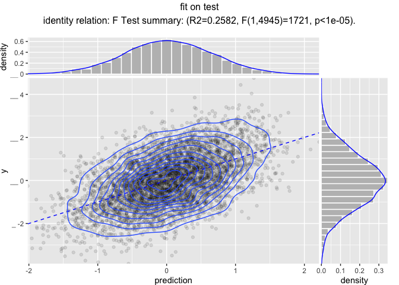

Modeling Pipelines HP
================

Workflow similar to [here](https://github.com/WinVector/vtreat/blob/master/extras/ModelingPipelines.md), but much more hyper parameter tuning. Notice it *didn't* actually improve the held-out model. Our advice is to not always treat the number of variables as just another hyper-parameter, but instead do a simple initial filtering step (either with a simple linear model, or with a random-forest style permutation test). At some point the hyper-parameter optimizer can't tell apart two ways of improving the training error: picking a better model or leaking through the cross-validation procedures.

``` r
library("wrapr")
library("vtreat")
library("glmnet")
```

    ## Loading required package: Matrix

    ## Loading required package: foreach

    ## Loaded glmnet 2.0-16

``` r
library("ggplot2")
library("WVPlots")
library("doParallel")
```

    ## Loading required package: iterators

    ## Loading required package: parallel

``` r
# https://arxiv.org/abs/1703.03373
library("mlrMBO")
```

    ## Loading required package: mlr

    ## Loading required package: ParamHelpers

    ## Loading required package: smoof

    ## Loading required package: BBmisc

    ## 
    ## Attaching package: 'BBmisc'

    ## The following object is masked from 'package:wrapr':
    ## 
    ##     coalesce

    ## The following object is masked from 'package:base':
    ## 
    ##     isFALSE

    ## Loading required package: checkmate

``` r
ncore <- parallel::detectCores()
cl <- parallel::makeCluster(ncore)
registerDoParallel(cl)

# function to make practice data
mk_data <- function(nrows, n_var_cols, n_noise_cols) {
  d <- data.frame(y = rnorm(nrows))
  for(i in seq_len(n_var_cols)) {
    vari = paste0("var_", sprintf("%03g", i))
    d[[vari]] <- rnorm(nrows)
    d$y <- d$y + (2/n_var_cols)*d[[vari]]
    d[[vari]][d[[vari]]>abs(2*rnorm(nrows))] <- NA
    d[[vari]] <- rlnorm(1, meanlog=10, sdlog = 10)*d[[vari]]
  }
  for(i in seq_len(n_noise_cols)) {
    vari = paste0("noise_", sprintf("%03g", i))
    d[[vari]] <- rnorm(nrows)
    d[[vari]][d[[vari]]>abs(2*rnorm(nrows))] <- NA
    d[[vari]] <- rlnorm(1, meanlog=10, sdlog = 10)*d[[vari]]
  }
  d
}

set.seed(2018)
d <- mk_data(10000, 10, 200)
is_train <- runif(nrow(d))<=0.5
dTrain <- d[is_train, , drop = FALSE]
dTest <- d[!is_train, , drop = FALSE]
outcome_name <- "y"
vars <- setdiff(colnames(dTrain), outcome_name)

# design a treatment plan using cross-validation methods
ncross <- 5
cplan <- vtreat::kWayStratifiedY(
  nrow(dTrain), ncross, dTrain, dTrain[[outcome_name]])
cp <- vtreat::mkCrossFrameNExperiment(
  dTrain, vars, outcome_name,
  splitFunction = pre_comp_xval(nrow(dTrain), ncross, cplan),
  ncross = ncross,
  parallelCluster = cl)
```

    ## [1] "vtreat 1.3.3 start initial treatment design Mon Nov 26 08:33:42 2018"
    ## [1] " start cross frame work Mon Nov 26 08:33:44 2018"
    ## [1] " vtreat::mkCrossFrameNExperiment done Mon Nov 26 08:33:52 2018"

``` r
print(cp$method)
```

    ## [1] "kwaycrossystratified (pre-computed 5053 5 )"

``` r
# sort the variables by possible sig
sf <- cp$treatments$scoreFrame
orderedvars <- sf$varName[order(sf$sig)]

# build a cross-validation strategy to help us
# search for a good alpha hyper-parameter value
# convert the plan to cv.glmnet group notation
foldid <- numeric(nrow(dTrain))
for(i in seq_len(length(cplan))) {
  cpi <- cplan[[i]]
  foldid[cpi$app] <- i
}


build_model <- function(nvars, alpha) {
  newvars <- orderedvars[seq_len(nvars)]
  
  # learn a centering and scaling of the cross-validated 
  # training frame
  tfs <- scale(cp$crossFrame[, newvars, drop = FALSE], 
               center = TRUE, scale = TRUE)
  centering <- attr(tfs, "scaled:center")
  scaling <- attr(tfs, "scaled:scale")
  
  # apply the centering and scaling to the cross-validated 
  # training frame
  tfs <- scale(cp$crossFrame[, newvars, drop = FALSE],
               center = centering,
               scale = scaling)
  
  # look for best lambda
  model <- cv.glmnet(as.matrix(tfs), 
                     cp$crossFrame[[outcome_name]],
                     alpha = alpha,
                     family = "gaussian", 
                     standardize = FALSE,
                     foldid = foldid, 
                     parallel = TRUE)
  index <- which(model$lambda == model$lambda.min)[[1]]
  score <- model$cvm[[index]]
  list(model = model, score = score)
}

fn = function(x) {
  scored_model <- build_model(nvars = x[[1]], alpha = x[[2]])
  scored_model$score
}

# https://cran.r-project.org/web/packages/mlrMBO/vignettes/mlrMBO.html
obj_fn <- makeSingleObjectiveFunction(
  name = "loss",
  fn = function(x) {
    scored_model <- build_model(nvars = x[[1]], alpha = x[[2]])
    scored_model$score
  },
  par.set = makeParamSet(
    makeIntegerVectorParam("nvars", len = 1L, lower = 2L, upper = length(orderedvars)),
    makeNumericVectorParam("alpha", len = 1L, lower = 0, upper = 1)
  ),
  minimize = TRUE
)
des = generateDesign(n = 20, par.set = getParamSet(obj_fn), fun = lhs::randomLHS)
des$y <- vapply(seq_len(nrow(des)),
                function(i) {
                  obj_fn(c(des$nvars[[i]],des$alpha[[i]]))
                }, numeric(1))
surr_km = makeLearner("regr.km", predict.type = "se", covtype = "matern3_2", control = list(trace = FALSE))
control = makeMBOControl()
control = setMBOControlTermination(control, iters = 100)
control = setMBOControlInfill(control, crit = makeMBOInfillCritEI())
run = mbo(obj_fn, design = des, learner = surr_km, control = control, show.info = TRUE)
```

    ## [mbo] 1: nvars=142; alpha=0.704 : y = 1.07 : 0.6 secs : infill_ei

    ## [mbo] 2: nvars=74; alpha=0.62 : y = 1.05 : 0.3 secs : infill_ei

    ## [mbo] 3: nvars=38; alpha=0.441 : y = 1.06 : 0.2 secs : infill_ei

    ## [mbo] 4: nvars=346; alpha=1 : y = 1.08 : 2.2 secs : infill_ei

    ## [mbo] 5: nvars=60; alpha=1 : y = 1.05 : 0.2 secs : infill_ei

    ## [mbo] 6: nvars=90; alpha=7.13e-05 : y = 1.05 : 0.4 secs : infill_ei

    ## [mbo] 7: nvars=31; alpha=6.37e-05 : y = 1.06 : 0.2 secs : infill_ei

    ## [mbo] 8: nvars=86; alpha=1 : y = 1.05 : 0.5 secs : infill_ei

    ## [mbo] 9: nvars=420; alpha=0.815 : y = 1.08 : 2.6 secs : infill_ei

    ## [mbo] 10: nvars=49; alpha=1 : y = 1.05 : 0.3 secs : infill_ei

    ## [mbo] 11: nvars=2; alpha=0.636 : y = 1.39 : 0.1 secs : infill_ei

    ## [mbo] 12: nvars=33; alpha=1 : y = 1.06 : 0.2 secs : infill_ei

    ## [mbo] 13: nvars=83; alpha=0.365 : y = 1.05 : 0.3 secs : infill_ei

    ## [mbo] 14: nvars=116; alpha=1 : y = 1.06 : 0.6 secs : infill_ei

    ## [mbo] 15: nvars=160; alpha=1 : y = 1.07 : 0.8 secs : infill_ei

    ## [mbo] 16: nvars=55; alpha=0.688 : y = 1.05 : 0.2 secs : infill_ei

    ## [mbo] 17: nvars=107; alpha=1.71e-05 : y = 1.06 : 0.5 secs : infill_ei

    ## [mbo] 18: nvars=227; alpha=1 : y = 1.08 : 1.2 secs : infill_ei

    ## [mbo] 19: nvars=63; alpha=2.06e-06 : y = 1.05 : 0.3 secs : infill_ei

    ## [mbo] 20: nvars=313; alpha=1 : y = 1.08 : 2.0 secs : infill_ei

    ## [mbo] 21: nvars=66; alpha=0.42 : y = 1.05 : 0.4 secs : infill_ei

    ## [mbo] 22: nvars=48; alpha=5.38e-05 : y = 1.05 : 0.3 secs : infill_ei

    ## [mbo] 23: nvars=69; alpha=0.998 : y = 1.05 : 0.3 secs : infill_ei

    ## [mbo] 24: nvars=318; alpha=1.46e-05 : y = 1.12 : 1.8 secs : infill_ei

    ## [mbo] 25: nvars=49; alpha=0.611 : y = 1.05 : 0.2 secs : infill_ei

    ## [mbo] 26: nvars=94; alpha=0.346 : y = 1.05 : 0.4 secs : infill_ei

    ## [mbo] 27: nvars=137; alpha=0.000819 : y = 1.06 : 0.6 secs : infill_ei

    ## [mbo] 28: nvars=58; alpha=0.0997 : y = 1.05 : 0.2 secs : infill_ei

    ## [mbo] 29: nvars=191; alpha=7.43e-05 : y = 1.08 : 0.9 secs : infill_ei

    ## [mbo] 30: nvars=78; alpha=0.885 : y = 1.05 : 0.3 secs : infill_ei

    ## [mbo] 31: nvars=52; alpha=0.842 : y = 1.05 : 0.2 secs : infill_ei

    ## [mbo] 32: nvars=53; alpha=0.000119 : y = 1.05 : 0.2 secs : infill_ei

    ## [mbo] 33: nvars=420; alpha=6.47e-06 : y = 1.16 : 2.8 secs : infill_ei

    ## [mbo] 34: nvars=405; alpha=1 : y = 1.08 : 2.9 secs : infill_ei

    ## [mbo] 35: nvars=90; alpha=0.732 : y = 1.05 : 0.3 secs : infill_ei

    ## [mbo] 36: nvars=173; alpha=0.532 : y = 1.07 : 0.7 secs : infill_ei

    ## [mbo] 37: nvars=45; alpha=0.769 : y = 1.05 : 0.2 secs : infill_ei

    ## [mbo] 38: nvars=51; alpha=0.131 : y = 1.05 : 0.2 secs : infill_ei

    ## [mbo] 39: nvars=78; alpha=2.35e-06 : y = 1.05 : 0.3 secs : infill_ei

    ## [mbo] 40: nvars=95; alpha=1 : y = 1.05 : 0.3 secs : infill_ei

    ## [mbo] 41: nvars=33; alpha=0.669 : y = 1.06 : 0.1 secs : infill_ei

    ## [mbo] 42: nvars=52; alpha=0.443 : y = 1.05 : 0.2 secs : infill_ei

    ## [mbo] 43: nvars=152; alpha=0.332 : y = 1.07 : 0.6 secs : infill_ei

    ## [mbo] 44: nvars=111; alpha=0.52 : y = 1.06 : 0.4 secs : infill_ei

    ## [mbo] 45: nvars=251; alpha=1 : y = 1.08 : 1.2 secs : infill_ei

    ## [mbo] 46: nvars=64; alpha=0.867 : y = 1.05 : 0.2 secs : infill_ei

    ## [mbo] 47: nvars=54; alpha=0.93 : y = 1.05 : 0.2 secs : infill_ei

    ## [mbo] 48: nvars=364; alpha=0.761 : y = 1.08 : 2.3 secs : infill_ei

    ## [mbo] 49: nvars=69; alpha=3.9e-05 : y = 1.05 : 0.3 secs : infill_ei

    ## [mbo] 50: nvars=51; alpha=0.351 : y = 1.05 : 0.2 secs : infill_ei

    ## [mbo] 51: nvars=52; alpha=0.0537 : y = 1.05 : 0.3 secs : infill_ei

    ## [mbo] 52: nvars=61; alpha=0.53 : y = 1.05 : 0.3 secs : infill_ei

    ## [mbo] 53: nvars=291; alpha=1 : y = 1.08 : 1.6 secs : infill_ei

    ## [mbo] 54: nvars=97; alpha=9.38e-05 : y = 1.05 : 0.4 secs : infill_ei

    ## [mbo] 55: nvars=55; alpha=0.000316 : y = 1.05 : 0.2 secs : infill_ei

    ## [mbo] 56: nvars=53; alpha=0.77 : y = 1.05 : 0.2 secs : infill_ei

    ## [mbo] 57: nvars=52; alpha=0.206 : y = 1.05 : 0.2 secs : infill_ei

    ## [mbo] 58: nvars=53; alpha=1 : y = 1.05 : 0.2 secs : infill_ei

    ## [mbo] 59: nvars=270; alpha=5.14e-05 : y = 1.11 : 1.7 secs : infill_ei

    ## [mbo] 60: nvars=81; alpha=0.101 : y = 1.05 : 0.3 secs : infill_ei

    ## [mbo] 61: nvars=76; alpha=0.999 : y = 1.05 : 0.3 secs : infill_ei

    ## [mbo] 62: nvars=51; alpha=0.000118 : y = 1.05 : 0.3 secs : infill_ei

    ## [mbo] 63: nvars=79; alpha=0.525 : y = 1.05 : 0.3 secs : infill_ei

    ## [mbo] 64: nvars=42; alpha=8.17e-05 : y = 1.06 : 0.3 secs : infill_ei

    ## [mbo] 65: nvars=30; alpha=0.311 : y = 1.06 : 0.2 secs : infill_ei

    ## [mbo] 66: nvars=57; alpha=0.819 : y = 1.05 : 0.2 secs : infill_ei

    ## [mbo] 67: nvars=135; alpha=1 : y = 1.06 : 0.5 secs : infill_ei

    ## [mbo] 68: nvars=53; alpha=0.548 : y = 1.05 : 0.3 secs : infill_ei

    ## [mbo] 69: nvars=108; alpha=1 : y = 1.06 : 0.4 secs : infill_ei

    ## [mbo] 70: nvars=52; alpha=0.958 : y = 1.05 : 0.3 secs : infill_ei

    ## [mbo] 71: nvars=85; alpha=0.000229 : y = 1.05 : 0.4 secs : infill_ei

    ## [mbo] 72: nvars=53; alpha=0.39 : y = 1.05 : 0.2 secs : infill_ei

    ## [mbo] 73: nvars=52; alpha=0.32 : y = 1.05 : 0.2 secs : infill_ei

    ## [mbo] 74: nvars=60; alpha=0.000125 : y = 1.05 : 0.3 secs : infill_ei

    ## [mbo] 75: nvars=81; alpha=1 : y = 1.05 : 0.3 secs : infill_ei

    ## [mbo] 76: nvars=65; alpha=0.0181 : y = 1.05 : 0.3 secs : infill_ei

    ## [mbo] 77: nvars=53; alpha=0.495 : y = 1.05 : 0.2 secs : infill_ei

    ## [mbo] 78: nvars=52; alpha=2.2e-05 : y = 1.05 : 0.2 secs : infill_ei

    ## [mbo] 79: nvars=53; alpha=0.0934 : y = 1.05 : 0.2 secs : infill_ei

    ## [mbo] 80: nvars=53; alpha=0.891 : y = 1.05 : 0.2 secs : infill_ei

    ## [mbo] 81: nvars=53; alpha=0.165 : y = 1.05 : 0.3 secs : infill_ei

    ## [mbo] 82: nvars=53; alpha=0.639 : y = 1.05 : 0.2 secs : infill_ei

    ## [mbo] 83: nvars=53; alpha=0.018 : y = 1.05 : 0.2 secs : infill_ei

    ## [mbo] 84: nvars=124; alpha=0.872 : y = 1.06 : 0.5 secs : infill_ei

    ## [mbo] 85: nvars=53; alpha=0.722 : y = 1.05 : 0.2 secs : infill_ei

    ## [mbo] 86: nvars=63; alpha=0.24 : y = 1.05 : 0.5 secs : infill_ei

    ## [mbo] 87: nvars=75; alpha=0.000222 : y = 1.05 : 0.4 secs : infill_ei

    ## [mbo] 88: nvars=100; alpha=0.204 : y = 1.06 : 0.8 secs : infill_ei

    ## [mbo] 89: nvars=214; alpha=0.635 : y = 1.08 : 1.2 secs : infill_ei

    ## [mbo] 90: nvars=53; alpha=0.592 : y = 1.05 : 0.2 secs : infill_ei

    ## [mbo] 91: nvars=67; alpha=0.733 : y = 1.05 : 0.2 secs : infill_ei

    ## [mbo] 92: nvars=72; alpha=0.812 : y = 1.05 : 0.2 secs : infill_ei

    ## [mbo] 93: nvars=93; alpha=0.0734 : y = 1.05 : 0.3 secs : infill_ei

    ## [mbo] 94: nvars=77; alpha=0.29 : y = 1.05 : 0.3 secs : infill_ei

    ## [mbo] 95: nvars=50; alpha=0.000182 : y = 1.05 : 0.2 secs : infill_ei

    ## [mbo] 96: nvars=41; alpha=0.999 : y = 1.06 : 0.4 secs : infill_ei

    ## [mbo] 97: nvars=53; alpha=0.348 : y = 1.05 : 0.3 secs : infill_ei

    ## [mbo] 98: nvars=114; alpha=6.36e-05 : y = 1.06 : 0.6 secs : infill_ei

    ## [mbo] 99: nvars=50; alpha=0.242 : y = 1.05 : 0.2 secs : infill_ei

    ## [mbo] 100: nvars=53; alpha=0.811 : y = 1.05 : 0.2 secs : infill_ei

``` r
opt <- run$x
print(opt)
```

    ## $nvars
    ## [1] 53
    ## 
    ## $alpha
    ## [1] 0.0001189942

``` r
print(run$y)
```

    ## [1] 1.049697

``` r
alpha <- opt$alpha
nvars <- opt$nvars

# re-fit model with chosen alpha and nvars
m <- build_model(nvars, alpha)
newvars <- orderedvars[seq_len(nvars)]
lambdas <- m$model$lambda
s <- m$model$lambda.min
lambdas <- lambdas[lambdas>=s]

print(nvars)
```

    ## [1] 53

``` r
print(alpha)
```

    ## [1] 0.0001189942

``` r
print(s)
```

    ## [1] 0.03029936

``` r
# learn a centering and scaling of the cross-validated 
# training frame
tfs <- scale(cp$crossFrame[, newvars, drop = FALSE], 
             center = TRUE, scale = TRUE)
centering <- attr(tfs, "scaled:center")
scaling <- attr(tfs, "scaled:scale")

# apply the centering and scaling to the cross-validated 
# training frame
tfs <- scale(cp$crossFrame[, newvars, drop = FALSE],
             center = centering,
             scale = scaling)

model <- glmnet(as.matrix(tfs), 
                cp$crossFrame[[outcome_name]],
                alpha = alpha,
                family = "gaussian", 
                standardize = FALSE,
                lambda = lambdas)

pipeline <-
  pkgfn("vtreat::prepare",
        arg_name = "dframe", 
        args = list(treatmentplan = cp$treatments,
                    varRestriction = newvars)) %.>%
  pkgfn("subset",
        arg_name = "x",
        args = list(select = newvars))  %.>%
  pkgfn("scale",
        arg_name = "x",
        args = list(center = centering,
                    scale = scaling))  %.>%
  pkgfn("glmnet::predict.glmnet",
        arg_name = "newx",
        args = list(object = model,
                    s = s))  %.>%
  srcfn(".[, cname, drop = TRUE]",
        arg_name = ".",
        args = list(cname = "1"))

cat(format(pipeline))
```

    ## UnaryFnList(
    ##    vtreat::prepare(dframe=., treatmentplan, varRestriction),
    ##    base::subset(x=., select),
    ##    base::scale(x=., center, scale),
    ##    glmnet::predict.glmnet(newx=., object, s),
    ##    SrcFunction{ .[, cname, drop = TRUE] }(.=., cname))

``` r
dTrain$prediction <- dTrain %.>% pipeline

WVPlots::ScatterHist(
  dTrain, "prediction", "y", "fit on training data",
  smoothmethod = "identity",
  estimate_sig = TRUE,
  point_alpha = 0.1,
  contour = TRUE)
```


``` r
dTest$prediction <- dTest %.>% pipeline

WVPlots::ScatterHist(
  dTest, "prediction", "y", "fit on test",
  smoothmethod = "identity",
  estimate_sig = TRUE,
  point_alpha = 0.1,
  contour = TRUE)
```



``` r
parallel::stopCluster(cl)
```
