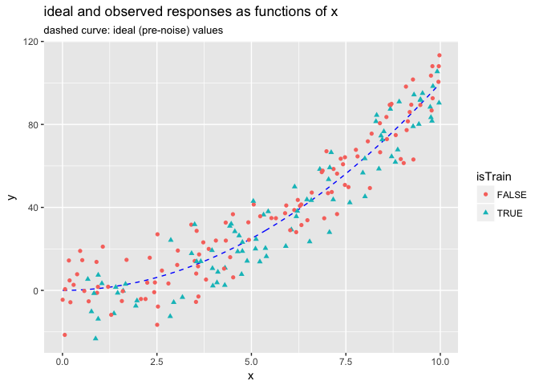
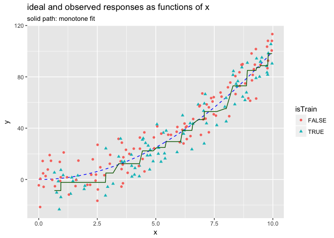

Custom Level Coding in vtreat
================
John Mount, Win-Vector LLC
2017-09-30

``` r
suppressPackageStartupMessages(library("ggplot2"))
source("isotone.R")


set.seed(23525)
d <- data.frame(x = 10*runif(200))
d$yIdeal <- d$x^2
d$yObserved <- d$yIdeal + 10*rnorm(nrow(d))
d$isTrain <- runif(nrow(d))<=0.5

ggplot(data=d, aes(x=x)) + 
  geom_line(aes(y=yIdeal), color='blue', linetype=2) + 
  geom_point(aes(y=yObserved, color=isTrain, shape=isTrain)) +
  ylab('y') +
  ggtitle("ideal and observed responses as functions of x")
```



``` r
dTrain <- d[d$isTrain, , drop=FALSE]
dTrain$soln <- solveIsotonicProblemW(dTrain$x, dTrain$yObserved, NULL)

sum((dTrain$yIdeal - dTrain$soln)^2)
```

    ## [1] 1695.844

``` r
sum((dTrain$yIdeal - dTrain$yObserved)^2)
```

    ## [1] 9736.865

``` r
ggplot(data=d, aes(x=x)) + 
  geom_line(aes(y=yIdeal), color='blue', linetype=2) + 
  geom_point(aes(y=yObserved, color=isTrain, shape=isTrain)) +
  geom_line(data= dTrain, aes(x=x, y=soln), color='darkgreen') +
  ylab('y') +
  ggtitle("ideal and observed responses as functions of x",
          subtitle = "dashed line monotone fit")
```


