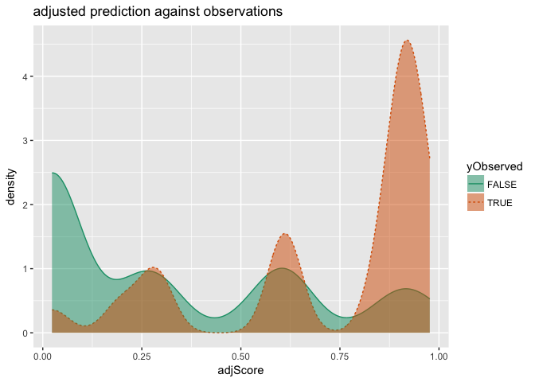
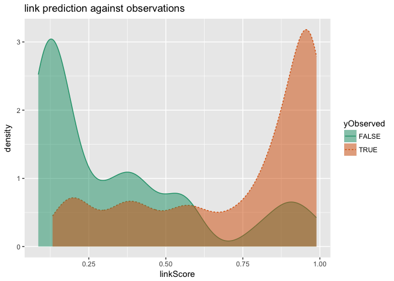
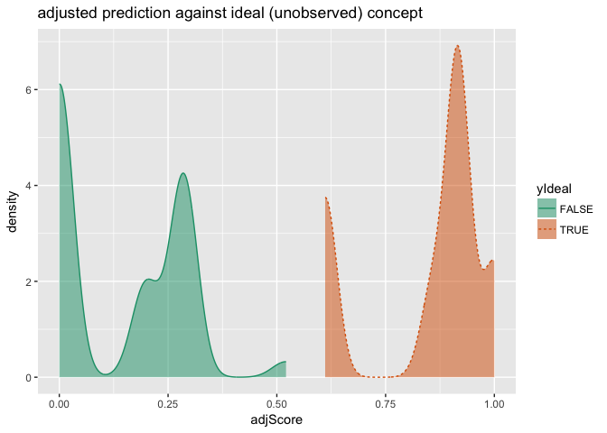
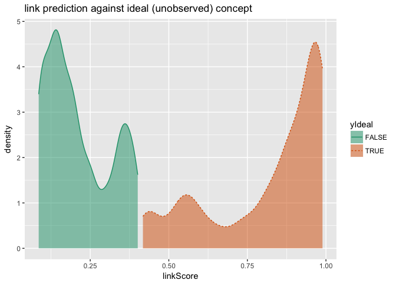

Isotone Coding in vtreat
================
John Mount, Win-Vector LLC
2017-10-22

Monotone (or isotone) regression via the [`isotone` package](https://CRAN.R-project.org/package=isotone) (also give [`scam`](https://CRAN.R-project.org/package=scam) and [`gbm` `var.monotone`](https://CRAN.R-project.org/package=gbm) a look, which should have the advantage of also being low complexity).

We will use the [`vtreat` package](https://winvector.github.io/vtreat/) [custom coder interface](https://github.com/WinVector/vtreat/blob/master/extras/CustomLevelCoders.md), which will supply cross-validated significance calculations and out-of sample interpolation (allowing us to apply the monotone transforms to new data). For a more substantial application of `vtreat` custom coding please see the [partial pooling application](http://www.win-vector.com/blog/2017/09/partial-pooling-for-lower-variance-variable-encoding/).

Regression
----------

``` r
suppressPackageStartupMessages(library("ggplot2"))
source("isotone.R")

# set up example data
set.seed(23525)
d <- data.frame(x = 10*runif(200))
d$yIdeal <- d$x^2
d$yObserved <- d$yIdeal + 25*rnorm(nrow(d))
d$isTrain <- runif(nrow(d))<=0.5

ggplot(data=d, aes(x=x)) + 
  geom_line(aes(y=yIdeal), color='blue', linetype=2) + 
  geom_point(aes(y=yObserved, color=isTrain, shape=isTrain)) +
  ylab('y') +
  ggtitle("ideal and observed responses as functions of x",
          subtitle = "dashed curve: ideal (pre-noise) values")
```


``` r
customCoders = list('n.NonDecreasingV.num' = solveNonDecreasing,
                    'n.NonIncreasingV.num' = solveNonIncreasing)
treatments <- vtreat::designTreatmentsN(d[d$isTrain, , drop=FALSE], 
                                        'x', 'yObserved', 
                                        customCoders = customCoders,
                                        verbose = FALSE)
print(treatments$scoreFrame[, c('varName', 'rsq', 'sig', 'needsSplit'), drop=FALSE])
```

    ##            varName       rsq          sig needsSplit
    ## 1 x_NonDecreasingV 0.5809673 9.905695e-18       TRUE
    ## 2          x_clean 0.6129088 3.320652e-19      FALSE

``` r
dTreated <- vtreat::prepare(treatments, d)
d$soln <- dTreated$x_NonDecreasingV

dTrain <- d[d$isTrain, , drop=FALSE]

# good inference on train
sum((dTrain$yIdeal - dTrain$soln)^2)
```

    ## [1] 7460.391

``` r
sum((dTrain$yIdeal - dTrain$yObserved)^2)
```

    ## [1] 60855.41

``` r
dTest <- d[!d$isTrain, , drop=FALSE]

# good performance on test
sum((dTest$yIdeal - dTest$soln)^2)
```

    ## [1] 14315.25

``` r
sum((dTest$yIdeal - dTest$yObserved)^2)
```

    ## [1] 75152.66

``` r
ggplot(data=d, aes(x=x)) + 
  geom_line(aes(y=yIdeal), color='blue', linetype=2) + 
  geom_point(aes(y=yObserved, color=isTrain, shape=isTrain)) +
  geom_line(aes(x=x, y=soln), color='darkgreen') +
  ylab('y') +
  ggtitle("ideal and observed responses as functions of x",
          subtitle = "solid path: isotone fit")
```


The above formulation is kind of exciting. You get one degree of freedom per data-row (a very large number), but a simple constraint system (that the produced predictions must follow the x-order constraints) is enough to produce reasonable fits. This reminiscent of the [maximum entropy formulation of logistic regression](http://www.win-vector.com/dfiles/LogisticRegressionMaxEnt.pdf), and is evidence one is working with a sort of dual-formulation of a smaller primal problem.

Some notes on smoother implementations can be found [here](https://github.com/WinVector/vtreat/blob/master/extras/Monotone2.md).

Clasification
-------------

We can also easily adapt to classification and to categorical inputs.

``` r
source("isotone.R")

# set up example data
set.seed(23525)
d <- data.frame(x = 10*runif(200))
d$yIdeal <- -d$x^2
d$yObserved <- d$yIdeal + 25*rnorm(nrow(d))
d$isTrain <- runif(nrow(d))<=0.5
threshold <- -50
d$yIdeal <- d$yIdeal >= threshold
d$yObserved <- d$yObserved >= threshold


# could also build link-space versions
customCoders = list('c.NonDecreasingV.num' = solveNonDecreasing,
                    'c.NonIncreasingV.num' = solveNonIncreasing)
treatments <- vtreat::designTreatmentsC(d[d$isTrain, , drop=FALSE], 
                                        'x', 'yObserved', TRUE,
                                        customCoders = customCoders,
                                        verbose = FALSE)
# examining variables
print(treatments$scoreFrame[, c('varName', 'rsq', 'sig', 'needsSplit'), drop=FALSE])
```

    ##            varName       rsq          sig needsSplit
    ## 1 x_NonIncreasingV 0.3370146 2.856172e-10       TRUE
    ## 2          x_clean 0.3522417 1.138713e-10      FALSE

``` r
# copy fit over to original data frame
dTreated <- vtreat::prepare(treatments, d)
d$soln <- dTreated$x_NonIncreasingV
d$prediction <- d$soln>0.5

dTrain <- d[d$isTrain, , drop=FALSE]

# good inference on train
sigr::wrapChiSqTest(dTrain, 'soln', 'yIdeal')
```

    ## [1] "Chi-Square Test summary: pseudo-R2=0.69 (X2(1,N=87)=77, p<1e-05)."

``` r
table(dTrain$prediction, dTrain$yIdeal)
```

    ##        
    ##         FALSE TRUE
    ##   FALSE    28    0
    ##   TRUE      2   57

``` r
sigr::wrapFisherTest(dTrain, 'prediction', 'yIdeal')
```

    ## [1] "Fisher's Exact Test for Count Data: (odds.ratio=Inf, p<1e-05)."

``` r
table(dTrain$yObserved, dTrain$yIdeal)
```

    ##        
    ##         FALSE TRUE
    ##   FALSE    25   11
    ##   TRUE      5   46

``` r
sigr::wrapFisherTest(dTrain, 'yObserved', 'yIdeal')
```

    ## [1] "Fisher's Exact Test for Count Data: (odds.ratio=20, p<1e-05)."

``` r
dTest <- d[!d$isTrain, , drop=FALSE]

# good performance on test
sigr::wrapChiSqTest(dTest, 'soln', 'yIdeal')
```

    ## [1] "Chi-Square Test summary: pseudo-R2=0.72 (X2(1,N=113)=1.1e+02, p<1e-05)."

``` r
table(dTest$prediction, dTest$yIdeal)
```

    ##        
    ##         FALSE TRUE
    ##   FALSE    38    0
    ##   TRUE      1   74

``` r
sigr::wrapFisherTest(dTest, 'prediction', 'yIdeal')
```

    ## [1] "Fisher's Exact Test for Count Data: (odds.ratio=Inf, p<1e-05)."

``` r
table(dTest$yObserved, dTest$yIdeal)
```

    ##        
    ##         FALSE TRUE
    ##   FALSE    24   11
    ##   TRUE     15   63

``` r
sigr::wrapFisherTest(dTest, 'yObserved', 'yIdeal')
```

    ## [1] "Fisher's Exact Test for Count Data: (odds.ratio=8.9, p<1e-05)."

Model calibration/polish
------------------------

One application we have used the monotone methodology with good success is: calibrating regressions and classifiers.

This is an idea that came up in discussion with [Jeremy Howard](http://www.fast.ai/about/). Jeremy, while President and Chief Scientist of Kaggle, decided AUC was a good "early to see if you have something" metric for running contests. That leaves the question: what is a principled mechanical way to convert a score with a good AUC to a score with correct probabilities (a good deviance). Kaggle participants are famous for good solutions. But here is our solution: a arbitrary isotone transform.

That is: we take a model that does well on the `AUC` measure (meaning it is good at ranking or reproducing order relations) and build the best model with the same order structure with respect to a more stringent measure (such as sum of squared errors, or deviance). Often this step is ignored or done by binning or some other method- but for systems that are not natively in probability units (such as margin based systems such as support vector machines) this isotone calibration or polish step can be an improvement (assuming one is careful about nested model bias issues).

We can try- that. Suppose we forgot to set `type="response"` on a logistic regression and we didn't know the link function is the sigmoid (so we can't directly apply the correction).

``` r
source("isotone.R")

# set up example data
set.seed(23525)
d <- data.frame(x = 10*runif(200))
d$yIdeal <- -d$x^2
d$yObserved <- d$yIdeal + 25*rnorm(nrow(d))
d$isTrain <- runif(nrow(d))<=0.5
threshold <- -50
d$yIdeal <- d$yIdeal >= threshold
d$yObserved <- d$yObserved >= threshold


model <- glm(yObserved ~ x, data = d[d$isTrain, , drop=FALSE], family = binomial)
sigr::wrapChiSqTest(model)
```

    ## [1] "Chi-Square Test summary: pseudo-R2=0.35 (X2(1,N=87)=42, p<1e-05)."

``` r
d$rawScore <- predict(model, newdata = d)  # oops forgot type='response'
head(d)
```

    ##          x yIdeal yObserved isTrain   rawScore
    ## 1 3.615347   TRUE      TRUE   FALSE  2.0180394
    ## 2 6.811326   TRUE      TRUE    TRUE -0.1834170
    ## 3 7.173432  FALSE      TRUE   FALSE -0.4328434
    ## 4 9.732597  FALSE     FALSE    TRUE -2.1956494
    ## 5 3.726201   TRUE      TRUE   FALSE  1.9416808
    ## 6 2.197222   TRUE      TRUE   FALSE  2.9948735

``` r
# fix it with isotone regression
customCoders = list('c.NonDecreasingV.num' = solveNonDecreasing)
treatments <- vtreat::designTreatmentsC(d[d$isTrain, , drop=FALSE], 
                                        'rawScore', 'yObserved', TRUE,
                                        customCoders = customCoders,
                                        verbose = FALSE)
print(treatments$scoreFrame[, c('varName', 'rsq', 'sig', 'needsSplit'), drop=FALSE])
```

    ##                   varName       rsq          sig needsSplit
    ## 1 rawScore_NonDecreasingV 0.3370146 2.856172e-10       TRUE
    ## 2          rawScore_clean 0.3522417 1.138713e-10      FALSE

``` r
predictionCollar <- 2/(sum(d$isTrain)-1)
```

Notice in the score frame `vtreat`'s cross validation based scoring correctly indentifies that the isotone encoding is over-fitting and not in fact better than the sigmoid link function.

``` r
# copy fit over to original data frame
dTreated <- vtreat::prepare(treatments, d)
d$adjScore <- dTreated$rawScore_NonDecreasingV
d$adjScore <- pmax(predictionCollar, pmin(1-predictionCollar, d$adjScore))
d$adjPred <- d$adjScore>=0.5

# and the correct link
d$linkScore <-  predict(model, newdata = d, type = 'response')
d$linkPred <- d$linkScore>=0.5
head(d)
```

    ##          x yIdeal yObserved isTrain   rawScore   adjScore adjPred
    ## 1 3.615347   TRUE      TRUE   FALSE  2.0180394 0.91666667    TRUE
    ## 2 6.811326   TRUE      TRUE    TRUE -0.1834170 0.61111111    TRUE
    ## 3 7.173432  FALSE      TRUE   FALSE -0.4328434 0.28571429   FALSE
    ## 4 9.732597  FALSE     FALSE    TRUE -2.1956494 0.02325581   FALSE
    ## 5 3.726201   TRUE      TRUE   FALSE  1.9416808 0.91666667    TRUE
    ## 6 2.197222   TRUE      TRUE   FALSE  2.9948735 0.91666667    TRUE
    ##   linkScore linkPred
    ## 1 0.8826781     TRUE
    ## 2 0.4542739    FALSE
    ## 3 0.3934475    FALSE
    ## 4 0.1001419    FALSE
    ## 5 0.8745367     TRUE
    ## 6 0.9523420     TRUE

``` r
dTest <- d[!d$isTrain, , drop=FALSE]
```

### Adjusted Score versus observed outcomes

``` r
sigr::wrapChiSqTest(dTest, 'adjScore', 'yObserved')
```

    ## [1] "Chi-Square Test summary: pseudo-R2=0.14 (X2(1,N=113)=19, p=1.3e-05)."

``` r
WVPlots::DoubleDensityPlot(dTest, 'adjScore', 'yObserved',
                           "adjusted prediction against observations")
```



### Link Score versus observed outcomes

``` r
sigr::wrapChiSqTest(dTest, 'linkScore', 'yObserved')
```

    ## [1] "Chi-Square Test summary: pseudo-R2=0.2 (X2(1,N=113)=28, p<1e-05)."

``` r
WVPlots::DoubleDensityPlot(dTest, 'linkScore', 'yObserved',
                           "link prediction against observations")
```



### Adjusted Score versus Ideal (Unobserved) Concept

``` r
sigr::wrapChiSqTest(dTest, 'adjScore', 'yIdeal')
```

    ## [1] "Chi-Square Test summary: pseudo-R2=0.71 (X2(1,N=113)=1e+02, p<1e-05)."

``` r
WVPlots::DoubleDensityPlot(dTest, 'adjScore', 'yIdeal',
                           "adjusted prediction against ideal (unobserved) concept")
```



### Link Score versus Ideal (Unobserved) Concept

``` r
sigr::wrapChiSqTest(dTest, 'linkScore', 'yIdeal')
```

    ## [1] "Chi-Square Test summary: pseudo-R2=0.64 (X2(1,N=113)=93, p<1e-05)."

``` r
WVPlots::DoubleDensityPlot(dTest, 'linkScore', 'yIdeal',
                           "link prediction against ideal (unobserved) concept")
```



Conclusion
----------

And we see the adjusted prediction is pretty good, even with the nested model bias issue. In fact even though it shows sings of over-fit on the testing set, it outperforms the original links score in recovering the (unobserved) original concept. This is because the inductive bias we introduced (monotone solution) was something true for the concept (the mapping of link scores to probabilities) but not a property of the noise model; so the transform prefers signal.
