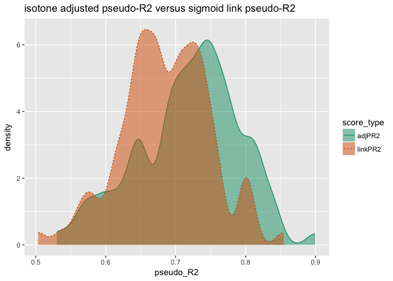

MonotoneStats
================
Win-Vector LLC
10/16/2017

``` r
library("seplyr")
```

    ## Loading required package: wrapr

``` r
library("cdata")
library("WVPlots")
library("sigr")
source("isotone.R")

# set up example data
set.seed(23525)

mkData <- function(n=200) {
  d <- data.frame(x = 10*runif(n))
  d$yIdeal <- -d$x^2
  d$yObserved <- d$yIdeal + 25*rnorm(nrow(d))
  d$isTrain <- runif(nrow(d))<=0.5
  threshold <- -50
  d$yIdeal <- d$yIdeal >= threshold
  d$yObserved <- d$yObserved >= threshold
  d
}


doModeling <- function(d) {
  model <- glm(yObserved ~ x, data = d[d$isTrain, , drop=FALSE], family = binomial)

  d$rawScore <- predict(model, newdata = d)  # oops forgot type='response'
  
  # fix it with isotone regression
  customCoders = list('c.NonDecreasingV.num' = solveNonDecreasing)
  treatments <- vtreat::designTreatmentsC(d[d$isTrain, , drop=FALSE], 
                                          'rawScore', 'yObserved', TRUE,
                                          customCoders = customCoders,
                                          verbose = FALSE)
  # copy fit over to original data frame
  dTreated <- vtreat::prepare(treatments, d)
  d$adjScore <- dTreated$rawScore_NonDecreasingV
  d$adjPred <- d$adjScore>=0.5
  
  # and the correct link
  d$linkScore <-  predict(model, newdata = d, type = 'response')
  d$linkPred <- d$linkScore>=0.5
  d
}

scoreModeling <- function(d) {
  dTest <- d[!d$isTrain, , drop=FALSE]
  
  s1 <- sigr::wrapChiSqTest(dTest, 'adjScore', 'yIdeal')$pseudoR2
  s2 <- sigr::wrapChiSqTest(dTest, 'linkScore', 'yIdeal')$pseudoR2
  data.frame(adjPR2 = s1, linkPR2 = s2)
}

expmt <- lapply(1:100,
                function(i) {
                  di <- mkData() %.>% doModeling(.) %.>% scoreModeling(.)
                  di$runNumber <- i
                  di
                })
expmt <- bind_rows(expmt)

summary(expmt)
```

    ##      adjPR2          linkPR2         runNumber     
    ##  Min.   :0.5301   Min.   :0.5034   Min.   :  1.00  
    ##  1st Qu.:0.6790   1st Qu.:0.6457   1st Qu.: 25.75  
    ##  Median :0.7280   Median :0.6842   Median : 50.50  
    ##  Mean   :0.7189   Mean   :0.6853   Mean   : 50.50  
    ##  3rd Qu.:0.7688   3rd Qu.:0.7276   3rd Qu.: 75.25  
    ##  Max.   :0.8996   Max.   :0.8547   Max.   :100.00

``` r
wrapTTest(expmt, "adjPR2", "linkPR2")
```

    ## [1] "Welch Two Sample t-test, two.sided: (t=3.5, df=1.9e+02, p=0.00067)."

``` r
pltf <- unpivotValuesToRows(expmt, 
                            nameForNewKeyColumn = 'score_type', 
                            nameForNewValueColumn = 'pseudo_R2', 
                            columnsToTakeFrom = c("adjPR2", "linkPR2"))

WVPlots::DoubleDensityPlot(pltf, 'pseudo_R2', 'score_type', 
                           "isotone adjusted pseudo-R2 versus sigmoid link pseudo-R2")
```


