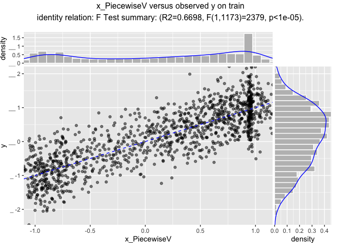
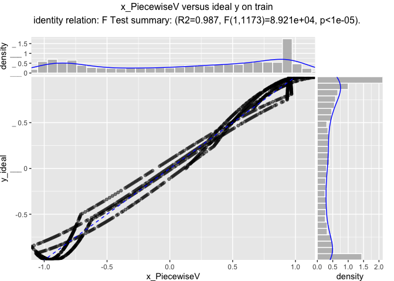
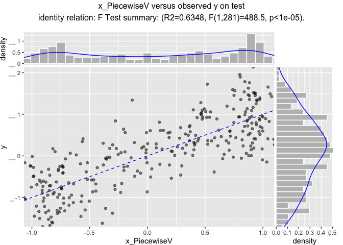
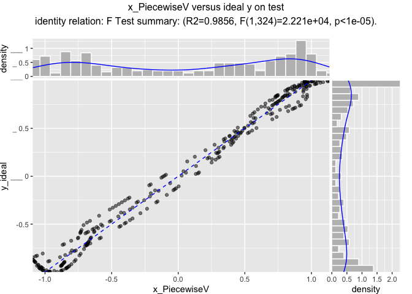

SegFitter
================

``` r
library("ggplot2")
```

``` r
customCoders = list('c.PiecewiseV.num' = vtreat::solve_piecewise,
                    'n.PiecewiseV.num' = vtreat::solve_piecewise)
```

``` r
d <- data.frame(x = seq(0, 15, by = 0.01))
d$y_ideal <- sin(d$x)
d$x_noise <- d$x[sample.int(nrow(d), nrow(d), replace = FALSE)]
d$y <- d$y_ideal + 0.5*rnorm(nrow(d))
d$is_train <- runif(nrow(d))>=0.2

ggplot(data=d) +
  geom_point(aes(x = x, y = y), alpha=0.5) + 
  geom_line(aes(x = x, y = y_ideal), color = "lightblue")
```


``` r
cfe <- vtreat::mkCrossFrameNExperiment(d[d$is_train, , drop=FALSE], 
                                        c('x', 'x_noise'), 'y',
                                        customCoders = customCoders,
                                        verbose = FALSE)
cfe$treatments
```

    ##              varName varMoves          rsq           sig needsSplit
    ## 1       x_PiecewiseV     TRUE 0.6550661901 6.156370e-279       TRUE
    ## 2            x_clean     TRUE 0.0007680121  3.376642e-01      FALSE
    ## 3 x_noise_PiecewiseV     TRUE 0.0003799665  5.001037e-01       TRUE
    ## 4      x_noise_clean     TRUE 0.0029398181  6.053472e-02      FALSE
    ##   extraModelDegrees origName       code
    ## 1              1199        x PiecewiseV
    ## 2                 0        x      clean
    ## 3              1199  x_noise PiecewiseV
    ## 4                 0  x_noise      clean

``` r
prepared <- vtreat::prepare(cfe$treatments, d)
d$x_PiecewiseV <- prepared$x_PiecewiseV

ggplot(data=d) +
 # geom_point(aes(x = x, y = y)) + 
  geom_line(aes(x = x, y = y_ideal), color = "lightblue") + 
  geom_line(aes(x = x, y = x_PiecewiseV))
```


``` r
WVPlots::ScatterHist(d[d$is_train, , drop=FALSE], 
                     "x_PiecewiseV", "y",
                     "x_PiecewiseV versus observed y on train",
                     smoothmethod = "identity",
                     estimate_sig = TRUE)
```



``` r
WVPlots::ScatterHist(d[d$is_train, , drop=FALSE], 
                     "x_PiecewiseV", "y_ideal",
                     "x_PiecewiseV versus ideal y on train",
                     smoothmethod = "identity",
                     estimate_sig = TRUE)
```



``` r
WVPlots::ScatterHist(d[!d$is_train, , drop=FALSE], 
                     "x_PiecewiseV", "y",
                     "x_PiecewiseV versus observed y on test",
                     smoothmethod = "identity",
                     estimate_sig = TRUE)
```



``` r
WVPlots::ScatterHist(d[!d$is_train, , drop=FALSE], 
                     "x_PiecewiseV", "y_ideal",
                     "x_PiecewiseV versus ideal y on test",
                     smoothmethod = "identity",
                     estimate_sig = TRUE)
```


