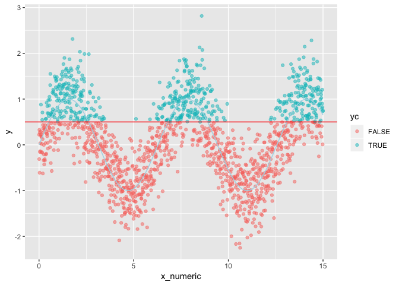
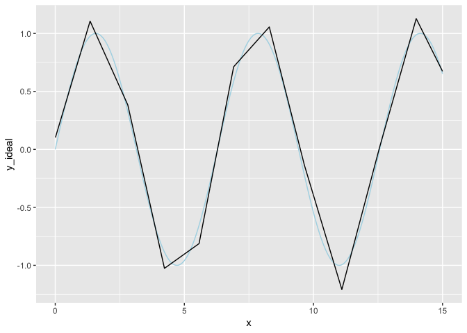

SegFitter
================

``` r
library("ggplot2")
```

``` r
# encode xs as lambdas
encode_x_as_lambdas <- function(x, minx, maxx, xs) {
  n <- length(x)
  k <- length(xs)
  x[is.na(x)] <- (minx+maxx)/2
  x <- pmin(maxx, pmax(minx, x))
  ff <- data.frame("intercept" = rep(1, n))
  for(ki in seq_len(k)) {
    vname <- paste0("lambda_", sprintf("%05g", ki))
    v <- numeric(n)
    left <- xs[[ki]]
    if(ki<k) {
      right <- xs[[ki+1]]
    } else {
      right <- maxx
    }
    v <- (x-left)/(right-left)
    v[x<left] <- 0
    v[x>=right] <- 1 # copy to res of the models
    ff[[vname]] <- v
  }
  ff
}

#' Fit a piecewise linear function at cut-points
fit_segments <- function(x, y) {
  meany = mean(y)
  missing_pred = meany
  na_posns = is.na(x)
  if(sum(na_posns)>20) {
    missing_pred = mean(y[na_posns])
  }
  x <- x[!na_posns]
  y <- y[!na_posns]
  n <- length(x)
  minx <- min(x)
  maxx <- max(x)
  xs <- sort(x)
  idxs <- sort(unique(c(1, round(seq(1, n, by = n^(2/3))))))
  idxs <- pmin(n, pmax(1, idxs))
  idxs <- idxs[idxs<n]
  xs <- sort(unique(xs[idxs]))
  xs <- xs[xs<maxx]
  ff <- encode_x_as_lambdas(x, minx, maxx, xs)
  vars <- colnames(ff)
  ff$y <- y
  f <- paste("y", paste(c("0", vars), collapse = " + "), sep = " ~ ")
  model <- lm(f, data = ff)
  coef <- model$coefficients
  coef[is.na(coef)] <- 0
  list(minx = minx, 
       maxx = maxx,
       xs = xs,
       meany = meany,
       missing_pred = missing_pred,
       coef = coef)
}

pred_segs <- function(model, x) {
  ff <- encode_x_as_lambdas(x, model$min, model$maxx, model$xs)
  preds <- as.matrix(ff) %*% model$coef
  preds[is.na(x)] <- model$missing_pred
  preds
}
```

``` r
d <- data.frame(x = seq(0, 15, by = 0.01))
d$y_ideal <- sin(d$x)
d$y <- d$y_ideal + 0.5*rnorm(nrow(d))

ggplot(data=d) +
  geom_point(aes(x = x, y = y), alpha=0.5) + 
  geom_line(aes(x = x, y = y_ideal), color = "lightblue")
```



``` r
model <- fit_segments(d$x, d$y)
d$pred <- pred_segs(model, d$x)
ggplot(data=d) +
 # geom_point(aes(x = x, y = y)) + 
  geom_line(aes(x = x, y = y_ideal), color = "lightblue") + 
  geom_line(aes(x = x, y = pred))
```


