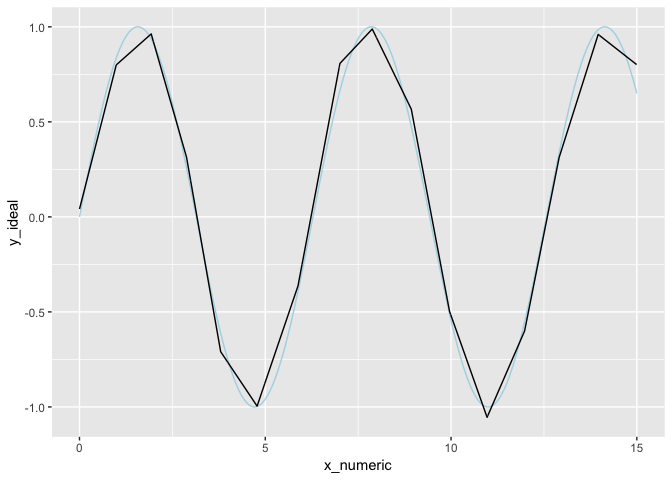
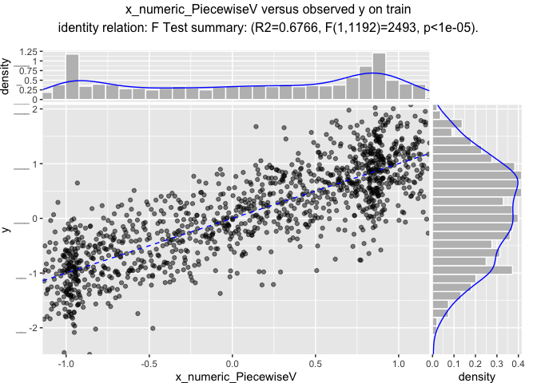
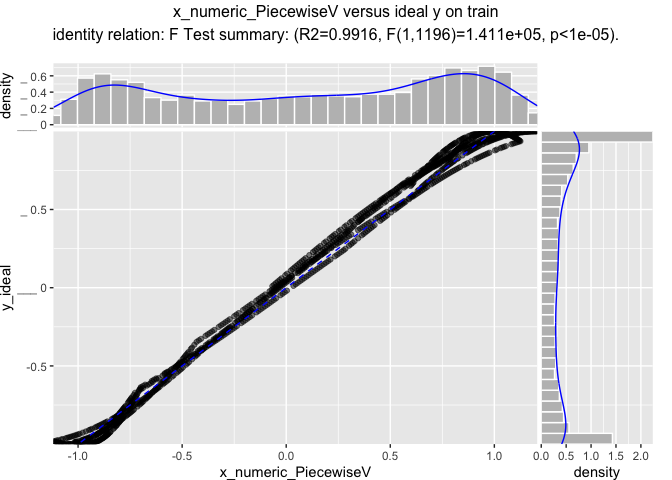
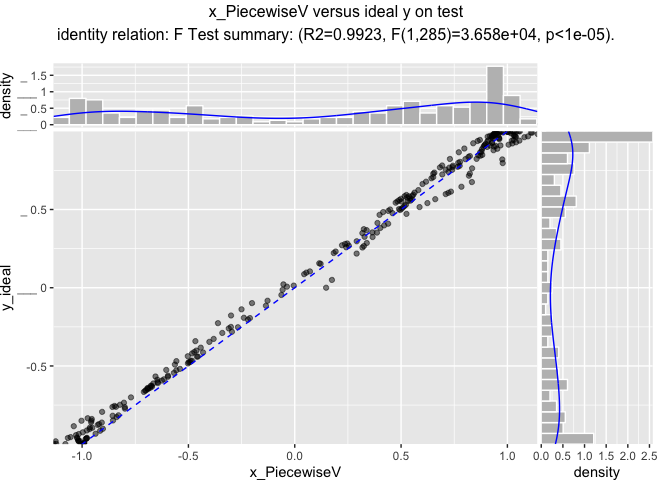
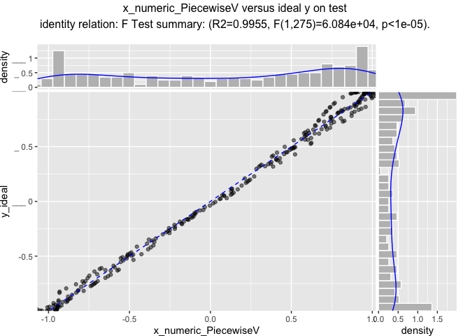

SegFitter
================

``` r
library("ggplot2")
```

``` r
customCoders = list('c.PiecewiseV.num' = vtreat::solve_piecewise,
                    'n.PiecewiseV.num' = vtreat::solve_piecewise,
                    'c.knearest.num' = vtreat::square_window,
                    'n.knearest.num' = vtreat::square_window)
codeRestriction = c("PiecewiseV", 
                    "knearest",
                    "poolN", "poolC",
                    "NonDecreasingV", "NonIncreasingV",
                    "clean", "isBAD", "catB", "catP")
```

``` r
d <- data.frame(x_numeric = seq(0, 15, by = 0.01))
d$x_cat <- paste0("l_", round(d$x_numeric, digits = 1))
d$y_ideal <- sin(d$x_numeric)
d$x_numeric_noise <- d$x_numeric[sample.int(nrow(d), nrow(d), replace = FALSE)]
d$x_cat_noise <- d$x_cat[sample.int(nrow(d), nrow(d), replace = FALSE)]
d$y <- d$y_ideal + 0.5*rnorm(nrow(d))
d$yc <- d$y>0.5
d$is_train <- runif(nrow(d))>=0.2

dcheck <- d[1:2, ]
dcheck$x_numeric <- NA_real_
dcheck$x_cat[1] <- "new_level"
dcheck$x_cat[2] <- NA_character_
dcheck
```

    ##   x_numeric     x_cat     y_ideal x_numeric_noise x_cat_noise           y
    ## 1        NA new_level 0.000000000            0.00        l_12 -0.07727517
    ## 2        NA      <NA> 0.009999833            2.73       l_8.9  0.10468679
    ##      yc is_train
    ## 1 FALSE     TRUE
    ## 2 FALSE     TRUE

``` r
head(d)
```

    ##   x_numeric x_cat     y_ideal x_numeric_noise x_cat_noise           y
    ## 1      0.00   l_0 0.000000000            0.00        l_12 -0.07727517
    ## 2      0.01   l_0 0.009999833            2.73       l_8.9  0.10468679
    ## 3      0.02   l_0 0.019998667            1.02      l_13.7 -0.52030465
    ## 4      0.03   l_0 0.029995500            7.53       l_8.6  0.24767570
    ## 5      0.04   l_0 0.039989334            2.51       l_2.4  0.24777823
    ## 6      0.05   l_0 0.049979169            8.81       l_6.5  0.59700824
    ##      yc is_train
    ## 1 FALSE     TRUE
    ## 2 FALSE     TRUE
    ## 3 FALSE     TRUE
    ## 4 FALSE    FALSE
    ## 5 FALSE     TRUE
    ## 6  TRUE     TRUE

``` r
summary(d)
```

    ##    x_numeric        x_cat              y_ideal        x_numeric_noise
    ##  Min.   : 0.00   Length:1501        Min.   :-1.0000   Min.   : 0.00  
    ##  1st Qu.: 3.75   Class :character   1st Qu.:-0.5917   1st Qu.: 3.75  
    ##  Median : 7.50   Mode  :character   Median : 0.2412   Median : 7.50  
    ##  Mean   : 7.50                      Mean   : 0.1174   Mean   : 7.50  
    ##  3rd Qu.:11.25                      3rd Qu.: 0.8104   3rd Qu.:11.25  
    ##  Max.   :15.00                      Max.   : 1.0000   Max.   :15.00  
    ##  x_cat_noise              y               yc           is_train      
    ##  Length:1501        Min.   :-2.1749   Mode :logical   Mode :logical  
    ##  Class :character   1st Qu.:-0.5369   FALSE:934       FALSE:277      
    ##  Mode  :character   Median : 0.2002   TRUE :567       TRUE :1224     
    ##                     Mean   : 0.1239                                  
    ##                     3rd Qu.: 0.8049                                  
    ##                     Max.   : 2.5499

``` r
ggplot(data=d) +
  geom_point(aes(x = x_numeric, y = y, color = yc), alpha=0.5) + 
  geom_line(aes(x = x_numeric, y = y_ideal), color = "lightblue") +
  geom_hline(yintercept = 0.5, color = "red")
```


``` r
cfn <- vtreat::mkCrossFrameNExperiment(
  d[d$is_train, , drop=FALSE], 
  c('x_numeric', 'x_numeric_noise', 'x_cat', 'x_cat_noise'), 'y',
  customCoders = customCoders,
  codeRestriction = codeRestriction,
  verbose = FALSE)

cfn$treatments
```

    ##                      varName varMoves          rsq           sig
    ## 1       x_numeric_PiecewiseV     TRUE 0.6694909972 4.637253e-296
    ## 2         x_numeric_knearest     TRUE 0.6612358144 1.641808e-289
    ## 3                  x_numeric     TRUE 0.0006752999  3.636765e-01
    ## 4 x_numeric_noise_PiecewiseV     TRUE 0.0001639720  6.544721e-01
    ## 5   x_numeric_noise_knearest     TRUE 0.0002067480  6.152720e-01
    ## 6            x_numeric_noise     TRUE 0.0029358380  5.807925e-02
    ## 7                 x_cat_catP     TRUE 0.0051501214  1.202533e-02
    ## 8           x_cat_noise_catP     TRUE 0.0004087766  4.797539e-01
    ##   needsSplit extraModelDegrees        origName       code
    ## 1       TRUE              1224       x_numeric PiecewiseV
    ## 2       TRUE              1224       x_numeric   knearest
    ## 3      FALSE                 0       x_numeric      clean
    ## 4       TRUE              1224 x_numeric_noise PiecewiseV
    ## 5       TRUE              1224 x_numeric_noise   knearest
    ## 6      FALSE                 0 x_numeric_noise      clean
    ## 7       TRUE               150           x_cat       catP
    ## 8       TRUE               150     x_cat_noise       catP

``` r
vtreat::variable_values(cfn$treatments$scoreFrame)
```

    ##                          rsq count           sig             var
    ## x_cat           0.0051501214     1  1.202533e-02           x_cat
    ## x_cat_noise     0.0004087766     1  4.797539e-01     x_cat_noise
    ## x_numeric       0.6694909972     3 1.391176e-295       x_numeric
    ## x_numeric_noise 0.0029358380     3  1.742378e-01 x_numeric_noise

``` r
# or directly
vtreat::value_variables_N(
  d[d$is_train, , drop=FALSE], 
  c('x_numeric', 'x_numeric_noise', 'x_cat', 'x_cat_noise'), 'y')
```

    ##                         rsq count           sig             var
    ## x_cat           0.003035676     1  5.396703e-02           x_cat
    ## x_cat_noise     0.001285648     1  2.099995e-01     x_cat_noise
    ## x_numeric       0.672764959     3 3.167179e-298       x_numeric
    ## x_numeric_noise 0.002935838     3  1.742378e-01 x_numeric_noise

``` r
prepared <- vtreat::prepare(cfn$treatments, d)
d$x_numeric_PiecewiseV <- prepared$x_numeric_PiecewiseV
d$x_numeric_knearest <- prepared$x_numeric_knearest

ggplot(data=d) +
  # geom_point(aes(x = x_numeric, y = y)) + 
  geom_line(aes(x = x_numeric, y = y_ideal), color = "lightblue") + 
  geom_line(aes(x = x_numeric, y = x_numeric_PiecewiseV)) +
  ggtitle("y_ideal as a function of x_numeric_PiecewiseV")
```



``` r
ggplot(data=d) +
  # geom_point(aes(x = x_numeric, y = y)) + 
  geom_line(aes(x = x_numeric, y = y_ideal), color = "lightblue") + 
  geom_line(aes(x = x_numeric, y = x_numeric_knearest)) +
  ggtitle("y_ideal as a function of x_numeric_knearest")
```



``` r
WVPlots::ScatterHist(d[d$is_train, , drop=FALSE], 
                     "x_numeric_PiecewiseV", "y",
                     "x_numeric_PiecewiseV versus observed y on train",
                     smoothmethod = "identity",
                     estimate_sig = TRUE)
```


``` r
WVPlots::ScatterHist(d[d$is_train, , drop=FALSE], 
                     "x_numeric_PiecewiseV", "y_ideal",
                     "x_numeric_PiecewiseV versus ideal y on train",
                     smoothmethod = "identity",
                     estimate_sig = TRUE)
```



``` r
WVPlots::ScatterHist(d[!d$is_train, , drop=FALSE], 
                     "x_numeric_PiecewiseV", "y",
                     "x_numeric_PiecewiseV versus observed y on test",
                     smoothmethod = "identity",
                     estimate_sig = TRUE)
```



``` r
WVPlots::ScatterHist(d[!d$is_train, , drop=FALSE], 
                     "x_numeric_PiecewiseV", "y_ideal",
                     "x_numeric_PiecewiseV versus ideal y on test",
                     smoothmethod = "identity",
                     estimate_sig = TRUE)
```



``` r
vtreat::prepare(cfn$treatments, dcheck)
```

    ##   x_numeric_PiecewiseV x_numeric_knearest x_numeric
    ## 1            0.1262072          0.1262072  7.597353
    ## 2            0.1262072          0.1262072  7.597353
    ##   x_numeric_noise_PiecewiseV x_numeric_noise_knearest x_numeric_noise
    ## 1                  0.1373923               -0.3016298            0.00
    ## 2                  0.1661613                0.1761822            2.73
    ##     x_cat_catP x_cat_noise_catP           y
    ## 1 0.0004084967      0.005718954 -0.07727517
    ## 2 0.0004084967      0.005718954  0.10468679

``` r
cfc <- vtreat::mkCrossFrameCExperiment(
  d[d$is_train, , drop=FALSE], 
  c('x_numeric', 'x_numeric_noise', 'x_cat', 'x_cat_noise'), 'yc', TRUE,
  customCoders = customCoders,
  codeRestriction = codeRestriction,
  verbose = FALSE)

cfc$treatments
```

    ##                       varName varMoves          rsq           sig
    ## 1        x_numeric_PiecewiseV     TRUE 0.3972440915 7.695092e-142
    ## 2          x_numeric_knearest     TRUE 0.3857020428 8.892748e-138
    ## 3                   x_numeric     TRUE 0.0001148029  6.664300e-01
    ## 4  x_numeric_noise_PiecewiseV     TRUE 0.0008110320  2.519172e-01
    ## 5    x_numeric_noise_knearest     TRUE 0.0004757064  3.802412e-01
    ## 6             x_numeric_noise     TRUE 0.0006156839  3.181654e-01
    ## 7                  x_cat_catP     TRUE 0.0015356506  1.149055e-01
    ## 8                  x_cat_catB     TRUE 0.2732254214  3.575976e-98
    ## 9            x_cat_noise_catP     TRUE 0.0008879143  2.306136e-01
    ## 10           x_cat_noise_catB     TRUE 0.0001467635  6.259928e-01
    ##    needsSplit extraModelDegrees        origName       code
    ## 1        TRUE              1224       x_numeric PiecewiseV
    ## 2        TRUE              1224       x_numeric   knearest
    ## 3       FALSE                 0       x_numeric      clean
    ## 4        TRUE              1224 x_numeric_noise PiecewiseV
    ## 5        TRUE              1224 x_numeric_noise   knearest
    ## 6       FALSE                 0 x_numeric_noise      clean
    ## 7        TRUE               150           x_cat       catP
    ## 8        TRUE               150           x_cat       catB
    ## 9        TRUE               150     x_cat_noise       catP
    ## 10       TRUE               150     x_cat_noise       catB

``` r
vtreat::variable_values(cfc$treatments$scoreFrame)
```

    ##                          rsq count           sig             var
    ## x_cat           0.2732254214     2  7.151952e-98           x_cat
    ## x_cat_noise     0.0008879143     2  4.612271e-01     x_cat_noise
    ## x_numeric       0.3972440915     3 2.308528e-141       x_numeric
    ## x_numeric_noise 0.0008110320     3  7.557515e-01 x_numeric_noise

``` r
# or directly
vtreat::value_variables_C(
  d[d$is_train, , drop=FALSE], 
  c('x_numeric', 'x_numeric_noise', 'x_cat', 'x_cat_noise'), 'yc', TRUE)
```

    ##                          rsq count           sig             var
    ## x_cat           0.2840483173     2 1.102382e-101           x_cat
    ## x_cat_noise     0.0009138376     2  4.478529e-01     x_cat_noise
    ## x_numeric       0.3927362845     3 8.913927e-140       x_numeric
    ## x_numeric_noise 0.0006156839     3  9.544962e-01 x_numeric_noise

``` r
vtreat::prepare(cfc$treatments, dcheck)
```

    ##   x_numeric_PiecewiseV x_numeric_knearest x_numeric
    ## 1             0.374183           0.374183  7.597353
    ## 2             0.374183           0.374183  7.597353
    ##   x_numeric_noise_PiecewiseV x_numeric_noise_knearest x_numeric_noise
    ## 1                  0.3979745                      0.1            0.00
    ## 2                  0.3893568                      0.3            2.73
    ##     x_cat_catP x_cat_catB x_cat_noise_catP x_cat_noise_catB    yc
    ## 1 0.0004084967          0      0.005718954        0.8019866 FALSE
    ## 2 0.0004084967          0      0.005718954        0.2266392 FALSE
