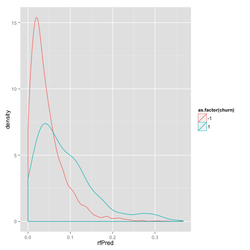
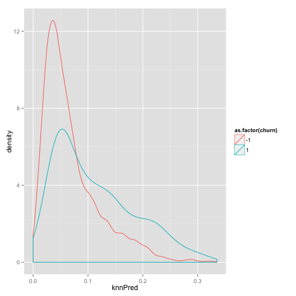
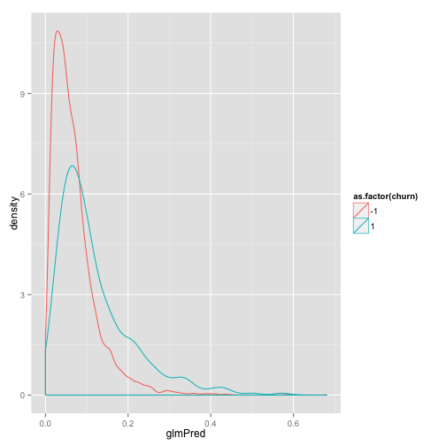
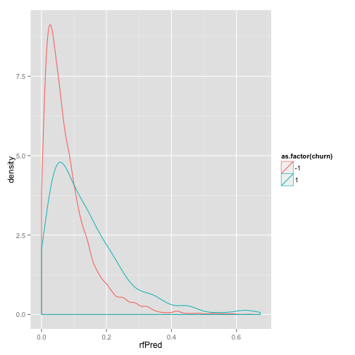
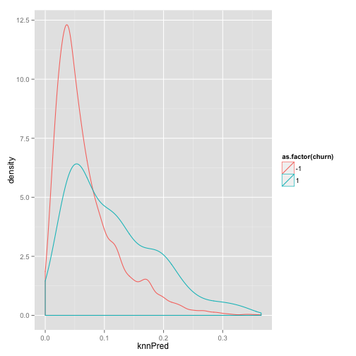
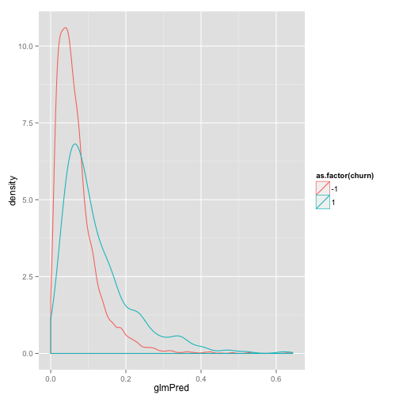
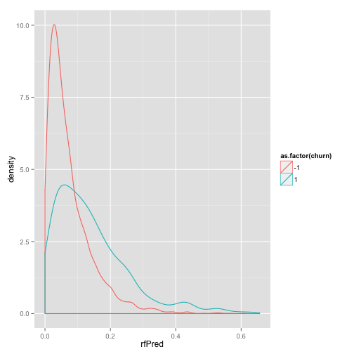
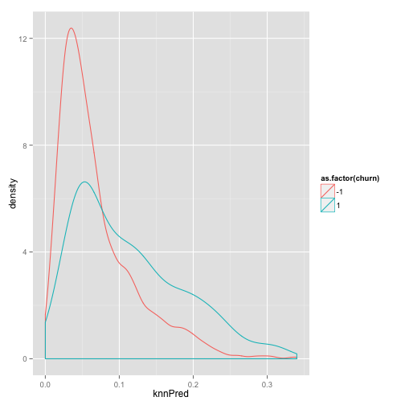

```r
# To make the html: echo "library(knitr); knit('KDD2009example.Rmd')" | R --vanilla ; pandoc KDD2009example.md -o KDD2009example.html
# Example of working with KDD2009 data (just to show library at work).
# For data and details see: https://github.com/WinVector/zmPDSwR/tree/master/KDD2009
# and Chapter 6 of Practical Data Science with R: http://www.amazon.com/Practical-Data-Science/dp/1617291560
# load the data as in the book
dir <- '~/Documents/work/DataScienceBook/zmPDSwR/KDD2009/' # change this path to match your directory structure
d <- read.table(paste(dir,'orange_small_train.data.gz',sep=''),
                header=T,sep='\t',na.strings=c('NA',''))
churn <- read.table(paste(dir,'orange_small_train_churn.labels.txt',sep=''),
                    header=F,sep='\t')
d$churn <- churn$V1
appetency <- read.table(paste(dir,'orange_small_train_appetency.labels.txt',sep=''),
                        header=F,sep='\t')
d$appetency <- appetency$V1
upselling <- read.table(paste(dir,'orange_small_train_upselling.labels.txt',sep=''),
                        header=F,sep='\t')
d$upselling <- upselling$V1
set.seed(729375)
d$rgroup <- runif(dim(d)[[1]])
dTrainPri <- subset(d,rgroup<=0.8)
dTrainCal <- subset(d,rgroup>0.8 & rgroup<=0.9)
dTest <- subset(d,rgroup>0.9)
rm(list=c('d','churn','appetency','upselling','dir'))
outcomes <- c('churn','appetency','upselling')
vars <- setdiff(colnames(dTrainPri),
                c(outcomes,'rgroup'))
yName <- 'churn'
yTarget <- 1
yCond <- paste(yName,yTarget,sep='==')
```


```r
#load some libraries
library('vtreat')  # This library isn't public yet, intall instructions: http://www.win-vector.com/blog/2014/08/vtreat-designing-a-package-for-variable-treatment/

# try the automatic variable treatment
set.seed(239525)
treatments <- designTreatmentsC(dTrainPri,
    vars,yName,yTarget,smFactor=1.0,minFraction=2.0,maxMissing=-1.0)
save(file='kdd2009ex.Rdata',list=ls())
```


```r
#load('kdd2009ex.Rdata') # how we would load the data by hand
#load/re-load some libraries
library('ggplot2')
library('ROCR')
```

```
## Loading required package: gplots
## KernSmooth 2.23 loaded
## Copyright M. P. Wand 1997-2009
## 
## Attaching package: 'gplots'
## 
## The following object is masked from 'package:stats':
## 
##     lowess
```

```r
library('vtreat')
library('randomForest')
```

```
## randomForest 4.6-7
## Type rfNews() to see new features/changes/bug fixes.
```

```r
library('class')


# select variables that look good in calibration
pruneLevel <- 0.99999 # noisy weak variables, so not leaning on PRESS statistic
treatedTrain <- prepare(treatments,dTrainPri,
                        pruneLevel=pruneLevel,scale=TRUE)
treatedCal <- prepare(treatments,dTrainCal,
                        pruneLevel=pruneLevel,scale=TRUE)
treatedTest <- prepare(treatments,dTest,
                       pruneLevel=pruneLevel,scale=TRUE)
scoreVarCal <- function(vname,trainFrame,calFrame) {
  mv <- glm(paste(yCond,vname,sep=' ~ '),data=trainFrame,family=binomial(link='logit'))
  sv <- predict(mv,newdata=calFrame,type='response')
  ncal <- length(calFrame[,yName])
  sc <- sum(calFrame[,yName]==yTarget)/ncal
  (sum(ifelse(calFrame[,yName]==yTarget,log(sv),log(1-sv))) - sum(ifelse(calFrame[,yName]==yTarget,log(sc),log(1-sc))))/ncal
}
m1vars <- intersect(treatments$vars,colnames(treatedTrain))
varValues <- sapply(m1vars,function(v) scoreVarCal(v,treatedTrain,treatedCal)) # weak noisy variables, so score on calibration set
```

```
## Warning: glm.fit: fitted probabilities numerically 0 or 1 occurred
## Warning: glm.fit: fitted probabilities numerically 0 or 1 occurred
```

```r
print(table(PRESSgood=treatments$varScores[m1vars]<1,CALgood=varValues>0))
```

```
##          CALgood
## PRESSgood FALSE TRUE
##      TRUE    66  143
```

```r
mvars <- names(varValues)[varValues>1.0e-5]


# Add some principal components as new synthetic variables (better would be something like partial least squares 
# as we are working towards inverse-regressio style effects).  
# See http://www.win-vector.com/blog/2014/06/skimming-statistics-papers-for-the-ideas-instead-of-the-complete-procedures/ )
pcomp <- prcomp(treatedTrain[,mvars])
goodP <- pcomp$sdev>=1.0e-3
projection <- pcomp$rotation[,goodP]
treatedTrainP <- as.data.frame(as.matrix(treatedTrain[,mvars]) %*% projection)
pvars1 <- colnames(treatedTrainP)
treatedTrainP <- cbind(treatedTrainP,treatedTrain)
treatedCalP <- as.data.frame(as.matrix(treatedCal[,mvars]) %*% projection)
treatedCalP <- cbind(treatedCalP,treatedCal)
treatedTestP <- as.data.frame(as.matrix(treatedTest[,mvars]) %*% projection)
treatedTestP <- cbind(treatedTestP,treatedTest)
pvarValues <- sapply(pvars1,function(v) scoreVarCal(v,treatedTrainP,treatedCalP)) # weak noisy variables, so score on calibration set
pvars <- names(pvarValues)[pvarValues>1.0e-5]


uvars <- c(mvars,pvars)


for (varset in list(mvars,pvars,uvars)) {
   print('----------')
   print(varset)
   
   print('')
   print('glm')
   # simple glm model (just to show things work)
   formulaP <- paste(yCond,paste(varset,collapse=' + '),sep=' ~ ')
   modelP <- glm(formulaP,data=treatedTrainP,family=binomial(link='logit'))
   treatedTestP$glmPred <- predict(modelP,newdata=treatedTestP,type='response')
   print(ggplot(data=treatedTestP) +
      geom_density(aes_string(x='glmPred',color=paste('as.factor(',yName,')'))))
   # compute AUC aas in chapter 5 of Practical Data Science with R
   ROCR_glmPred <- prediction(treatedTestP$glmPred,treatedTest[,yName]==yTarget)
   #plot(performance(ROCR_glmPred,"tpr","fpr"))
   glmPredAUC <- attributes(performance(ROCR_glmPred,'auc'))$y.values[[1]]
   print(glmPredAUC)
   print('')

   print('')
   print('randomForest')
   # random forest model, see chapter 9 of Practical Data Science with R
   modelF <- randomForest(x=treatedTrainP[,varset],
      y=as.factor(treatedTrainP[,yName]==yTarget),
      ntree=300)
   treatedTestP$rfPred <- predict(modelF,newdata=treatedTestP[,varset],type='prob')[,'TRUE']
   print(ggplot(data=treatedTestP) +
      geom_density(aes_string(x='rfPred',color=paste('as.factor(',yName,')'))))
   ROCR_rfPred <- prediction(treatedTestP$rfPred,treatedTest[,yName]==yTarget)
   #plot(performance(ROCR_rfPred,"tpr","fpr"))
   rfPredAUC <- attributes(performance(ROCR_rfPred,'auc'))$y.values[[1]]
   print(rfPredAUC)
   print('')

   print('')
   print('knn')
   # knn model, see chapter 6 of Practical Data Science with R
   knnPred <- function(trainF,trainY,nK,testF) {
       knnDecision <- knn(trainF,testF,trainY,k=nK,prob=T)
       ifelse(knnDecision==TRUE,
          attributes(knnDecision)$prob,
          1-(attributes(knnDecision)$prob))
   }
   treatedTestP$knnPred <- knnPred(treatedTrainP[,varset],treatedTrainP[,yName],
                                   200,
                                   treatedTestP[,varset])
   print(ggplot(data=treatedTestP) +
      geom_density(aes_string(x='knnPred',color=paste('as.factor(',yName,')'))))
   ROCR_knnPred <- prediction(treatedTestP$knnPred,treatedTest[,yName]==yTarget)
   #plot(performance(ROCR_knnPred,"tpr","fpr"))
   knnPredAUC <- attributes(performance(ROCR_knnPred,'auc'))$y.values[[1]]
   print(knnPredAUC)
   print('')
}
```

```
## [1] "----------"
##   [1] "Var2_isBAD"   "Var3_isBAD"   "Var4_isBAD"   "Var6_clean"  
##   [5] "Var6_isBAD"   "Var7_clean"   "Var7_isBAD"   "Var11_isBAD" 
##   [9] "Var13_clean"  "Var13_isBAD"  "Var14_isBAD"  "Var17_isBAD" 
##  [13] "Var18_isBAD"  "Var19_isBAD"  "Var21_isBAD"  "Var22_isBAD" 
##  [17] "Var24_clean"  "Var24_isBAD"  "Var25_clean"  "Var25_isBAD" 
##  [21] "Var28_clean"  "Var28_isBAD"  "Var34_isBAD"  "Var35_isBAD" 
##  [25] "Var36_isBAD"  "Var37_isBAD"  "Var38_isBAD"  "Var40_isBAD" 
##  [29] "Var43_isBAD"  "Var44_isBAD"  "Var46_isBAD"  "Var49_isBAD" 
##  [33] "Var51_isBAD"  "Var54_isBAD"  "Var56_isBAD"  "Var59_isBAD" 
##  [37] "Var65_clean"  "Var65_isBAD"  "Var68_isBAD"  "Var72_clean" 
##  [41] "Var73_clean"  "Var74_clean"  "Var74_isBAD"  "Var75_isBAD" 
##  [45] "Var76_isBAD"  "Var78_isBAD"  "Var81_clean"  "Var81_isBAD" 
##  [49] "Var82_isBAD"  "Var83_isBAD"  "Var84_isBAD"  "Var85_clean" 
##  [53] "Var85_isBAD"  "Var88_isBAD"  "Var89_isBAD"  "Var95_isBAD" 
##  [57] "Var96_isBAD"  "Var99_isBAD"  "Var101_isBAD" "Var102_isBAD"
##  [61] "Var104_isBAD" "Var105_isBAD" "Var106_isBAD" "Var109_isBAD"
##  [65] "Var110_clean" "Var112_isBAD" "Var113_clean" "Var114_isBAD"
##  [69] "Var115_isBAD" "Var117_isBAD" "Var119_isBAD" "Var122_isBAD"
##  [73] "Var123_isBAD" "Var124_isBAD" "Var125_clean" "Var125_isBAD"
##  [77] "Var126_clean" "Var126_isBAD" "Var127_isBAD" "Var128_isBAD"
##  [81] "Var130_isBAD" "Var132_isBAD" "Var133_isBAD" "Var134_isBAD"
##  [85] "Var135_isBAD" "Var138_isBAD" "Var139_clean" "Var140_isBAD"
##  [89] "Var143_isBAD" "Var144_clean" "Var144_isBAD" "Var145_isBAD"
##  [93] "Var149_clean" "Var149_isBAD" "Var150_isBAD" "Var152_isBAD"
##  [97] "Var153_isBAD" "Var155_isBAD" "Var158_isBAD" "Var159_isBAD"
## [101] "Var160_clean" "Var160_isBAD" "Var161_isBAD" "Var162_isBAD"
## [105] "Var163_isBAD" "Var164_isBAD" "Var165_isBAD" "Var168_clean"
## [109] "Var170_isBAD" "Var171_isBAD" "Var173_isBAD" "Var174_isBAD"
## [113] "Var176_isBAD" "Var177_isBAD" "Var178_isBAD" "Var179_isBAD"
## [117] "Var181_isBAD" "Var182_isBAD" "Var183_isBAD" "Var184_isBAD"
## [121] "Var188_clean" "Var188_isBAD" "Var189_clean" "Var191_catN" 
## [125] "Var193_catN"  "Var197_catN"  "Var203_catN"  "Var205_catN" 
## [129] "Var206_catN"  "Var207_catN"  "Var208_catN"  "Var210_catN" 
## [133] "Var211_catN"  "Var218_catN"  "Var219_catN"  "Var221_catN" 
## [137] "Var223_catN"  "Var224_catN"  "Var225_catN"  "Var226_catN" 
## [141] "Var227_catN"  "Var228_catN"  "Var229_catN" 
## [1] ""
## [1] "glm"
```

```
## Warning: prediction from a rank-deficient fit may be misleading
```

 

```
## [1] 0.6971
## [1] ""
## [1] ""
## [1] "randomForest"
```

 

```
## [1] 0.6968
## [1] ""
## [1] ""
## [1] "knn"
```

 

```
## [1] 0.6893
## [1] ""
## [1] "----------"
##  [1] "PC1"  "PC2"  "PC3"  "PC4"  "PC5"  "PC6"  "PC8"  "PC13" "PC15" "PC16"
## [11] "PC17" "PC19" "PC22" "PC23" "PC24" "PC26" "PC29" "PC30" "PC31" "PC34"
## [21] "PC36" "PC37" "PC42" "PC44"
## [1] ""
## [1] "glm"
```

 

```
## [1] 0.692
## [1] ""
## [1] ""
## [1] "randomForest"
```

 

```
## [1] 0.6758
## [1] ""
## [1] ""
## [1] "knn"
```

```
## [1] 0.6945
## [1] ""
## [1] "----------"
##   [1] "Var2_isBAD"   "Var3_isBAD"   "Var4_isBAD"   "Var6_clean"  
##   [5] "Var6_isBAD"   "Var7_clean"   "Var7_isBAD"   "Var11_isBAD" 
##   [9] "Var13_clean"  "Var13_isBAD"  "Var14_isBAD"  "Var17_isBAD" 
##  [13] "Var18_isBAD"  "Var19_isBAD"  "Var21_isBAD"  "Var22_isBAD" 
##  [17] "Var24_clean"  "Var24_isBAD"  "Var25_clean"  "Var25_isBAD" 
##  [21] "Var28_clean"  "Var28_isBAD"  "Var34_isBAD"  "Var35_isBAD" 
##  [25] "Var36_isBAD"  "Var37_isBAD"  "Var38_isBAD"  "Var40_isBAD" 
##  [29] "Var43_isBAD"  "Var44_isBAD"  "Var46_isBAD"  "Var49_isBAD" 
##  [33] "Var51_isBAD"  "Var54_isBAD"  "Var56_isBAD"  "Var59_isBAD" 
##  [37] "Var65_clean"  "Var65_isBAD"  "Var68_isBAD"  "Var72_clean" 
##  [41] "Var73_clean"  "Var74_clean"  "Var74_isBAD"  "Var75_isBAD" 
##  [45] "Var76_isBAD"  "Var78_isBAD"  "Var81_clean"  "Var81_isBAD" 
##  [49] "Var82_isBAD"  "Var83_isBAD"  "Var84_isBAD"  "Var85_clean" 
##  [53] "Var85_isBAD"  "Var88_isBAD"  "Var89_isBAD"  "Var95_isBAD" 
##  [57] "Var96_isBAD"  "Var99_isBAD"  "Var101_isBAD" "Var102_isBAD"
##  [61] "Var104_isBAD" "Var105_isBAD" "Var106_isBAD" "Var109_isBAD"
##  [65] "Var110_clean" "Var112_isBAD" "Var113_clean" "Var114_isBAD"
##  [69] "Var115_isBAD" "Var117_isBAD" "Var119_isBAD" "Var122_isBAD"
##  [73] "Var123_isBAD" "Var124_isBAD" "Var125_clean" "Var125_isBAD"
##  [77] "Var126_clean" "Var126_isBAD" "Var127_isBAD" "Var128_isBAD"
##  [81] "Var130_isBAD" "Var132_isBAD" "Var133_isBAD" "Var134_isBAD"
##  [85] "Var135_isBAD" "Var138_isBAD" "Var139_clean" "Var140_isBAD"
##  [89] "Var143_isBAD" "Var144_clean" "Var144_isBAD" "Var145_isBAD"
##  [93] "Var149_clean" "Var149_isBAD" "Var150_isBAD" "Var152_isBAD"
##  [97] "Var153_isBAD" "Var155_isBAD" "Var158_isBAD" "Var159_isBAD"
## [101] "Var160_clean" "Var160_isBAD" "Var161_isBAD" "Var162_isBAD"
## [105] "Var163_isBAD" "Var164_isBAD" "Var165_isBAD" "Var168_clean"
## [109] "Var170_isBAD" "Var171_isBAD" "Var173_isBAD" "Var174_isBAD"
## [113] "Var176_isBAD" "Var177_isBAD" "Var178_isBAD" "Var179_isBAD"
## [117] "Var181_isBAD" "Var182_isBAD" "Var183_isBAD" "Var184_isBAD"
## [121] "Var188_clean" "Var188_isBAD" "Var189_clean" "Var191_catN" 
## [125] "Var193_catN"  "Var197_catN"  "Var203_catN"  "Var205_catN" 
## [129] "Var206_catN"  "Var207_catN"  "Var208_catN"  "Var210_catN" 
## [133] "Var211_catN"  "Var218_catN"  "Var219_catN"  "Var221_catN" 
## [137] "Var223_catN"  "Var224_catN"  "Var225_catN"  "Var226_catN" 
## [141] "Var227_catN"  "Var228_catN"  "Var229_catN"  "PC1"         
## [145] "PC2"          "PC3"          "PC4"          "PC5"         
## [149] "PC6"          "PC8"          "PC13"         "PC15"        
## [153] "PC16"         "PC17"         "PC19"         "PC22"        
## [157] "PC23"         "PC24"         "PC26"         "PC29"        
## [161] "PC30"         "PC31"         "PC34"         "PC36"        
## [165] "PC37"         "PC42"         "PC44"        
## [1] ""
## [1] "glm"
```

```
## Warning: prediction from a rank-deficient fit may be misleading
```

  

```
## [1] 0.6971
## [1] ""
## [1] ""
## [1] "randomForest"
```

 

```
## [1] 0.7091
## [1] ""
## [1] ""
## [1] "knn"
```

 

```
## [1] 0.6884
## [1] ""
```
