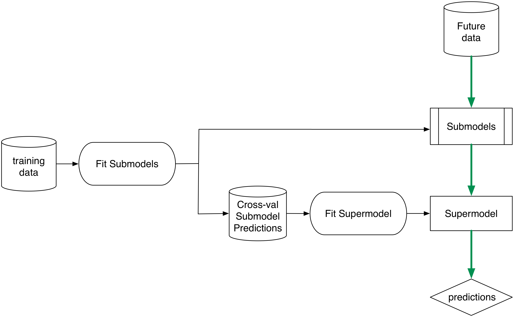
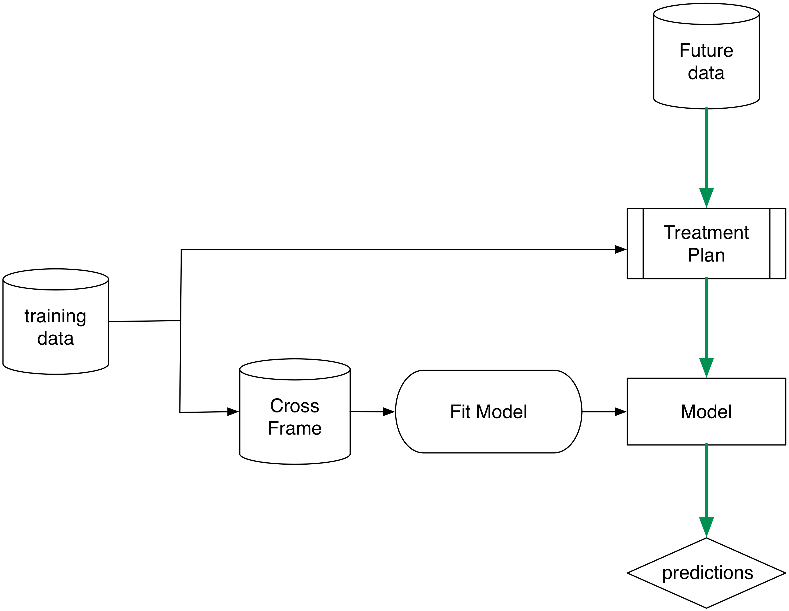

Example demonstrating "cross validated training frames" (or "cross frames") in vtreat.

Consider the following data frame. The outcome only depends on the "good" variables, not on the (high degree of freedom) "bad" variables. Modeling such a data set runs a high risk of overfit.

```{r}
set.seed(22626)

mkData <- function(n) {
  d <- data.frame(xBad1=sample(paste('level',1:1000,sep=''),n,replace=TRUE),
                  xBad2=sample(paste('level',1:1000,sep=''),n,replace=TRUE),
                  xBad3=sample(paste('level',1:1000,sep=''),n,replace=TRUE),
                  xGood1=rnorm(n),
                  xGood2=rnorm(n))
  
  # outcome only depends on "good" variables
  d$y <- rnorm(nrow(d))+0.2*d$xGood1 + 0.3*d$xGood2>0.5
  # the random group used for splitting the data set, not a variable.
  d$rgroup <- sample(c("cal","train","test"),nrow(d),replace=TRUE)  
  d
}

d <- mkData(2000)

# devtools::install_github("WinVector/WVPlots")
# library('WVPlots')
plotRes <- function(d,predName,yName,title) {
  print(title)
  tab <- table(truth=d[[yName]],pred=d[[predName]]>0.5)
  print(tab)
  diag <- sum(vapply(seq_len(min(dim(tab))),
                     function(i) tab[i,i],numeric(1)))
  acc <- diag/sum(tab)
#  if(requireNamespace("WVPlots",quietly=TRUE)) {
#     print(WVPlots::ROCPlot(d,predName,yName,title))
#  }
  print(paste('accuracy',acc))
}
```

## The Wrong Way

Bad practice: use the same set of data to prepare variable encoding and train a model.

```{r badmixcalandtrain}
dTrain <- d[d$rgroup!='test',,drop=FALSE]
dTest <- d[d$rgroup=='test',,drop=FALSE]
treatments <- vtreat::designTreatmentsC(dTrain,c('xBad1','xBad2','xBad3','xGood1','xGood2'),
                                        'y',TRUE,
  rareCount=0 # Note: usually want rareCount>0, setting to zero to illustrate problem
)
dTrainTreated <- vtreat::prepare(treatments,dTrain,
  pruneSig=c() # Note: usually want pruneSig to be a small fraction, setting to null to illustrate problems
)
m1 <- glm(y~xBad1_catB + xBad2_catB + xBad3_catB + xGood1_clean + xGood2_clean,
          data=dTrainTreated,family=binomial(link='logit'))
print(summary(m1))  # notice low residual deviance

dTrain$predM1 <- predict(m1,newdata=dTrainTreated,type='response')
plotRes(dTrain,'predM1','y','model1 on train')
dTestTreated <- vtreat::prepare(treatments,dTest,pruneSig=c())
dTest$predM1 <- predict(m1,newdata=dTestTreated,type='response')
plotRes(dTest,'predM1','y','model1 on test')
```

Notice above that we see a training accuracy of 98% and a test accuracy of 60%.

## The Right Way: A Calibration Set

Now try a proper calibration/train/test split:

```{r separatecalandtrain}
dCal <- d[d$rgroup=='cal',,drop=FALSE]
dTrain <- d[d$rgroup=='train',,drop=FALSE]
dTest <- d[d$rgroup=='test',,drop=FALSE]

# a nice heuristic, 
# expect only a constant number of noise variables to sneak past
pruneSig <- 1/ncol(dTrain) 
treatments <- vtreat::designTreatmentsC(dCal,
                                        c('xBad1','xBad2','xBad3','xGood1','xGood2'),
                                        'y',TRUE,
  rareCount=0 # Note: usually want rareCount>0, setting to zero to illustrate problem
)
dTrainTreated <- vtreat::prepare(treatments,dTrain,
  pruneSig=pruneSig)
newvars <- setdiff(colnames(dTrainTreated),'y')
m1 <- glm(paste('y',paste(newvars,collapse=' + '),sep=' ~ '),
          data=dTrainTreated,family=binomial(link='logit'))
print(summary(m1))  

dTrain$predM1 <- predict(m1,newdata=dTrainTreated,type='response')
plotRes(dTrain,'predM1','y','model1 on train')
dTestTreated <- vtreat::prepare(treatments,dTest,
                                pruneSig=pruneSig)
dTest$predM1 <- predict(m1,newdata=dTestTreated,type='response')
plotRes(dTest,'predM1','y','model1 on test')
```

Notice above that we now see training and test accuracies of 70%.  We have defeated overfit in two ways: training performance is closer to test performance, and test performance is better. Also we see that the model now properly considers the "bad" variables to be insignificant.

## Another Right Way: Cross-Validation

Below is a more statistically efficient practice: building a cross training frame.  

### The intuition

Consider any trained statistical model (in this case our treatment plan and variable selection plan) as a two-argument function _f(A,B)_.  The first argument is the training data and the second argument is the application data.  In our case _f(A,B)_ is: `designTreatmentsC(A) %>% prepare(B)`, and it produces a treated data frame.

When we use the same data in both places to build our training frame, as in

> _TrainTreated = f(TrainData,TrainData)_, 

we are not doing a good job simulating the future application of _f(,)_, which will be _f(TrainData,FutureData)_.  

To improve the quality of our simulation we can call 

> _TrainTreated = f(CalibrationData,TrainData)_ 

where _CalibrationData_ and _TrainData_ are disjoint datasets (as we did in the earlier example) and expect this to be a good imitation of future _f(CalibrationData,FutureData)_.

### Cross-Validation and vtreat: The cross-frame.

Another approach is to build a "cross validated" version of _f_.  We split _TrainData_ into a list of 3 disjoint row intervals: _Train1_,_Train2_,_Train3_.  Instead of computing _f(TrainData,TrainData)_ compute:

> _TrainTreated = f(Train2+Train3,Train1) + f(Train1+Train3,Train2) + f(Train1+Train2,Train3)_ 

(where + denotes `rbind()`).  

The idea is this looks a lot like _f(TrainData,TrainData)_ except it has the important property that no row in the right-hand side is ever worked on by a model built using that row (a key characteristic that future data will have) so we have a good imitation of _f(TrainData,FutureData)_.

In other words: we use cross validation to simulate future data.  The main thing we are doing differently is remembering that we can apply cross validation to *any* two argument function _f(A,B)_ and not only to functions of the form _f(A,B)_ = `buildModel(A) %>% scoreData(B)`.  We can use this formulation in stacking or super-learning with _f(A,B)_ of the form `buildSubModels(A) %>% combineModels(B)` (to produce a stacked or ensemble model); the idea applies to improving ensemble methods in general.

See: 

- "General oracle inequalities for model selection" Charles Mitchell and Sara van de Geer
- "On Cross-Validation and Stacking: Building seemingly predictive models on random data" Claudia Perlich and Grzegorz Swirszcz
- "Super Learner" Mark J. van der Laan, Eric C. Polley, and Alan E. Hubbard

In fact (though it was developed independently) you can think of vtreat as a superlearner.

In super learning cross validation techniques are used to simulate having built 
sub-model predictions on novel data.  The simulated out of sample-applications of these 
sub models (and not the sub models themselves) are then used as input data for 
the next stage learner.  In future application the actual sub-models are applied and
their immediate outputs is used by the super model.



In vtreat the sub-models are single variable treatments and
the outer model construction is left to the practitioner (using the cross-frames for 
simulation and not the treatmentplan).  In application the treatment plan is used.



### Example

Below is the example cross-run. The function `mkCrossFrameCExperiment` returns a treatment plan for use in preparing future data, and a cross-frame for use in fitting a model.

```{r crossframes}
dTrain <- d[d$rgroup!='test',,drop=FALSE]
dTest <- d[d$rgroup=='test',,drop=FALSE]
prep <- vtreat::mkCrossFrameCExperiment(dTrain,
           c('xBad1','xBad2','xBad3','xGood1','xGood2'),
           'y',TRUE,
           rareCount=0 # Note: usually want rareCount>0, setting to zero to illustrate problems
)
treatments <- prep$treatments
print(treatments$scoreFrame[,c('varName','sig')])
# vtreat::mkCrossFrameCExperiment doesn't take a pruneSig argument, but we can
# prune on our own.
print(pruneSig)
newvars <- treatments$scoreFrame$varName[treatments$scoreFrame$sig<=pruneSig]
newvars <- union(newvars,c("xBad1_catB","xBad3_catB"))
print(newvars)
dTrainTreated <- prep$crossFrame
```

We ensured the undesirable `xBad*_catB` variables back in to demonstrate that even if they sneak past a lose `pruneSig`, the crosframe
lets the downstream model deal with them correctly.  To ensure more consistent filtering of the complicated variables one can
increase the `ncross` argument in `vtreat::mkCrossFrame?Experiment`.

Now we fit the model to *the cross-frame* rather than to `prepare(treatments, dTrain)` (the treated training data).

```{r xframemodel}
m1 <- glm(paste('y',paste(newvars,collapse=' + '),sep=' ~ '),
          data=dTrainTreated,family=binomial(link='logit'))
print(summary(m1))  

dTrain$predM1 <- predict(m1,newdata=dTrainTreated,type='response')
plotRes(dTrain,'predM1','y','model1 on train')
dTestTreated <- vtreat::prepare(treatments,dTest,
                                pruneSig=c(),varRestriction=newvars)
dTest$predM1 <- predict(m1,newdata=dTestTreated,type='response')
plotRes(dTest,'predM1','y','model1 on test')
```

The model fit to the cross-frame behaves similarly to the model produced via the process _f(CalibrationData, TrainData)_.
Notice that the  `xBad*_catB` variables fail to achieve significance in the downstream `glm` model, allowing that
model to give them small coefficients and even (if need be) prune them out.  This is the point of using a cross frame as
we see in the first example the  `xBad*_catB` are hard to remove if they make it to standard (non-cross) frames as they are 
hiding a lot of degrees of freedom from downstream modeling procedures.


